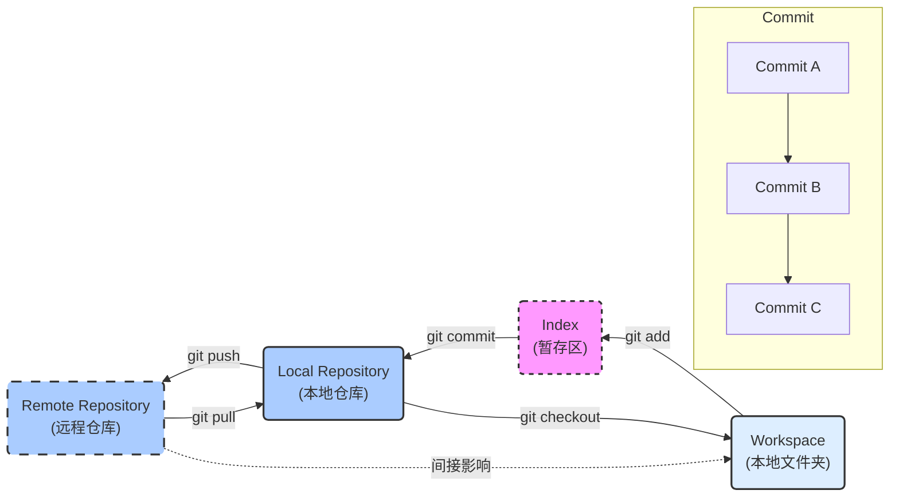
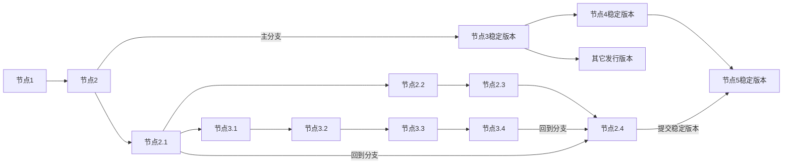
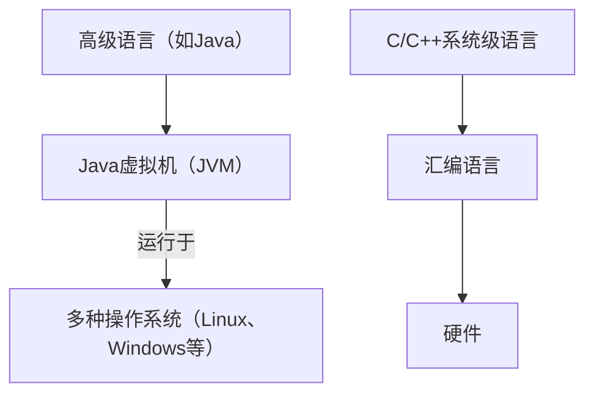
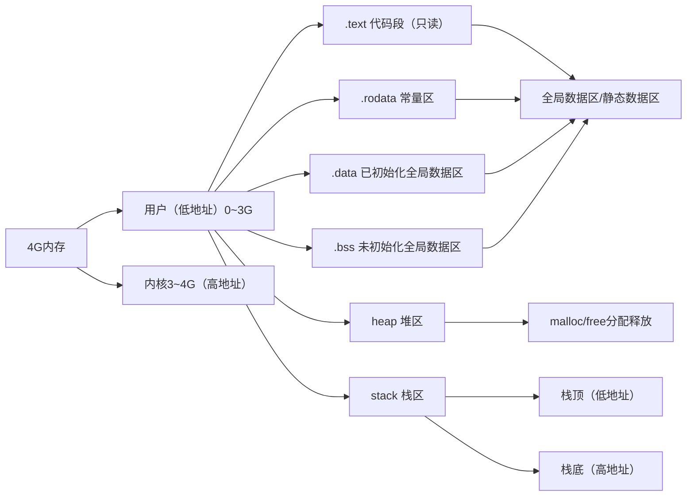
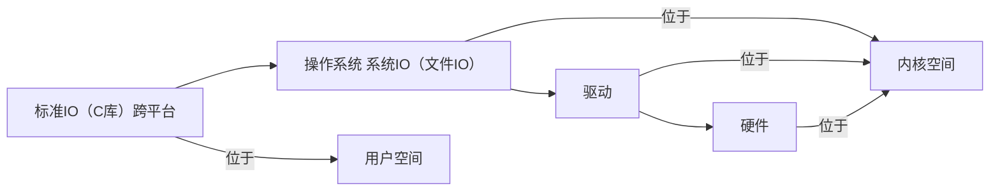
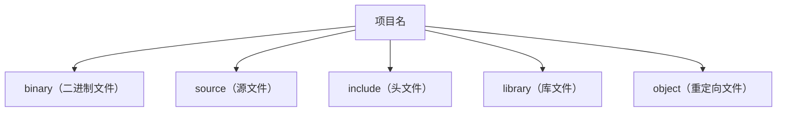
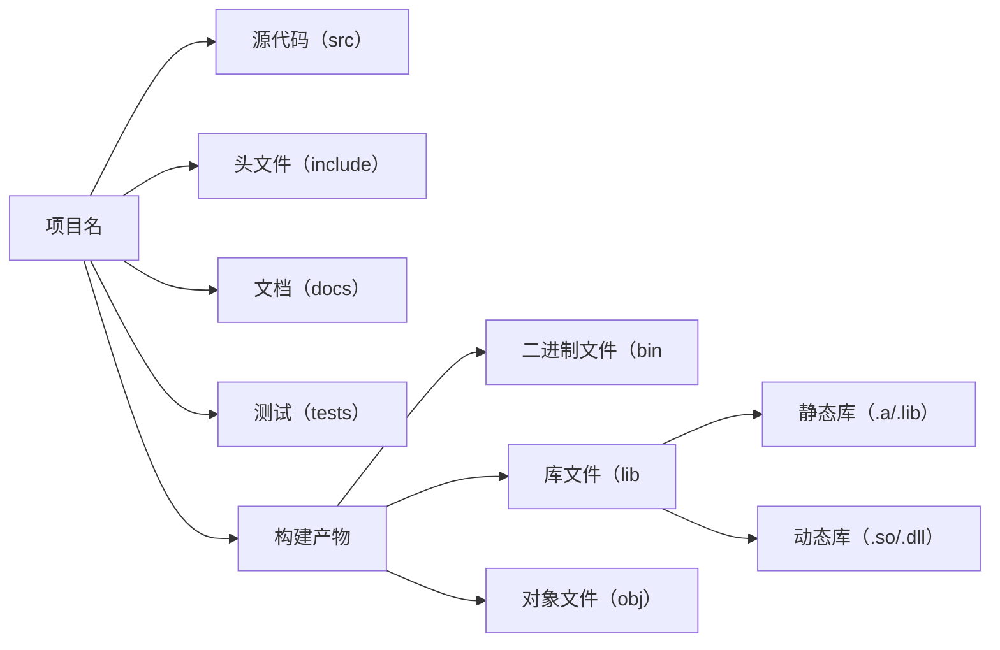
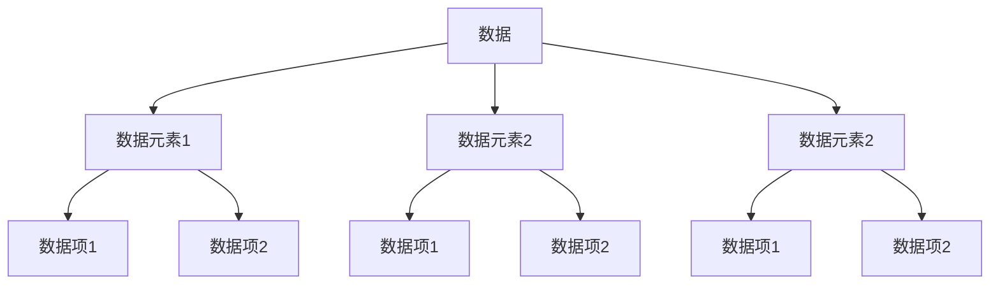
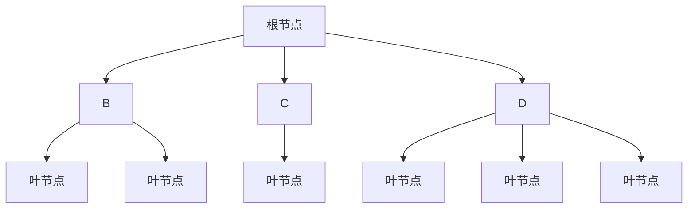

# C++嵌入式开发体系笔记

##   1. 环境搭建

### 1.1 Windows环境

#### 1.1.1 防火墙

``` markdown
对于进行网络编程等开发环境的Windows系统，合理设置防火墙是非常重要的。这包括允许特定端口的入站和出站流量，以及信任你的开发工具和服务器。具体步骤会依据你的防火墙软件（如Windows Defender防火墙）而异，但一般流程包括：

1.打开“控制面板”或“设置”中的“Windows Defender 防火墙”。
点击“高级设置”进入防火墙的高级管理界面。
2.在“入站规则”或“出站规则”中，你可以创建新的规则来允许或阻止特定程序的网络访问。
3.为你的开发工具和服务器软件创建规则，允许它们所需的网络端口通信。
```

#### 1.1.2 扩展名

``` markdown
确认文件类型的一个常用方法是查看文件扩展名。Windows默认可能隐藏了文件扩展名，以便用户更清晰地查看文件名。你可以通过以下步骤显示文件扩展名：

1.打开“文件资源管理器”。
2.点击“查看”选项卡。
3.在“显示/隐藏”部分，勾选“文件扩展名”选项。
```

#### 1.1.3 虚拟机

``` markdown
vmware虚拟机
```

### 1.2 Linux环境

#### 1.2.1 共享目录

##### 1.2.1.1 手动挂载

``` markdown
1.开启VMwareTool工具
2.选择Windows要共享的目录
3.在VMWare中选择启用共享该目录
```

``` bash
sudo vmhgfs-fuse .host:/share /mnt/hgfs -o allow_other   
#share是Windows中设置好的共享文件夹名称
cd /mnt/hgfs    
#进入共享文件夹(共享文件夹默认位置)
```

##### 1.2.1.2 自动挂载

``` bash
sudo vim /etc/fstab    
#修改开机自动挂载文件
#进入后在最下方添加以下命令
.host:/share /home/user/share fuse.vmhgfs-fuse allow_other,defaults 0  0
#切记底行模式wq保存文件
#编辑/etc/fstab文件时要非常小心
#因为错误的配置可能导致系统无法启动
```

### 1.3 必要常识

#### 1.3.1 进制及转换

##### 1.3.1.1 进制表示

``` markdown
1.十进制：日常生活中最常用的进制，由0-9十个数字组成，如123、500、0等。
2.二进制：计算机内部存储和运算的基础进制，由0和1两个数字组成，通常以0b或0B（在某些编程语言中）开头表示，如0b1101。
3.八进制：在某些场合下，八进制可以简化数字的表示，以0开头表示，如071（注意：在严格的编程环境中，八进制数字不应包含8或9，且前缀0是必须的，但在某些旧的或特定上下文中，可能不强制使用前缀）。
4.十六进制：在表示计算机中的字节和内存地址时非常有用，以0x或0X开头表示，由0-9和A-F（或a-f）组成，如0xca。
```

##### 1.3.1.2 进制转换

``` markdown
1.N进制到十进制：通过计算每一位上的数字乘以对应的权值（N的幂次方），然后将这些结果相加得到。
2.十进制到N进制：使用短除法，将十进制数除以N，记录余数，然后将商继续除以N，直到商为0，最后将得到的余数逆序排列。
3.十进制小数到二进制：通过不断乘以2并取整数部分的方式实现，整数部分为1时表示该位为1，否则为0，然后将小数部分继续乘以2，重复此过程直到小数部分为0或达到所需的精度。
```

#### 1.3.2 计算机数据

##### 1.3.2.1 数据存储

``` markdown
1.计算机内部使用补码来表示所有数据，包括整数和浮点数。
2.有符号数：最高位（最左边的位）用作符号位，0表示正数，1表示负数。
3.原码：一个数的二进制表示，包括符号位。
4.反码：正数的反码与原码相同，负数的反码是其原码（除符号位外）取反。
5.补码：正数的补码与原码相同，负数的补码是其反码加1。
6.在计算机中，所有的算术运算（包括加减乘除）都是在补码的基础上进行的，这简化了硬件设计。
```

##### 1.3.2.2 存储单位

``` markdown
1.位（bit）：计算机存储信息的最小单位，只能表示0或1。
2.字节（Byte）：由8个位组成，是计算机存储和处理数据的基本单位。
3.千字节（kB）：1 kB = 1024 B，通常用于表示文件大小或内存大小。
```

##### 1.3.2.3 字节对齐

``` markdown
1.字节对齐是计算机内存访问的一种优化技术，确保特定类型的数据存储在内存中的地址是该类型大小的整数倍。
2.这样做可以提高内存访问的效率，因为许多处理器在访问对齐的数据时速度更快。
3.在结构体中，成员之间的字节对齐可能会导致结构体占用的内存空间比其成员大小之和要大。
```

#### 1.3.3 ASCLL码

##### 1.3.3.1 非打印控制字符

``` markdown
ASCII码表中的前32个字符（0-31）是控制字符，用于控制打印机、终端等外围设备，如换行（LF, \n, ASCII 10）、回车（CR, \r, ASCII 13）等。
```

##### 1.3.3.1 打印字符

``` markdown
1.ASCII码表中的32-126号字符是可打印字符，包括英文字母、数字、标点符号等。
2.数字127（ASCII 7F）通常分配给删除（DEL）命令，但在现代计算机系统中，其用途可能有所不同或不再使用。
```

## 2. 开发工具

### 2.1 文本编辑器

#### 2.1.1 vscode编辑器

##### 2.1.1.1 常用设置

###### 2.1.1.1.1 字体设置

``` markdown
1.调整字体大小与样式：通过文件 > 首选项 > 设置（或使用快捷键Ctrl+, / Cmd+,），在搜索栏输入font来找到字体相关的设置。你可以调整editor.fontSize来改变字体大小，以及editor.fontFamily来改变字体类型。
2.字体样式调整：除了基本的字体大小和类型，你还可以调整行高（editor.lineHeight）、字间距等，以获得更舒适的阅读体验。
```

###### 2.1.1.1.2 新窗口设置

###### 2.1.1.1.3 默认编辑器

``` markdown
纯文本文件使用记事本打开时会添加额外信息
故使用VSCode等编辑器作为默认选项
```

##### 2.1.1.2 常用插件

``` markdown
1.Chinese (Simplified) Language Pack for Visual Studio Code：安装此插件后，VSCode的界面将支持简体中文，便于中文用户使用。
2.Prettier - Code formatter：自动格式化代码，支持多种语言和框架，保持代码风格一致。
3.GitLens — Git supercharged：增强VSCode的Git集成，提供更多关于Git操作的上下文信息。
4.Python、Java Extension Pack、C/C++等：针对特定编程语言的支持，包括语法高亮、代码补全、调试等功能。
```

##### 2.1.1.3 编码转换

``` markdown
1.查看和转换文件编码：VSCode右下角会显示当前文件的编码格式。如果你需要转换文件的编码格式，可以点击该区域，在弹出的列表中选择所需的编码。VSCode会尝试以新编码重新打开文件，并在必要时提供转换选项。
2.注意：在转换文件编码时，请确保目标编码与你的项目需求相匹配，以避免出现乱码等问题。
```

#### 2.1.2 vim编辑器

##### 2.1.2.1 模式切换

``` markdown
1.命令模式：Vim 启动后默认进入命令模式。在此模式下，用户可以使用各种快捷键来移动光标、复制粘贴文本、删除文本等。
2.插入模式：在命令模式下，按 i、o、a 等键可以进入插入模式，此时可以像使用普通文本编辑器一样输入文本。
3.底行模式：在命令模式下，按 : 键可以进入底行模式。在此模式下，用户可以执行保存文件、退出 Vim、查找替换文本等命令。
```

``` bash
vim <文件名>
#当文件不存在时会自动创建
#进入文件时即进入命令模式
```


##### 2.1.2.2 命令模式

| 按键    | 功能                     | 备注                                   |
| ------- | ------------------------ | -------------------------------------- |
| h/j/k/l | 左/下/上/右              | 代替方向键                             |
| nyy     | 复制n行                  | 从光标开始向下复制n行                  |
| p       | 粘贴内容                 | 在光标位置粘贴                         |
| ndd     | 删除n行                  | 从光标开始向下删除n行                  |
| u       | 撤销操作                 | 撤销上一次操作                         |
| Ctrl+r  | 重做操作                 | 撤销后的反向操作                       |
| gg      | 回到文件开头             |                                        |
| G       | 回到文件末尾             |                                        |
| 0       | 移动到行首               | 绝对行首，不包括缩进空格               |
| ^       | 移动到行首第一个非空字符 |                                        |
| $       | 移动到行尾               |                                        |
| i/o/a   | 进入插入模式             | 分别光标处、下方、光标后插入           |
| I/O/A   | 进入插入模式             | 分别在当前行首、上方新行、当前行尾插入 |
| ：      | 进入底行模式             |                                        |

##### 2.1.2.3 插入模式

``` markdown
在插入模式下，Vim 表现得像是一个普通的文本编辑器，用户可以直接输入文本。要退出插入模式并返回到命令模式，只需按 Esc 键。
```

##### 2.1.2.4 底行模式

| 命令           | 功能描述    | 备注                              |
| -------------- | ----------- | --------------------------------- |
| w              | 保存文件    | 尾缀 `!` 强制执行，即使文件不可写 |
| q              | 退出Vim     | 尾缀 `!` 强制退出，不保存更改     |
| wq 或 x        | 保存并退出  |                                   |
| n,my           | 复制        | Vim 中通常使用 `nyy` 复制n行      |
| p              | 粘贴        | 在光标位置粘贴                    |
| set nu         | 显示行号    | 临时显示，重启 Vim 后失效         |
| set nonu       | 隐藏行号    | 临时隐藏，重启 Vim 后失效         |
| n              | 跳转到第n行 |                                   |
| /pattern       | 查找字符串  | 向下查找，n下一个，N 上一个       |
| n,ms/str1/str2 | 替换字符串  | str2替换n~m内匹配的第一个str1     |
| %s/str1/str2   | 替换字符串  | str2替换全部范围的第一个str1      |
| %s/str1/str2   | 替换字符串  | str2替换全部范围的全部str1        |

##### 2.1.2.5 相关插件

###### 2.1.2.5.1 ctags插件

``` markdown
ctags 是一个用于生成代码标签文件的工具，Vim 可以利用这些标签文件快速跳转到函数、变量等的定义处。
```

``` bash
1.安装 ctags：在大多数 Linux 发行版中，可以通过包管理器安装 ctags。
2.生成 tags 文件：在项目的根目录下运行 ctags -R .，这将为项目中的所有文件生成一个 tags 文件。
3.配置 Vim：在 ~/.vimrc 文件中添加 set tags+=/path/to/tags，指定 Vim 查找 tags 文件的路径。
4.使用 ctags：在 Vim 中，使用 <C-]> 跳转到光标下的标签定义，使用 <C-t> 跳回。
```

#### 2.1.3 文件编码

| 编码类型 | 使用平台                                                     | 案例                                                         | 备注                                                         |
| -------- | ------------------------------------------------------------ | ------------------------------------------------------------ | ------------------------------------------------------------ |
| UTF-8    | Linux, macOS, Windows, 多数现代编辑器（如VSCode, Sublime Text） | VSCode默认编码，Linux终端编码，Web开发常用                   | 跨平台性好，支持几乎所有语言的字符，兼容ASCII，节省空间（对于英文等非Unicode字符） |
| GB2312   | 早期WindowsVS                                                | （Visual Studio）早期版本默认编码，Win控制台（在某些设置下） | 主要用于简体中文环境，支持6763个汉字和682个其他符号，但已逐渐被GBK、GB18030等更广泛的编码替代 |
| GBK      | Windows                                                      | 替代GB2312，支持更多字符（包括繁体中文）                     | 向下兼容GB2312，广泛用于Windows系统中文环境                  |

### 2.2 Git版本控制

#### 2.2.1 相关概念

##### 2.2.1.1 基本功能

``` markdown
分布式版本管理控制：Git 是一个分布式版本控制系统，允许多个用户在不同的计算机上独立工作，并可以轻松地合并这些工作。
```

``` markdown
Index（缓存区）：暂存区是工作区与本地仓库之间的一个过渡区域，用于暂存即将提交的文件变更。
Repository（本地仓库）：本地仓库是存储项目所有版本历史的地方，包括提交记录、分支、标签等。
Workspace（工作区）：工作区是用户进行日常开发的地方，包括项目的文件和目录。
Remote（远程仓库）：远程仓库是托管在服务器上的仓库，用于团队成员之间的共享和协作。
```
##### 2.2.1.2 存储图解



##### 2.2.1.3 相关设置

###### 2.2.1.3.1 全局信息

``` bash
#新装git需要配置全局用户信息
git config --global user.name "<用户名>"
git config --global user.email "<邮箱地址>"
#邮箱地址用于区分提交用户，便于团队合作
git config --list
#查看配置
```

###### 2.2.1.3.2 配置编码

``` bash
#Windows下默认编码GB2312
#目录中的中文名文件会显示乱码，需要配置
#左上角右键打开选项选择文本设置字符集UTF-8
git config --global core.quotepath false
#显示status编码
git config --global gui.encoding utf-8
#图形界面编码
git config --global i18n.commit.encoding utf-8
#提交信息编码
git config --global i18n.logoutputencoding utf-8
#输出log编码
export LESSCHARSET=utf-8
#git log 使用less分页,需要bash对less命令进行utf-8编码
```

###### 2.2.1.3.3 使用方案

``` bash
git add <文件名>
#git使用的最佳方案
#多次git add 提交到缓存区
#一次 git commit 提交到本地仓库
```

#### 2.2.2 基础语法

##### 2.2.2.1 初始化仓库

``` bash
git init
#初始化仓库
```

##### 2.2.2.1 状态查看

``` bash
git status
```

``` bash
#执行git status后会打印如下信息
On branch <分支名>
#展示当前分支
Your branch is up to date with '<远程仓库名>'.
#展示远程仓库信息
Changes not staged for commit:
  (use "git add <file>..." to update what will be committed)
  (use "git restore <file>..." to discard changes in working directory)
        modified:   <文件名>
#提示未添加修改信息
no changes added to commit (use "git add" and/or "git commit -a")
#提示是否需要提交
```

##### 2.2.2.1 状态提交

``` bash
git add <文件名>
#新创建和修改过的文件，都是用git add来添加到缓存区
#缓存区只记录最后一次提交
git add .
#提交当前工作区下的所有文件
#部分文件打开时会在当前目录添加一个临时文件
#该操作会将临时文件也进行提交，注意！！！
#文件跟踪只能针对纯文本文件
#如果是二进制文件，只会跟踪文件的大小
git commit -m "<评论>"
#提交至仓库,可加备注
```

##### 2.2.2.2 版本管理

###### 2.2.2.2.1 日志查看

``` bash
git log
#查看提交日志
git log <文件名>
#查看指定文件提交日志
$ git reflog
#查看所有日志，包括版本回退后的状态
git log --pretty=oneline
#一行显示一次提交
git log --pretty=oneline <文件名>
#显示该目录下指定文件的提交（每次单行显示）
```

``` bash
#执行git log后会打印如下信息
commit <ID> (HEAD -> master)
#commit 后面为该次提交的ID，该标识码唯一
#master 代表主分支
#HEAD 可以理解C语言指针，指向该分区
#正式的开发一般不会位于主分支
Author: <用户名+邮箱地址>
#提交用户的信息
Date:   Wed Jul 3 10:22:52 2024 +0800
#展示提交时间
    <This is the third modification.文本内容>
#展示第三次次提交
commit 121846a858cf39fa7d53ffa610adfaf10ba7734c
Author: <用户名+邮箱地址>
Date:   Wed Jul 3 10:19:53 2024 +0800
    <This is the second modification.文本内容>
#展示第二次次提交
commit 818cb8dd08c8c957a05fb2465af296e27101018d
Author: <用户名+邮箱地址>
Date:   Wed Jul 3 10:18:41 2024 +0800
    <This is the first modification.文本内容>
#顶部信息为最后一次提交
```

###### 2.2.2.2.2 版本比较

``` bash
git diff <文件名>
#当工作区和本地仓库一致时该代码无输出
#实测比较的是缓存区版本和工作区修改过的版本
diff --git <版本1/文件名> <版本2/文件名>
#比较指定版本
git difftool <文件名>
#会通过对比展示改动前和改动后的版本
```

``` bash
#执行比较命令后，会打印如下信息
index 4ec7751..be9a177 100644
#由哈希方式生成修改前版本..修改后版本。
#100代表普通文件，64代表权限
--- <版本1/文件名>
+++ <版本2/文件名>
#---代表修改前版本
#+++代表修改后版本
@@ -1 +1,2 @@
#-改动前，+改动后，1、2代表第一行开始的连续两行
-This is a sentence.
\ No newline at end of file
+This is a sentence.
+The second line.
\ No newline at end of file
#-之前版本
#+之后版本
```

###### 2.2.2.2.3 版本切换

``` bash
git reset --hard HEAD^
#将HEAD"指针"指向上一个节点
git reset --hard HEAD^^
#将HEAD"指针"指向上上一个节点,以此类推
#执行操作后，文件将回退上一个版本
git reset --hard <ID>
#将HEAD替换为版本ID，即回到对应版本
```

##### 2.2.2.3 分支管理

###### 2.2.2.3.1 分支图解



###### 2.2.2.3.1 分支策略

``` bash
#Master:主分支，正式版本
#Dev:开发版本
#在开发版本上新建个人分支进行团队协作
#当个人分支成熟后合并到dev分支
#团队成员都会含有master分支和dev分支
```

###### 2.2.2.3.2 创建切换

``` bash
#用HEAD指向可合并和切换分支
git branch
#查看分支
git switch -c dev
#创建并立即切换到新分支
git branch <分支名>
#创建分支
git switch <分支名>
#切换分支
```

###### 2.2.2.3.3 合并分支

``` bash
git merge <分支名>
#将分支合并到当前分支
#会自动把最新的<分支>作为master的下一个版本
#HEAD指针回退会出现问题
git merge --no--ff dev
#普通合并模式，会产生新的提交
```

``` bash
#合并过程分自动和手动
#当自动过程失败会进入手动合并
Auto-merging a.txt
CONFLICT (content): Merge conflict in <文件名>
Automatic merge failed; fix conflicts and then commit the result.
#当多分支对同一文件产生修改即会冲突
#发生冲突，自动合并失败
cat <文件名>
#查看冲突标记的文件内容
<分支内容>
<<<<<<< HEAD
#HEAD指向当前分支
=======
#分隔符，用于分离两个冲突版本
#标记另一个分支内容开始
<分支内容>
>>>>>>> dev
#解决冲突后需要删除Git插入的冲突标记
```

##### 2.2.2.4 撤销操作

###### 2.2.2.4.1 撤销工作区

``` bash
#新文件，没有在缓冲区中add过，也没有commit过
#处理：直接删除
rm <新文件>
```

``` bash
#文件发生修改
#a.缓存区存过（add）,没有commit过
git checkout HEAD--<文件名>
#相当于撤销工作区未add的操作，回退到上一次add的版本。
#用缓存区覆盖工作区
#b.缓存区空了,commit过
git restore <文件名>
#将缓存区文件取出覆盖工作区
#也能将本地仓库文件取出覆盖工作区
#缓存区和本地仓库哪个新用哪个
git restore --staged <文件名>
#恢复暂存区的文件到上一次提交的状态
```

###### 2.2.2.4.2 撤销缓存区

``` bash
#工作区状态干净,且做过add
git reset HEAD <文件名>
Unstaged changes after reset:
M       <文件名>
#M表示modified状态
#该命令会撤销add操作，将文件从缓存区放回工作区
#用缓存区覆盖工作区
#想完全撤销就继续使用工作区撤销的方式。
```

###### 2.2.2.4.3 撤销本地仓库

``` bash
#实质：版本回退
git reset --hard <ID>
```

#### 2.2.5 远程仓库

##### 2.2.5.1 创建仓库

``` markdown
在github或gitee注册
创建新的仓库
仓库名要用英文
```

##### 2.2.5.2 添加公钥

``` bash
ssh-keygen -t rsa -C "<邮箱>"
#生成公钥，位于C盘用户目录下的.ssh目录
#用VSCode打开.pub文件
#将内容复制进gitee的SSH公钥
```

##### 2.2.5.3 关联仓库

``` bash
git remote add <名称> <仓库地址(SSH)>
#可以做两次不同远程仓库的关联
#git默认名称origin,可修改。
#在远程仓库界面查看克隆和下载选项可得到ssh链接
git push -u <名称> master
#本地仓库的内容推送到远程库
#第一次推送＋-u,git不但会把本地的master分支推送到远程库的master分支，还会把本地的master分支跟远程库的master分支关联起来，关联以后可简化指令不用加u。
```

``` bash
git pull <名称> <分支名>
#将远程库的内容推送到本地
#在push之前先从远程仓库拉取再合并
```

##### 2.2.5.4 解除关联

``` bash
git remote -v
#查看远程库信息
<仓库名>     <SSH> (fetch)
<仓库名>     <SSH> (push)
```

``` bash
git remote rm <仓库名>
#删除选定远程库
```

##### 2.2.5.5 克隆仓库

``` bash
git clone <SSH地址>
#在本地运行克隆指令后，会新建一个仓库目录
```

### 2.3 GDB调试

#### 2.3.1 启动退出

``` bash
gcc -g <文件名>.c
#生成带有调试信息的可执行文件
```

``` bash
gdb <可执行文件名>  
# 开始调试指定的可执行文件  
(gdb) q(uit)  
# 在GDB命令行中，使用q或quit命令退出调试
```

#### 2.3.2 常用命令

##### 2.3.2.1 断点管理

###### 2.3.2.1.1 创建断点

``` bash
(gdb) b(reak) <行号>  
# 在指定行号处打上断点  
(gdb) b(reak) <函数名>  
# 在指定函数入口处打上断点  
(gdb) b(reak) <文件名>:<行号>  
# 在指定文件的指定行号处打上断点  
(gdb) b(reak) <行号> if <条件>  
# 在指定行号处打上条件断点，条件为真时触发
```

###### 2.3.2.1.2 查看断点

``` bash
(gdb) info(i) break(b)  
# 查看当前设置的所有断点信息
```

###### 2.3.2.1.3 删除断点

``` bash
(gdb) delete <编号>  
# 删除指定编号的断点  
(gdb) delete  
# 删除所有断点  
(gdb) clear <行号>  
# 删除指定行号处的所有断点
```

###### 2.3.2.1.4 启用禁用

``` bash
(gdb) enable <编号>  
# 启用指定编号的断点  
(gdb) disable <编号>  
# 禁用指定编号的断点  
(gdb) enable  
# 启用所有断点  
(gdb) disable  
# 禁用所有断点
```

##### 2.3.2.2 查看修改

``` bash
(gdb) list(l) <行号>  
# 查看当前文件源代码，可以指定行号来查看特定部分的代码  
(gdb) list(l) <函数名>  
# 查看指定函数的源代码
```

``` bash
(gdb) print(p) <变量名>  
# 查看变量的值或输出特定表达式的计算结果  
(gdb) print(p) /x <变量名>  
# 以十六进制形式查看变量的值
```

``` bash
(gdb) display <变量名>  
# 在每次断点处自动显示指定变量的值  
(gdb) undisplay <编号>  
# 取消自动显示指定编号的变量
```

``` bash
(gdb) watch <变量名>  
# 监视变量的值，当变量的值发生变化时，程序会停止执行  
(gdb) rwatch <变量名>  
# 当变量的值被读取时停止  
(gdb) awatch <变量名>  
# 当变量的值被读取或写入时停止
```

``` bash
(gdb) set var <变量名>=<值>  
# 在调试过程中修改变量的值
```

### 2.4 GCC编译

#### 2.4.1 编译过程

##### 2.4.1.1 显式编译

``` bash
gcc -E <C源文件> -o <预处理文件>  
# 预处理阶段，展开宏、条件编译等，并删除注释，但不检查语法。
gcc -S <预处理文件> -o <汇编文件>  
# 编译阶段，将预处理后的文件转换成汇编语言，此阶段会检查语法。  
# 注意：通常不需要显式预处理文件，可以直接从源文件编译到汇编文件。 
gcc -c <汇编文件> -o <对象文件>  
# 汇编阶段，将汇编语言转换成机器语言（对象代码）。  
# 同样，通常直接从源文件生成对象文件。
gcc <对象文件> -o <可执行文件>  
# 链接阶段，将对象文件与库文件等链接成最终的可执行文件。  
# 如果有多个对象文件，可以一次性指定它们。
```
##### 2.4.1.2 隐式编译

``` bash
gcc Test.c -o Test.out  
# 隐式编译，直接编译并链接C源文件，生成可执行文件。  
# Windows下默认输出a.exe，Linux下默认输出a.out，但可以通过-o选项指定输出文件名。
```

#### 2.4.2 链接编译

``` bash
# 指定头文件和库文件的目录  
gcc -I<头文件目录> <C源文件> -c -o <对象文件>  
# 编译时指定头文件目录  
gcc <对象文件> -L<库目录> -l<库名> -o <可执行文件>  
# 链接时指定库文件目录和库名（不包括前缀lib和扩展名，如libm.so应指定为-lm）
```

#### 2.4.3 指定编译

``` bash
gcc -m32 <C源文件> -o <可执行文件>  
# 指定以32位模式编译程序，生成32位可执行文件。  
# 注意：这要求编译器和系统支持32位编译
```

#### 2.4.4 条件编译

``` c
#if <条件>
//当条件为1时编译代码块
//当条件为0时不编译代码块
#endif
```

``` c
#if <标识符>
//代码块
#endif
//当标识符值为1时执行编译
```

``` bash
gcc -D<标识符>=<参数> <C源文件>
#当参数为1时，执行该条件编译
#当参数为0时，不执行该条件编译
```

``` c
#ifndef <宏名>
#define <宏名>
//代码块
#endif
//头文件包护
//避免头文件重定义
```

``` c
#define <宏名>
//控制开关,注释掉即关闭开关
#ifdef <宏名>
//代码块1
#else
//代码块2
#endif
//根据开关状态选择执行代码块1还是代码块2
```

#### 2.4.5 常见参数

| 参数 | 作用                                          |
| ---- | --------------------------------------------- |
| E    | 仅进行预处理，不编译、汇编或链接              |
| S    | 编译到汇编语言，不进行汇编或链接              |
| c    | 编译和汇编，但不链接，生成对象文件            |
| o    | 指定输出文件的名称                            |
| I    | 指定头文件搜索路径                            |
| l    | 链接时指定要使用的库（不包括前缀lib和扩展名） |
| L    | 指定库文件搜索路径                            |
| Wall | 显示所有警告信息，帮助发现潜在问题            |

### 2.5 集成工具

#### 2.5.1 Visual Studio

##### 2.5.1.1 编码问题

``` markdown
Windows平台下，Visual Studio 默认使用GB2312或GBK编码（具体取决于系统和设置），而Linux平台则广泛采用UTF-8编码。当在Windows上开发的代码文件需要移动到Linux环境，或反之，需要进行编码转换以确保字符正确显示，避免乱码问题。推荐使用UTF-8编码作为跨平台的统一编码标准。
```

##### 2.5.1.2 版本选择

``` markdown
1.稳定性考量：新版本的Visual Studio可能会引入新功能，但也可能存在不稳定或未修复的bug。对于生产环境或需要高度稳定性的项目，推荐使用经过验证的稳定版本。
2.推荐版本：基于稳定性和社区反馈，2017 15.9版本被广泛认为是较为稳定的选择，但具体还需根据项目需求和个人偏好来决定。
3.项目依赖：不同公司的项目可能会依赖于特定版本的库或工具链，因此在选择Visual Studio版本时，需要考虑项目的具体需求和兼容性。
```

``` markdown
资源网站：对于寻找特定版本的Visual Studio安装文件或补丁，https://msdn.itellyou.cn/ 是一个提供官方下载链接的可靠资源网站。
```

##### 2.5.1.3 常用热键

``` markdown
F7：编译当前项目或解决方案。
F9：在光标所在行设置或移除断点。
F5：启动调试会话，执行到下一个断点。
Shift+F5：停止当前调试会话。
F11：逐语句调试，会进入被调用的函数内部。
F10：逐过程调试，跳过被调用的函数内部，直接执行到函数返回
```

##### 2.5.1.4 常用配置

```  markdown
1.项目属性：通过右键点击项目名称，选择“属性”进入项目配置界面。在这里，可以设置多种编译和链接选项，如链接库（包括第三方库和自定义库）、预处理器定义、包含目录等。
2.调试设置：在调试选项卡下，可以配置启动项、环境变量等，以满足特定的调试需求。
```

##### 2.5.1.5 编译模式

###### 2.5.1.5.1 Release模式

``` markdown
Release模式用于生成最终发布的软件版本。在此模式下，Visual Studio会启用多种优化技术，以提高代码的执行速度和效率。然而，这些优化可能会导致未初始化变量的行为变得不可预测，因为它们可能会被优化器重排或删除。因此，在Release模式下开发时，应特别注意初始化所有变量，并避免依赖于未定义的行为。
```

## 3. Linux系统

### 3.1常用快捷键

| 快捷键         | 功能描述                                                     |
| -------------- | ------------------------------------------------------------ |
| Ctrl+Alt+T     | 打开终端                                                     |
| Ctrl+Shift+N   | 在当前终端中新建标签页                                       |
| Ctrl+Shift+'+' | 放大终端（部分终端模拟器支持）                               |
| Ctrl+'-'       | 缩小终端（部分终端模拟器支持）                               |
| Ctrl+Alt+F7/F2 | 切换图形界面/终端界面（这取决于你的发行版和配置，通常F1-F7用于不同的虚拟控制台） |
| Tab            | 自动补全命令或文件名                                         |
| ⬆⬇（方向键）   | 遍历历史命令（需要按Enter执行）                              |

### 3.2 常用命令

#### 3.1.1 路径命令

``` bash
cd <参数>
# 切换到指定路径
```

| 参数 | 功能           |
| ---- | -------------- |
| 路径 | 切换到指定路径 |
| ../  | 切换到上级目录 |
| -    | 切换到上次目录 |

#### 3.1.2 查看命令

##### 3.1.2.1 ls命令

``` bash
ls -<参数>  
# 查看目录文件
```

| 参数 | 功能                                         |
| ---- | -------------------------------------------- |
| 无   | 查看当前目录下的文件和目录（不包括隐藏文件） |
| a    | 查看当前目录下的所有文件（包括隐藏文件）     |
| l    | 查看当前目录下文件的详细信息（长格式）       |

##### 3.1.2.2 pwd命令

``` bash
pwd  
# 查看当前目录的绝对路径
```

##### 3.1.2.3 cat命令

``` bash
cat <文件名>  
# 查看文件内容  
cat <文件名1> <文件名2> > <新文件名>  
# 合并两个文件到新文件
```

##### 3.1.2.4 readelf命令

``` bash
readelf -a <可执行文件>  
# 显示可执行文件的所有ELF头信息和节信息
```

##### 3.1.2.5 umask命令

``` bash
umask  
# 查看当前umask值  
umask <新值>  
# 设置新的umask值
```

#### 3.1.3 创建命令

##### 3.1.3.1 touch命令

``` bash
touch <文件名>  
# 创建一个空文件或更新文件的访问和修改时间
```

##### 3.1.3.2 mkdir命令

``` bash
mkdir <目录名>  
# 创建一个新目录  
mkdir -p <目录路径>  
# 递归创建目录路径
```

#### 3.1.4 删除命令

##### 3.1.4.1 rm命令

``` bash
rm <文件名>  
# 删除文件  
rm -r <目录名>  
# 递归删除目录及其内容  
rm -rf <目录名>  
# 强制递归删除目录及其内容，不提示
```

##### 3.1.4.2 rmdir命令

``` bash
rmdir <目录名>  
# 删除空目录
```

#### 3.1.5 复制移动

##### 3.1.5.1 cp命令

``` bash
cp <源文件名> <目标路径/新文件名>  
# 复制文件  
cp -r <源目录名> <目标路径/新目录名>  
# 递归复制目录
```

##### 3.1.5.2 mv命令

``` bash
mv <旧文件名> <新文件名>  
# 重命名文件  
mv <旧路径/旧文件名> <新路径/新文件名>  
# 移动文件并重命名
```

#### 3.1.6 系统命令

##### 3.1.6.1 终端命令

``` bash
clear  
# 清屏  
exit  
# 退出当前shell
```

##### 3.1.6.2 关机命令

``` bash
poweroff  
# 关机  
shutdown -h now  
# 立即关机
```

#### 3.1.7 查询命令

``` bash
man <命令名>  
# 查看命令的手册页  
man 7 ascii  
# 查看ASCII编码的手册页  
man 3 <函数名>  
# 查看C库函数的手册页
```

#### 3.1.5 软件安装

##### 3.1.5.1 本地安装

``` bash
sudo apt install <路径><包名>
#通过deb包进行安装
#要使用root权限
```

##### 3.1.5.2 在线安装

``` bash
sudo apt-get install <软件名>
```

### 3.3 文件类型

#### 3.3.1 查看方式

``` bash
ls -l  
# 查看当前目录下的详细信息
```

```bash
-rw-rw-r-- 1 damnjone damnjone   391  8月 24 17:10 cat.c
-rwxrwxr-x 1 damnjone damnjone 16120  8月 24 17:10 mycat
#文件名=文件类型+用户权限+组权限+其它权限+硬链接数+用户名+组名+文件大小+最近修改时间
```

#### 3.3.2 文件分类

``` bash
-rw-rw-r-- 1 damnjone damnjone   391  8月 24 17:10 cat.c
#开头一号位字符代表了不同的文件[bcd-lsp]
#-：普通文件
#d:目录
#b:block 块设备文件
#c:char 字符设备文件
#l:链接文件（软链接，硬链接）inode
#s:套接字文件
#p:管道文件
```

#### 3.3.3 权限分类

``` bash
-rw-rw-r-- 1 damnjone damnjone   391  8月 24 17:10 cat.c
#开头二三四号位字符代表当前用户权限
#r：可读（read）
#w：可写（write）
#x：可执行（execute）
#-：无权限
#开头五六七号位字符代表当前组权限
#后三位代表其它组用户权限
```

#### 3.3.4 umask机制

``` markdown
umask用于控制新创建文件和目录的默认权限。例如，默认umask值为022时，新创建的文件默认权限为644（rw-r--r--），目录默认权限为755（rwxr-xr-x）。
```

### 3.4 环境变量

``` bash
# 查看环境变量  
echo $PATH  
  
# 设置环境变量（临时，仅对当前shell会话有效）  
export PATH=$PATH:/your/new/path  
  
# 永久设置环境变量（通常需要添加到用户的shell配置文件中，如~/.bashrc或~/.bash_profile）  
echo 'export PATH=$PATH:/your/new/path' >> ~/.bashrc  
source ~/.bashrc
```

## 4. C语言基础

### 4.1 语言相关

#### 4.1.1 语言发展

##### 4.1.1.1 机器语言

``` markdown
机器语言是计算机能够直接识别和执行的语言，由二进制代码组成.
机器语言虽然执行效率极高，但编写和阅读都非常困难，容易出错，且难以移植。
```

``` plaintext
010110110101010
```

##### 4.1.1.2 汇编语言

``` markdown
汇编语言是一种低级语言，它使用助记符（mnemonic）来代替机器语言的二进制代码，使得编程更加容易理解和记忆。汇编语言与特定的硬件平台紧密相关，因此仍然需要直接处理硬件细节。
```

``` assembly
mov eax, n   ; 将变量n的值移动到寄存器eax中  
add eax, 2   ; 将eax中的值加2  
mov n, eax   ; 将结果存回变量n  
; 汇编语言编写的程序通常执行效率很高，但编写和维护较复杂
```

##### 4.1.1.3 高级语言

``` markdown
高级语言是一种更接近人类自然语言的编程语言，它隐藏了机器的细节，提供了更加丰富的数据结构和控制结构，使得编程更加高效、易读和易维护。C语言作为一种高效的高级语言，广泛应用于系统级编程和大规模项目开发中。
```

``` c
n = n + 2;  
// C/C++语言高效且灵活，适合系统级编程和大规模项目
```

##### 4.1.1.4 发展图解



### 4.2 C语言概要

#### 4.2.1 工业标准

``` markdown
1.C89 (ANSI C) 标准：这是C语言的一个早期标准，由ANSI（美国国家标准协会）在1989年发布，也被称为C90。它定义了C语言的基础语法和库函数，是许多工业级应用的首选标准，因为它提供了广泛的支持和稳定性。
2.C99 标准：在C89之后，C99标准于1999年发布，它引入了许多新特性，如变长数组（VLA）、新的数据类型（如_Bool和_Complex）、内联函数、对浮点数的更好支持等。然而，由于一些旧系统或编译器可能不完全支持C99，因此在开发阶段使用C99标准时需要注意兼容性问题。
```

#### 4.2.2 文件结构

##### 4.2.2.1 头文件

``` c
//1.系统头文件：使用尖括号<>包含的头文件，如#include <stdio.h>，编译器会在标准库路径中查找这些文件。
#include<stdio.h>
//2.用户定义的头文件：使用双引号""包含的头文件，如#include "xxxx.h"，编译器会首先在当前目录查找这些文件，如果找不到，则会在标准库路径中查找。
#include"xxxx.h"
//3.防止头文件重复包含：为了避免同一个头文件被多次包含导致的编译错误或不必要的代码重复，通常会在头文件的开始和结束处使用预处理宏来防止重复包含
#ifndef MYHEADER_H  
#define MYHEADER_H  
// 头文件内容  
#endif
//4.头文件包含允许嵌套：一个头文件可以包含（即#include）另一个头文件，这允许开发者将相关的声明和定义组织在不同的头文件中，以提高代码的可读性和可维护性。
```

##### 4.2.2.2 源文件

``` markdown
源文件（Source Files）是包含C语言代码的文件，通常以.c为扩展名。源文件通常包含函数定义（包括main函数）和必要的头文件包含指令。源文件通过编译器编译成目标代码（通常是.obj或.o文件），然后这些目标代码可以被链接器链接成可执行文件或库文件。

在编写C程序时，通常会将声明（如函数原型、类型定义等）放在头文件中，而将实现（即函数体）放在源文件中。这样做的好处是提高了代码的重用性和模块化，使得代码更加清晰和易于维护。
```

### 4.3 基本语法

#### 4.3.1 变量

##### 4.3.1.1 变量概念

###### 4.3.1.1.1 变量作用

``` markdown
1.变量和常量：用于表示内存中的一块区域。变量是计算机用来存储可变数据的内存空间。
2.作用域：使用大括号{}可以定义变量的作用域，即变量的可见性和生命周期。
3.数据类型：指示计算机为变量分配多少内存空间的标志。CPU访问内存时使用的是地址，变量名和函数名是程序员使用的助记符。
4.编译和链接：在编译和链接过程中，编译器和链接器会将变量名和函数名替换为对应的内存地址。
```

``` markdown
被花括号{}包含的变量都称为局部变量
1. 某个函数内部的局部变量，存储在该函数的栈空间。
2. 局部变量仅在该函数中可用，在函数外无法使用
3. 在函数退出时会被回收资源，由于函数内存取消，存在其中的局部变量也会被释放，局部变量也可以称为临时变量。
4. 函数的形参虽然不在花括号内，但是仍然属于函数的局部变量。
```

``` mark
1. 程序中全局变量存在于所有函数之外，包括 main 函数，
2. 全局变量的作用域是整个程序文件，随着程序结束而释放。
3. 全局变量和局部变量同名时，优先使用局部变量。
4. return 之后不可在访问函数的局部变量，因此返回局部变量的地址是错误的。
```

| 数据类型     | 定义位置       | 存放位置   | 生命周期 | 作用域     |
| ------------ | -------------- | ---------- | -------- | ---------- |
| 全局变量     | 源文件函数体外 | 全局数据区 | 整个程序 | 整个程序   |
| 静态全局变量 | 源文件函数体外 | 全局数据区 | 整个程序 | 当前源文件 |
| 局部变量     | 函数体内       | 栈区       | 当前函数 | 当前函数   |
| 静态局部变量 | 函数体内       | 全局数据区 | 整个程序 | 当前函数   |

###### 4.3.1.1.2 常见变量

``` c
char: 1 Byte
short: 2 Byte
int: 4 Byte (在多数现代系统上)
long: 4 Byte (Linux32), 8 Byte (Linux64)
long long: 8 Byte
float: 4 Byte
double: 8 Byte
```

###### 4.3.1.1.3 声明赋值

``` c
//声明：声明变量时，我们在程序中为变量预留了空间（通常在栈上，对于全局变量则在全局/静态存储区）。声明指定了变量的类型，这是编译器用来理解如何存储和解释变量值的信息。
int i;
//赋值：赋值是将一个值（或表达式的计算结果）存储到变量所占据的内存空间中的操作。赋值操作需要使用赋值操作符=。
i=10;
```

``` markdown
初始化是在声明变量的同时给它一个初始值。这是一个好习惯，因为它可以避免未定义行为（对于局部变量）和确保程序的行为是可预测的。

1.全局变量和静态变量：这些变量在未显式初始化时，会自动被初始化为零（对于数值类型）或NULL（对于指针类型）。
2.局部变量：如果局部变量没有初始化，那么它的值是未定义的，这意味着它可以是任何值，这取决于程序执行到该变量声明时的内存状态。这可能导致难以调试的错误。
3.在企业级开发中，确保所有变量在使用前都被初始化，这有助于避免难以追踪的错误。
4.GCC（或大多数C编译器）不会因编译模式（Debug或Release）的不同而改变未初始化变量的行为。未初始化的局部变量仍然是未定义的，而全局变量和静态变量则会被自动初始化为零。
5.显式初始化变量还可以帮助编译器进行更好的优化，因为编译器可以假设变量在使用前已经有一个已知的值。
```

##### 4.3.1.2 整数类型

``` markdown
1.有符号整型 (int):
-存储的数据可以是正数、负数或零。
-符号位（通常是最高位）用于表示数的正负。
-数值范围取决于编译器和平台，但通常是一个32位的二进制数，范围大约是-231到231-1（对于补码表示法）。

2.无符号整型 (unsigned int):
-存储的数据只能是非负的。
-所有位都用于表示数值，因此无符号整型能表示的最大值是有符号整型的两倍（对于相同位数的类型）。
-数值范围也是取决于编译器和平台，但通常是一个32位的二进制数，范围从0到2^32-1。
```

``` markdown
在C语言中，可以使用前缀来指定整数的进制：
0b或0B表示二进制，0（后跟非零数字）表示八进制，0x或0X表示十六进制。注意，十进制数没有特定的前缀，且是默认的进制。
```

##### 4.3.1.3 浮点数类型

``` markdown
1.float类型通常是一个32位的浮点数，提供大约7位十进制数字的精度。
2.double类型通常是一个64位的浮点数，提供大约15-17位十进制数字的精度。
浮点数在内存中是以指数和尾数（或称为有效数字）的形式存储的，这允许它们表示非常大或非常小的数，但也可能导致精度问题。
```

``` markdown
精度偏差:
1.由于浮点数在内存中的表示方式，很多小数（特别是那些无法精确表示为二进制分数的数）在存储时会有微小的误差。
2.例如，0.1在二进制中是一个无限循环小数，因此它不能完全精确地存储为float或double类型的值。
3.在进行浮点数比较时，通常需要设置一个小的容差范围（epsilon），以确定两个数是否“足够接近”以被视为相等。
```

``` markdown
浮点数也可以使用指数表示法（科学记数法）来初始化，如2.1e5表示2.1 * 10^5。
这种表示法允许更简洁地表示非常大或非常小的数
```

##### 4.3.1.4 字符类型

``` c
char <变量名>=<值>;
```

``` markdown
字符类型 (char):
1.char 类型用于存储单个字符，包括字母、数字、标点符号等。
在大多数现代系统中，char 类型实际上是用来存储ASCII码值的，其大小为1字节（8位）。这意味着它可以表示从0到255的整数范围（在有符号字符系统中，这个范围可能是-128到127，但C标准允许编译器实现为无符号或有符号）。
2.对于中文等特殊字符，由于它们通常不使用ASCII码表，因此需要多个char（通常是char数组）来存储。在Unicode系统中，如UTF-8，一个中文字符可能占用3到4个字节（即多个char）。
3.在Linux系统中，字符的存储和表示依赖于字符编码，UTF-8是一种流行的编码方式，其中中文字符确实可能占用3个字节或多个。
4.对于特殊字符或需要精确控制字符大小的场景，可以考虑使用int或其他更大的数据类型来存储字符编码值，但这通常不是处理标准ASCII字符的必要做法。
```

| 转义字符 | 含义                                | ASCII码值 |
| -------- | ----------------------------------- | --------- |
| \a       | 警报                                | 007       |
| \b       | 退格(BS) ，将当前位置移到前一列     | 008       |
| \f       | 换页(FF)，将当前位置移到下页开头    | 012       |
| \n       | 换行(LF) ，将当前位置移到下一行开头 | 010       |
| \r       | 回退(CR) ，将当前位置移到本行开头   | 013       |
| \t       | 水平制表(HT) （跳到下一个TAB位置）  | 009       |
| \v       | 垂直制表(VT)                        | 011       |
| \\       | 代表一个反斜线字符\                 | 092       |
| \'       | 代表一个单引号（撇号）字符          | 039       |
| \"       | 代表一个双引号字符                  | 034       |
| \?       | 代表一个问号                        | 063       |
| \ddd     | 8进制转义字符，d范围0~7             | 八进制    |
| \xhh     | 16进制转义字符，h范围0-9,A-f，A-F   | 十六进制  |

##### 4.3.1.5 字符串类型

``` c
char str[]="这是一个字符串";
const char* str="这是一个字符串";
//字符串表示:
//1.C语言本身没有专门的字符串类型，但通常使用字符数组来表示字符串。
//2.字符串常量（如"这是一个字符串"）在内存中作为字符数组存储，并且以空字符（'\0'）结尾，这表示字符串的结束。
//3.字符串常量位于程序的常量区，并且在大多数系统上都是只读的，试图修改它们会导致未定义行为。
//4.字符数组char str[]="这是一个字符串";允许在数组内直接存储字符串，并可以修改其内容（但不应改变'\0'终结符的位置，除非有意创建更短或更长的字符串）。
//5.指针const char* str="这是一个字符串";指向一个字符串常量，因此不能通过该指针修改字符串的内容。
//6.字符数组不一定只用于存储字符串；它们也可以存储任何字符序列，包括不包含'\0'的序列。但是，如果没有'\0'作为终结符，那么使用标准字符串函数（如strlen、strcpy等）可能会导致未定义行为。
//7.一旦字符数组在定义时被初始化为一个字符串，整个字符串（包括'\0'终结符）都被复制到数组中。之后，可以逐个字符地修改数组的内容，但通常需要小心处理'\0'终结符，以保持字符串的正确性。
```

##### 4.3.1.6 枚举类型

``` c
enum Week{MON,TUES,WED,THUR,FRI,SAT,SUN};
```

``` markdown
1.枚举类型 (enum):
枚举是一种用户定义的类型，它允许程序员为整数指定易于理解的名字。枚举类型是C语言中的一种基本数据类型，但它在编译时会被转换成整数类型（通常是int，但这不是强制的，具体取决于编译器）。
2.初始化与赋值:
当定义枚举类型时，如果不显式地为枚举常量指定值，编译器会自动为它们分配整数值，从0开始依次递增。例如，在enum Week中，MON会被赋值为0，TUES为1，依此类推。
3.显式赋值:
可以在枚举定义中显式地为某个或多个枚举常量指定值。一旦为某个常量指定了值，后续常量（如果没有显式指定值）将会基于这个值递增。例如，如果MON=1，则TUES将会是2，依此类推。
4.枚举类型作为常量:
枚举常量是常量表达式，它们的值在编译时就是已知的。因此，它们可以用于需要常量表达式的场合，如数组大小定义、case标签等。
5.枚举的整型本质:
尽管枚举提供了更易于理解的名称，但它们在内部仍然是整数。这意味着它们可以作为整数使用，并且可以进行整数类型的所有操作（尽管这样做可能会降低代码的可读性）。
6.作为函数返回值:
枚举类型可以作为函数的返回类型。在这种情况下，函数应该返回枚举类型中定义的一个值。返回枚举值可以让函数的调用者更容易地理解返回值的含义，而不是仅仅得到一个整数。
7.类型安全:
使用枚举类型可以提高代码的类型安全性。由于枚举常量具有明确的类型，编译器可以检查并防止不适当的类型混合，这在仅使用整数时可能难以避免。
8.注意事项:
枚举类型中的值可以是负数，也可以是超过int范围的值（尽管这取决于编译器和平台）。然而，为了避免移植性问题，通常建议将枚举值保持在int的范围内。
9.枚举类型不是C语言的标准数据类型之一，但它们是C语言标准库（和许多其他编程语言）中广泛使用的特性。
```

##### 4.3.1.7 结构体类型

###### 4.3.1.7.1 声明初始化

``` c
struct Person  
{  
    int age;           // 结构体成员  
    char sex;  
    char names[32];  
};  // 注意这里需要分号来结束结构体定义  
  
struct Person p1;      // 声明结构体变量p1，未初始化  
struct Person p2 = {16, 'f', "采桑女"}; // 声明并初始化结构体变量p2  
struct Person p3 = {.age = 16, .sex = 'f', .names = "采桑女"}; // 使用指定初始化器（C99及以后）
```

###### 4.3.1.7.2 成员访问

``` c
struct Person p;  
int age = p.age;       // 访问p的age成员  
strcpy(p.names, "str"); // 为p的names成员赋值，注意这里应该是字符串字面量或有效的字符串变量  
// 注意：*(p.names) = 's'; 只会修改names数组的第一个字符  
// p.names = "str"; 是错误的，因为names是数组名，不是指针，不能重新赋值  
  
memset(&p, 0, sizeof(struct Person)); // 清零结构体，注意使用&p来获取p的地址  
  
struct Person* ptr = &p;  
int age = (*ptr).age;   // 访问结构体指针指向的成员的复杂方式  
int age2 = ptr->age;    // 更简洁的访问方式，使用->操作符
```

###### 4.3.1.7.3 结构体大小

``` c
struct example {  
    char c;       // 1字节，偏移量0  
    // 编译器可能会在这里添加3字节的填充，以达到double的对齐要求 
    double d;     // 8字节，对齐到8的倍数地址  
    // 编译器可能会在这里添加2字节的填充，以达到下一个成员的对齐要求（尽管这里是结构体末尾）  
    short s;      // 2字节  
    // 结构体总大小需要是对齐数的倍数，这里可能是16（取决于编译器和平台）  
    // 但在某些情况下，编译器可能会在结构体末尾添加额外的填充  
};  
  
// 在Linux 32位系统上，默认对齐数可能是4，但double通常需要8字节对齐  
// 在Linux 64位系统上，默认对齐数可能是8  
// 因此，结构体的大小可能是 1(c) + 7(padding) + 8(d) + 2(s) + 6(padding for alignment) = 24 字节  
// 或者在某些编译器和设置下，可能是其他值  
  
// 注意：Windows下的对齐规则可能不同，且可能受到编译器选项（如#pragma pack）的影响
```

##### 4.3.1.8 共用体类型

###### 4.3.1.8.1 声明与定义

``` c
union Data{int n;char c;double d;};
// 使用共用体时，一次只能有效使用其中的一种类型，因为所有成员共享同一片内存空间。
Data data;
data.n=97;
// 假设int是4字节，这里给n赋值97  
// 此时，如果尝试访问data.c，可能会得到与'a'相关的值（取决于整数和字符的表示方式及内存布局），但这不是直接转换，而是内存内容的直接解释。  
// 修改一个成员确实会影响其余所有成员，因为它们是存储在相同的内存位置。  
// 共用体使用内存覆盖技术，即同一时刻只能保存一个成员的值。  
// 如果对新的成员赋值，就会覆盖掉原来成员的值。
```

###### 4.3.1.8.2 共用体大小

``` c
union Data{int n;char c;double d;};
// 共用体的大小确实与其中最大成员的大小有关，但具体大小还取决于编译器和平台的对齐要求。  
// 在大多数现代系统上，double类型占用8字节，且由于对齐要求，这个共用体的大小很可能是8字节（即使int和char占用更少的空间）。  
```

###### 4.3.1.8.3 大小端判断

``` c
union val {  int num; char ch; };   
int main() {  
    union val a;  
    a.num = 1; 
    // 给num赋值1，在内存中，这个值会根据系统的大小端模式来存储。 
    if (a.ch == 1) {  
        printf("小端\n"); 
    // 如果最低有效字节（LSB）存储在最低的内存地址，则系统是小端模式。  
    } else {  
        printf("大端\n"); // 如果最高有效字节（MSB）存储在最低的内存地址，则系统是大端模式。  
    }  
    return 0;  
}  
// 这段代码通过检查整数1在内存中的表示方式来判断系统的大小端模式。 
// 如果最低有效字节（即数值1）存储在最低的内存地址，那么系统就是小端模式。  
// 反之，如果最高有效字节（对于整数1来说，其他字节都是0）存储在最低的内存地址，那么系统就是大端模式。
```

##### 4.3.1.9 类型转换

###### 4.3.1.9.1 相关概念

``` markdown
类型转换在C语言中是非常重要的概念，它允许程序员在不同的数据类型之间进行转换。无论是强制类型转换还是自动类型转换，都是临时性的，即转换的结果会存储在临时空间中（通常是原数据的副本），不会改变原数据的类型或值。这意味着，转换后的数据仅在当前的表达式或运算中有效，不会影响到原变量的类型和值。
```

###### 4.3.1.9.2 自动转换

``` markdown
1.从浮点型到整型：如果需要将浮点型值赋给整型变量，则浮点型值的小数部分会被舍弃，只保留整数部分。
2.从小范围类型到大范围类型：如将int类型的值赋给double类型的变量时，整数会自动转换成小数，且值保持不变。
3.有符号到无符号：有符号数转换为无符号数时，如果原数是非负的，则转换后的值与原数相同；如果原数是负的，则转换后的值会是一个大的正数（基于二进制补码表示）。
4.整型扩展：在整型之间转换时（如char到int，short到long），如果是有符号数，则根据符号位进行扩展（负数扩展为1，正数扩展为0）；如果是无符号数，则高位统统扩展为0。
5.“宽”数据转换为“窄”数据：这通常涉及截断操作，即将超出目标类型范围的高位直接丢弃。
6.浮点运算：所有的浮点运算（包括只有float类型参与的运算）都是以双精度（double）进行的。
7.算术运算中的short和char：当short或char类型的变量参与算术运算时，它们会被提升为int类型（如果int能容纳它们的值）。
```

###### 4.3.1.9.3 强制转换

``` c
(目标类型) 值;
目标类型 变量 = (目标类型) 值;
double sum=(double)10/3;
```

##### 4.3.1.10 类型重定义

``` markdown
1.使用 typedef 可以提高代码的可读性和可维护性。
2.typedef 定义的别名在作用域内有效，可以像其他类型一样使用。
3.尽量避免在 typedef 中使用复杂的类型定义，以免使代码难以理解。
4.对于跨平台编程，建议使用标准库中定义的类型别名（如 <stdint.h> 中的 int32_t、int64_t 等），以确保类型的一致性和可移植性。
5.在使用 typedef 定义数组类型时，需要注意的是，虽然可以定义这样的别名，但直接使用它（如 Array a;）实际上定义了一个数组变量，而不是数组类型本身。如果需要传递数组类型给函数或进行其他操作，通常需要借助指针或数组大小的参数。
```

``` c
typedef int size_t; 
// 定义 size_t 为 int 的别名  
typedef int int32_t; 
// 定义一个32位整数的别名（尽管在实际使用中，int32_t 通常在 <stdint.h> 中定义）  
typedef long int64_t; 
// 定义一个64位整数的别名（同样，int64_t 在 <stdint.h> 中定义更为常见）
typedef int (*ptr)[3]; 
// 定义一个指针的别名，该指针指向一个包含3个整数的数组  
typedef int Array[20]; 
// 定义一个数组类型，该数组包含20个整数  
Array array; // 这等同于 int array[20];  
  
// 注意：直接对数组类型（如 int[10]）进行重定义是不直接支持的，因为数组类型在大多数情况下需要知道其大小。  
// 但上面的 Array 示例通过 typedef 间接实现了这一点。  
  
typedef int* (*FuncPtr)(int,int); 
// 定义一个函数指针的别名，该函数接受两个整数参数，并返回一个指向整数的指针
```

##### 4.3.1.11 类型修饰

###### 4.3.1.11.1 static关键字

``` markdown
如果对于局部变量进行static修饰，那么该变量在定义的时候将会分配到数据段（而非栈上），其生命周期将贯穿整个程序执行期间，直到程序结束后才会被释放。这个静态局部变量只需要初始化一次（如果没有显式初始化，则默认为0或null），并且在后续的函数调用中，其值会被保留，不会被重新初始化。

静态局部变量具有以下几个特点：

1.存储位置：在程序的数据段中分配内存。
2.生命周期：从程序开始执行到程序结束。
3.初始化：只初始化一次，通常在程序开始时或首次进入函数时（取决于编译器的实现）。
4.作用域：虽然生命周期长，但其作用域仍限制在定义它的函数内部。
```

###### 4.3.1.11.2 extern关键字

``` markdown
extern关键字用于声明一个变量或函数是在别的文件中定义的，或者是在当前文件的后面定义的。这样，即使在当前文件中还没有看到变量或函数的定义，也可以使用它们。extern声明告诉编译器，这些实体在其他地方定义了，编译器应该在链接时找到它们。

1.对于变量：使用extern声明外部变量时，如果变量在其他地方已经定义了（通常是在另一个文件中），则当前文件可以通过这个声明来访问该变量的值。但如果外部变量被static修饰，那么它的作用域被限制在定义它的文件内，即使使用extern也无法在其他文件中访问。
2.对于函数：extern可以用于函数的声明，但实际上在C语言中，即使不显式地使用extern，函数也被默认为外部链接的。因此，通常我们不需要为函数声明加上extern，除非在特定情况下需要明确指出函数的外部链接属性。
```

``` c
// extern标识 表示使用的是外部的number 变量
extern int number;
// extern标识，表示声明的是外部文件中的show()函数
extern void show();
//当全局变量被 static 修饰的时候，即使使用 extern 去声明外部引用，也无法获取外部变量的值
```

###### 4.3.1.11.3 const关键字

``` markdown
const关键字用于修饰变量，表示该变量的值在初始化后不能被修改。它是一个类型修饰符，可以用来修饰任何基本数据类型、指针、类类型等。使用const可以提高程序的健壮性，因为它可以防止对变量进行意外的修改。

注意事项：
1.当使用const修饰指针时，需要特别注意指针本身的const性和指针指向内容的const性。例如，const int* p;表示指针p可以指向不同的const int，但不能通过p修改所指向的值；而int* const p;表示指针p自身的值（即它所指向的地址）是const的，但可以通过p修改所指向的值。
2.const修饰的变量通常会被编译器放在只读数据段中，以提高程序的安全性。
```

```c
const <类型> <变量名> = <值>;
//const修饰的变量为常量
```

#### 4.3.2 命名

##### 4.3.2.1 标识符

###### 4.3.2.1.1 定义

``` markdown
在编程中，标识符是用来为变量、函数、数组、结构体等命名的有效字符序列。简而言之，变量名、函数名、宏定义等所有的名称都被称为标识符。
```

##### 4.3.2.2 关键字

###### 4.3.2.2.1 定义

``` markdown
关键字是编程语言中预定义的、具有特殊含义的单词。它们不能用作变量名、函数名等标识符，因为它们已经被语言本身赋予了特定的功能或意义。
```

###### 4.3.2.2.2 常见关键字

``` makrdown
1.数据类型：int, short, long, char, float, double, void, struct, union, signed, unsigned, enum
2.控制语句：for, while, do, if, else, switch, case, break, continue, return, goto, default
3.存储类型：auto, static, extern, register
4.其它：const, sizeof, typedef, volatile
```

##### 4.3.2.3 命名规范

``` markdown
1.标识符的组成：标识符只能由字母（A-Z, a-z）、数字（0-9）、下划线（_）和美元符号（$）组成，但第一个字符不能是数字。
2.不能使用关键字：如上所述，关键字具有特殊含义，因此不能用作标识符。
3.驼峰命名法：对于由多个单词组成的标识符，可以采用驼峰命名法（CamelCase），即第一个单词的首字母小写，后续单词的首字母大写（小驼峰命名法）或所有单词的首字母都大写（大驼峰命名法，常用于类名）。
4.清晰表达意图：尽量使用有意义的名称来命名变量、函数等，以便他人（或未来的你）能够容易地理解代码的目的和功能。
5.避免使用缩写：除非该缩写是广泛认可且不会产生歧义的，否则应避免使用缩写。
6.一致性：在整个项目中保持命名风格的一致性，以提高代码的整体美观性和可读性。
```

#### 4.3.3 运算符

##### 4.3.3.1 算术运算符

``` c
<变量> = <变量1> <运算符> <变量2>;  
// 或者使用复合赋值运算符  
<变量> <运算符>= <变量2>; 
// 当赋值对象为运算变量之一时可简写  
  
// 注意：简写形式的运算符优先级要低于算术运算符的优先级  
Num++; // 先参与计算后自增（后缀递增）  
++Num; // 先自增后参与计算（前缀递增）  
  
// 对于除法而言  
// 如果左右两边都是整数，会做整数除法（即相除取整运算）  
// 要做正常的除法运算（包括小数部分），需要保证“/”两边至少有一个浮点数
```

| 符号 | +    | -    | *    | /    | %            |
| ---- | ---- | ---- | ---- | ---- | ------------ |
| 表示 | 加法 | 减法 | 乘法 | 除法 | 取余(模运算) |

##### 4.3.3.2 关系运算符

``` c
<结果变量> = <变量1> <运算符> <变量2>;  
// 运算结果为0（假）或1（真）  
// 注意：浮点数比较时，由于浮点数的表示可能不精确，应避免直接使用==进行比较  
// 可以使用差值比较来判断两个浮点数是否“足够接近”  
int abs_tolerance = 0.00001; // 精度值  
if (fabs(<浮点数1> - <浮点数2>) <= abs_tolerance) {  
    // 认为两个浮点数相等  
}//使用fabs等数学函数时，需要包含相应的头文件（如<math.h>）
```

| 符号 | <    | ==   | >    | !=     | <=       | >=       |
| ---- | ---- | ---- | ---- | ------ | -------- | -------- |
| 表示 | 小于 | 等于 | 大于 | 不等于 | 小于等于 | 大于等于 |

##### 4.3.3.3 位运算符

``` c
<变量> = <变量1> <运算符> <变量2>;
// 位运算符直接对操作数的二进制位进行操作
// 注意：C语言中不能直接以二进制形式书写字面量，但操作数可以是十进制、八进制或十六进制
```

| 符号 | 表示   | 描述                                                         |
| ---- | ------ | ------------------------------------------------------------ |
| &    | 按位与 | 对两个数的二进制位进行逐位与操作，只有两个相应的位都为1时，结果位才为1 |
| \|   | 按位或 | 对两个数的二进制位进行逐位或操作，只要有一个相应的位为1时，结果位就为1 |
| ^    | 异或   | 对两个数的二进制位进行逐位异或操作，当两个相应的位不相同时，结果位为1 |
| ~    | 取反   | 对一个数的二进制位进行逐位取反操作，即0变1，1变0             |
| <<   | 左移   | 将一个数的各二进制位全部左移若干位，左边超出的部分被丢弃，右边空缺的部分补0 |
| >>   | 右移   | 将一个数的各二进制位全部右移若干位，右边超出的部分被丢弃。对于有符号整数，左边补0还是补1取决于编译器和系统（大多数情况下是算术右移，即补符号位） |

``` markdown
1.置位1：若需要将一个数的第n位（从右向左数，最右侧为第0位）置为1，可以使用`num |= (1 << n);`。
2.置位0：若需要将一个数的第n位清零，可以使用`num &= ~(1 << n);`。注意这里使用了按位取反和按位与的组合。
3.翻转：若需要翻转一个数的第n位，可以使用`num ^= (1 << n);`。
```

``` c
//异或运算有一个有趣的性质，即任何数和自身异或都为0，任何数和0异或都保持不变，且异或运算满足交换律和结合律。利用这些性质，我们可以不使用临时变量来交换两个数的值。

// 假设num1和num2是需要交换的两个数
num1 = num1 ^ num2; 
// 此时num1存储了num1和num2的异或结果
num2 = num1 ^ num2; 
// 使用num1（已变为num1^num2）和num2异或，得到原始的num1值存储在num2中
// 此时num1^num2 ^ num2 = num1（因为num2异或自身为0）
num1 = num1 ^ num2; 
// 再次使用num1（现在的num1^num2）和num2（现在的num1原始值）异或
// 得到num2的原始值存储在num1中，完成了交换
```

##### 4.3.3.4 逻辑运算符

``` c
int result = <表达式1> <运算符> <表达式2>;  
// 注意：逻辑运算符的结果为int类型，真对应非零值（通常是1），假对应0  
// 当使用逻辑或（||）时，如果左侧表达式为真，则不会评估右侧表达式 
// 当使用逻辑与（&&）时，如果左侧表达式为假，则不会评估右侧表达式 
// 这称为“短路”行为
```

| 符号 | &&     | \|\|   | !      |
| ---- | ------ | ------ | ------ |
| 表示 | 逻辑与 | 逻辑或 | 逻辑非 |

##### 4.3.3.5 三元运算符

``` c
<变量> = <条件> ? <值1> : <值2>;  
// 当条件为真时，表达式的结果为<值1>  
// 当条件为假时，表达式的结果为<值2>  
// 注意：三元运算符?和:是一个整体，不能分开使用  
// 三元运算符的结合方向是从右到左，但通常我们关注的是条件与两个值之间的关联
```

##### 4.3.3.6 sizeof运算符

``` c
size_t size = sizeof(<类型名>);  
size_t varSize = sizeof(<变量>);  
// 注意：sizeof运算符的结果类型是size_t，它是一个无符号整数类型，能够存储内存中对象的大小  
// 在不同的平台上，size_t的具体类型可能不同，但总是足够大以存储内存中任意对象的大小
```

##### 4.3.3.7 运算符优先级

| 级别 | 运算符种类                 | 运算符示例                                                   |
| ---- | -------------------------- | ------------------------------------------------------------ |
| 1    | 后缀操作符                 | 函数调用、`[]`、`.`、`->`、<br />`++`（后缀）、`--`（后缀）  |
| 2    | 前缀操作符和类型转换       | `++`（前缀）、`--`（前缀）、<br />`&`、`*`、`+`、-`、`~`、`!`、`(type)`、`sizeof`（编译时运算符） |
| 3    | 乘法、除法、取模           | `*`、`/`、`%`                                                |
| 4    | 加法、减法                 | `+`、`-`                                                     |
| 5    | 位移操作符                 | `<<`、`>>`                                                   |
| 6    | 关系操作符                 | `<`、`>`、`<=`、`>=`                                         |
| 7    | 相等性操作符               | `==`、`!=`                                                   |
| 8    | 按位与                     | `&`                                                          |
| 9    | 按位异或                   | `^`                                                          |
| 10   | 按位或                     | `|`                                                          |
| 11   | 逻辑与                     | `&&`（具有短路行为）                                         |
| 12   | 逻辑或                     | `||`（具有短路行为）                                         |
| 13   | 条件操作符（三元操作符）   | `?:`                                                         |
| 14   | 赋值操作符（从右到左结合） | `=`、`+=`、`-=` 等复合赋值操作符                             |
| 15   | 逗号操作符（最低优先级）   | `,`                                                          |

``` markdown
表格中的“优先级”是相对的，数值越小表示优先级越高。  
括号 `()` 可以用来改变运算符的默认优先级。  
某些操作符（如 `sizeof`）在特定上下文中（如作为编译时运算符时）可能不直接参与运行时的优先级比较。  
在实际编程中，使用括号来明确指定运算顺序是推荐的做法，这有助于提高代码的可读性和可维护性。
```

#### 4.3.4 结构

##### 4.3.4.1 分支结构

###### 4.3.4.1.1 if...else

``` c
if(<条件>){<代码块1>; }  
// 单if语句，条件为真时执行代码块1
```

``` c
if(<条件>){<代码块1>}
else{<代码块2>}
// if...else语句，条件为真时执行代码块1，条件为假时执行代码块2
```

``` c
if(<条件>){<代码块>}
else if(<条件>){<代码块>}
else{<代码块>}
// 连续判断不同条件，执行第一个为真的条件对应的代码块
```

###### 4.3.4.1.1 switch case

``` c
switch(<选项>)
{
    case <值1>:
        <代码块1>;
        break;
        //break用于跳出当前分支
        //不加break会继续执行其它分支
    case <值2>:
        <代码块2>;
        break;
    default:
        <代码块3>;
        break;
}
// 选项值的类型通常是整型、字符型或枚举型  
// switch语句从上至下依次判断，直到找到匹配的case或执行default  
// 注意：case中可以直接执行多条语句，但通常建议使用大括号{}来明确代码块的范围
```

##### 4.3.4.2 循环结构

###### 4.3.4.2.1 for

``` c
for(<初始化表达式>;<条件表达式>;<迭代表达式>){  
    // 条件表达式为真时执行循环体  
    // 循环体执行完毕后执行迭代表达式  
    // 再次判断条件表达式，如此循环  
}  
// break可用于退出循环  
// continue结束本次循环，进入下一次循环的迭代表达式判断
```

###### 4.3.4.2.2 do...while

``` c
while(<条件表达式>){  
    <代码块>;  
}  
// 当条件表达式为真时进入循环体，执行完毕后再次判断条件  
// 需要有循环退出条件，避免死循环  
// break可用于退出循环  
// continue结束本次循环，进入下一次循环的条件判断
```

``` c
do {  
    <代码块>;  
} while(<条件>);  
// 先执行代码块，再判断条件  
// 故至少会执行一次  
// break可用于退出循环  
// continue结束本次循环，进入下一次循环的条件判断（但在这个结构中，它直接跳到while的条件判断）
```

###### 4.3.4.2.3 goto

``` c
label:  
// 标签，用于goto跳转的目标点  
...  
goto label;  
// 使用goto语句跳转到指定的标签处继续执行  
// 通常不推荐使用goto，因为它会破坏程序的结构，使代码难以理解和维护  
// 但在某些特殊情况下（如跳出多层嵌套循环），它可能是有用的
```

#### 4.3.5 数组

##### 4.3.5.1 基本概念

``` markdown
1.数组：一片用于存储同类型元素的连续存储空间。
2.元素类型：数组中所有元素的类型相同，这个类型也是数组的类型。
数组名：
3.通常情况下，数组名代表首元素的地址（在表达式中）。
在sizeof(数组名)和&数组名中，数组名代表整个数组。
4.数组下标：从0开始。
5.静态性：C语言的数组大小在编译时确定，是静态的。
6.底层逻辑：虽然数组的底层逻辑涉及指针（如数组名在表达式中退化为指向首元素的指针），但数组本身不是指针。
7.越界问题：GCC编译时不会检查数组越界，但运行时可能会出问题。
8.数组类型：如char arr[20]的类型是char[20]。
```

``` c
//任意数组，不管有多复杂，其定义都有两部分组成操作
//第1部分：说明数组名和元素个数
//第2部分：说明元素的类型，可以是任意类型数据
int a[4]; 
//第一部分：a[4] 第二部分：int
int b[3][4]; 
//第一部分：b[3] 第二部分：int [4]
int c[2][3][4]; //第一部分：c[2] 第二部分：int [3][4]
int *b[4]; 
//第一部分：b[4] 第二部分：int *
int (*b[8])(int a,int b); 
//第一部分：b[8] 第二部分：int (*)(int a,int b);
```

##### 4.3.5.2 基本操作

###### 4.3.5.2.1 定义数组

``` c
1.定长数组：int a[4];
2.柔性数组（C99标准）：在结构体中定义的末尾数组，大小由结构体实例化时确定，但单独定义时不被支持。
3.变长数组（VLA）：int array[n];（n在运行时确定，不推荐使用，GCC支持）。
```

``` c
int (*operation[4])(int,int)={add,sub,mul,div};
//定义函数指针数组
int result=(*operation[0])(2,4);
```

###### 4.3.5.2.2 赋值初始化

``` c
1.基本初始化：int Array[4]={0,1,2,3};
2.部分初始化：未初始化的元素自动初始化为0。
3.范围初始化（GCC扩展）：int Array[100]={[0 ... 30]=10,[31 ... 60]=20,[61 ... 99]=30};
4.赋值：Array[下标]=值; 或 *(Array+下标)=值;
```

``` c
//字符数组存储的不一定是字符串
char str[]={'a','b','c'};
char str1[]={"abc"};
char str2[]="abc";
//字符数组初始化
```

###### 4.3.5.2.3 遍历数组

``` c
//利用循环对数组进行访问
array[index];
*(array+index);
//循环条件应避免魔术字
int length=sizeof(Array)/sizeof(Array[0]);
//可以通过计算得出数组长度
//通过这种方法获取数组长度更易于维护
//数组名代表的是地址常量，不能修改
//当用指针指向数组时，指针本身可以修改
//修改指针以指向不同的数组元素
```

##### 4.3.5.3 多维数组

###### 4.3.5.3.1 二维数组

``` c
//初始化时，行和列至少需要列数
//数组初始化不能存在歧义
//二维数组在C语言的存储形式为线性存储
//逻辑上是矩阵存储
int array[3][4]=
{//子数组可不带括号
    //可只初始化部分元素，其余元素补0
    {1,2,3,4},
    {5,6,7,8},
    {9,10,11,12},
};
int rows=sizeof(array)/sizeof(array[0]);
int cols=sizeof(array[0]/sizeof(array[0][0]));
//获取二维数组行数列数
int temp=*((*array+i)+j);
//用指针访问二维数组
// *(array + i) 是指向 array 中第i+1个子数组的指针
//+ j指向这个子数组中的第j+1个元素（索引为j）
//*((*array+i)+j)即为该元素的值
int array[2][3];
int (*ptr)[3]=array;
//ptr就是一个指向有3个int元素的数组的指针，与a的类型相匹配
```

###### 4.3.5.3.2 多维数组

``` c
int array[i][j][k];
//平常很难遇到，初始化与一二维数组类似
```

``` c
数组拆解
第一层array[i] 第二层int[j][k] 第三层int[k]
```

#### 4.3.6 函数

##### 4.3.6.1 基本概念

``` markdown
1.封装函数：可提高代码的重用性和可维护性。
2.局部变量：存放在栈中，函数调用结束时自动释放内存，有助于节省内存。
3.函数执行过程：
-函数形参在函数调用时压入栈中。
-数据从实参到形参的传递是单向的，即形参的修改不会影响到实参。
-形参变量只在函数被调用时分配内存，调用结束后立即释放。
-形参变量仅在函数内部有效。
4.参数传递：
-传值（Pass by Value）：实参的值被复制到形参中，形参的修改不会影响到实参。
-传地址（Pass by Reference）：通过指针传递实参的地址，允许函数通过指针修改实参指向的内容。
5.防御性编程：在编写函数时，应考虑可能的错误情况并进行处理，以避免函数被错误调用时导致程序崩溃或数据损坏。
```

##### 4.3.6.2 声明定义

``` markdown
函数声明：<返回值类型> <函数名>(参数列表); 用于提前声明函数的存在，以便在其他地方调用。
函数定义：<返回值类型> <函数名>(参数列表){<函数体>} 包含了函数的实现细节
```

``` c
int add(int num1, int num2) {  
    return num1 + num2; // 函数体  
}  
// 当函数定义在其他文件中时，可以使用extern关键字在其他源文件中声明该函数  
extern int add(int, int);
```

##### 4.3.6.3 作用范围

``` c
//作用域与生命周期
static void func01(){}
//静态函数：使用static关键字声明的函数，其作用域仅限于定义它的文件内，无法被其他文件访问。
extern void func02(){}
//跨文件使用函数：默认情况下，函数的作用域是全局的，但可以通过在头文件中声明函数，并在多个源文件中包含该头文件来实现跨文件使用。extern关键字通常用于在声明时强调函数的外部链接性，但在函数声明中不是必需的（除非在特殊情况下需要指定不同的链接性）。
```

##### 4.3.6.4 调用模式

###### 4.3.6.4.1 递归函数

``` c
//递归函数：直接或间接调用自身的函数。递归函数必须包含明确的退出条件，以避免无限递归导致的栈溢出。
int factorial(int n) {  
    if (n == 1) {  
        return 1; // 递归退出条件  
    } else {  
        return n * factorial(n - 1); // 继续调用递归函数  
    }  
}//利用递归求阶乘
```

###### 4.3.6.4.1 回调函数

``` c
//回调函数：是一种通过函数指针调用的函数。它允许你将一个函数作为参数传递给另一个函数，并在需要时由后者调用。
int add(int num1,int num2){
    return num1 + num2;
}
int sub(int num1, int num2){
    return num1 - num2;
}
int calculator(int num1,OP funcptr,int num2){
    return funcptr(num1, num2);
}//函数指针作为参数传递
```

##### 4.3.6.5 常用函数

###### 4.3.6.5.1 主函数解析

``` c
int main(int argc, char const *argv[]) {  
    // 参数argc代表命令行传入参数的数量（包括程序名）  
    // 不带额外参数时，至少为1（程序名）  
    // 参数argv是字符串数组，存储了所有命令行参数  
    // 使用argv[0]可以获取程序名，argv[1]开始是额外的命令行参数 
    // ...其它代码块  
    return 0; // main函数返回值为int型，0代表正常退出，非0值代表异常退出  
}  
// 注意：虽然main函数可以被视为被操作系统调用的函数，但它具有特殊的地位，是程序的入口点。
```

``` bash
#若带参主函数程序为a.out
./a.out <参数>
#运行过程即可向主函数传递
#argv[0]=="./a.out"
```

###### 4.3.6.5.2 字符串函数

``` c
// 获取字符串长度，不包括'\0'  
size_t length = strlen(str); // 注意返回类型是size_t  
  
// 获取字符数组大小（在栈上定义的数组），包括'\0'  
// 但对于指针指向的字符串，sizeof无法获取实际字符串长度  
size_t size = sizeof(str) / sizeof(str[0]); // 仅当str是数组时有效 
```

``` c
// 复制字符串  
char newstr[100];  
strcpy(newstr, origin); 
// 注意目标数组需要有足够的空间
//面试实现的时候需要有返回值
//返回修改后的目标字符串的地址
// 安全版本的字符串复制  
// 注意：strncpy不会自动在目标字符串末尾添加'\0'  
char dest[100];  
strncpy(dest, src, sizeof(dest) - 1); // 防止溢出，并确保以'\0'结尾  
dest[sizeof(dest) - 1] = '\0'; // 显式添加'\0'
```

``` c
// 拼接字符串  
char dest[200];  
strcpy(dest, "Hello, ");  
strcat(dest, "world!");  
  
// 安全版本的字符串拼接  
// 同样，strncat不会自动在目标字符串末尾添加'\0'
```

``` c
int result = strcmp(str0, str1);
//比较字符串,相同返回0
//如果 str1 大于 str2 就返回大于 0 的值
//如果 str1小于 str2 就返回小于 0 的值
```

``` c
char *p=strchr(src,'d');
//查找字符串中的指定字符
//找到第一个，返回当前位置指针，没找到返回NULL
```

``` c
strstr(<源字符串><子串>);
//查找子串
char src[]="abc*def*ghi*jkl*mno";
char* s=strtok(src,"*");
//分割字符串,返回第一个被分割的
//分割点会被置空'\0'
while (s != NULL)
{
	printf("%s\n", s);
	s = strtok(NULL, "*");
    //传递空值会调用上次字符串
}
```

``` c
//字符串转换函数(位于stdlib.h)
//atoi字符串整数
//atof字符串到浮点数
//itoa整数到字符串
//会忽略空格
//遇到除e外的字符会失败
//科学技术法能转换
```

``` c
//将格式化数据写入字符串，不成功返回-1
sprintf(<目标字符串>,<格式字符串>,<格式字符串参数>)
//格式化字符串中读取数值，不成功返回-1
char s[]="a=10,b=20";
int a=0;int b=0;
sscanf(s,"a=%d,b=%d",&a,&b);
```

###### 4.3.6.5.3 标准库函数

``` c
// 结束程序运行  
exit(0); // 0表示成功，非0值表示错误或异常  
// 需要包含头文件stdlib.h
```

###### 4.3.6.5.4 随机数函数

``` c
#include <stdlib.h>  
#include <time.h>  
time_t seconds = time(NULL); // 获取当前时间  
srand((unsigned int)seconds); // 使用当前时间的秒数作为随机数种子  
// 注意：随机数种子只需要在程序开始时初始化一次  
int num = rand(); // 生成一个伪随机数  
// 可以通过对rand()的结果进行取模和加减运算来获取指定范围内的随机数
//在 unsigned int 范围内随机生成整数
```

###### 4.3.6.5.5 数学库函数

``` c
#include <math.h>  
double result = pow(base, exponent); 
// 计算base的exponent次幂  
// 注意：需要包含头文件math.h，并且可能需要在编译时链接数学库（如gcc时使用-lm选项）  
// 其他数学库函数示例  
double sqrtResult = sqrt(number); // 计算平方根  
double absResult = fabs(number); // 计算绝对值（对于浮点数）
```

#### 4.3.7 指针

##### 4.3.7.1 定义初始化

``` c
int *ptr = NULL; // 推荐使用NULL来初始化指针，而不是0（尽管在大多数环境中0和NULL等价）  
// 定义并初始化指针ptr，初始化为NULL，表示不指向任何有效内存  

int num = 100;  
ptr = &num; // 将num的地址赋值给ptr  
  
int num2 = *ptr; // 将ptr指向的值（即num的值）赋给num2  
// 指针保存的是地址，其大小取决于系统架构（32位系统下通常是4字节，64位系统下通常是8字节）  
// 指针的类型决定了它所指向的内存块的大小以及如何解释该内存块中的数据
```

##### 4.3.7.2 指针运算

``` c
<Type>* <Name>; 
// 声明一个指向Type类型的指针Name  
  
double num = 0.0;  
double* ptr = &num;  
double* ptr2 = ptr + 2; 
// ptr2指向ptr后两个double类型元素的位置  
int size = (int)((char*)ptr2 - (char*)ptr) / sizeof(double); // 计算ptr和ptr2之间的元素数量  
  
int a[5] = {0};  
&a + 1 == &((int (*)[5])0)[1]; 
// 注意：&a+1 指向的是下一个数组的位置，而不是a[5]的地址  
  
int *p = (int*)0x100000; 
// 直接将十六进制地址赋值给指针（这在实际编程中非常罕见且危险）
```

##### 4.3.7.3 野指针

``` c
int *ptr; // 未初始化的指针是野指针  
*ptr = 4; // 危险操作，可能导致程序崩溃或数据损坏  
  
int *ptr_malloc = (int*)malloc(sizeof(int)); 
// 使用malloc分配内存  
if (ptr_malloc != NULL) {  
    // 使用ptr_malloc  
    free(ptr_malloc); // 释放内存  
    ptr_malloc = NULL; // 避免成为野指针  
}
```

##### 4.3.7.4 指针与常量

``` c
const char* p1; 
// p1指向的字符不能修改，但p1本身可以指向其他地址  
char const* p2; 
// 同p1，C语言中的const修饰符可以放在类型之前或之后  
char* const p3 = &some_char; 
// p3本身不能指向其他地址，但p3指向的字符可以修改  
const char* const p4; 
// p4和p4指向的字符都不能修改
```

##### 4.3.7.5 万能指针

``` markdown
void* 指针称为万能指针，可以指向任意类型的数据。  
1. 当不确定具体数据类型时使用。  
2. 常用于malloc申请内存空间或函数传参时，以提供通用性。  
3. 使用void*指针时必须通过类型转换确定具体类型后才能进行解引用或操作。
```

##### 4.3.7.6 函数指针

``` c
//函数名本身即为指针
int add(int a, int b){
	return a + b;
}
int (*ptr)(int, int) = add;
// ptr是一个指向函数的指针，该函数接受两个int参数并返回一个int
//(*ptr)需要用括号改变优先级

// 函数指针通常放在.c文件中，而不是头文件中，除非需要跨文件使用（并通过extern声明）
//函数指针放在头文件会出问题，编译时提示多重定义
```

##### 4.3.7.7 指针应用

``` markdown
PC intel 大小端
小端:低位在低地址
```

``` c
#include <stdio.h>  
int main() {  
    unsigned int num = 1; // 在内存中表示为 0x00000001  
    char *ptr = (char *)&num;  
    if (*ptr == 1) {  
        printf("小端模式\n"); // 最低字节在前  
    } else {  
        printf("大端模式\n"); // 最高字节在前（实际上在这个例子中不会执行）  
    }  
    return 0;  
}
```

#### 4.3.8 宏定义

##### 4.3.8.1 基本概念

``` markdown
宏定义是C语言中一种强大的文本替换机制，在预处理阶段进行。它允许程序员为代码中的常量、复杂的表达式或一段代码定义简短的别名（宏名），以提高代码的可读性和可维护性。
```

``` c
#define <宏名> <值>
1.宏定义将宏名替换为对应的值或代码片段。
2.替换过程发生在预处理阶段，是纯粹的文本替换，不进行语法或语义检查。
3.需要注意的是，字符串中的宏名不会被替换。
```

##### 4.3.8.2 宏的使用

###### 4.3.8.2.1 不带参数宏

``` c
#define <宏名> <值>  
#undef <宏名>  
// 用于取消宏定义
```

###### 4.3.8.2.2 带参数的宏

``` c
#define <宏名>(<参数列表>) <表达式>  
// 参数列表和整个表达式都要用括号包围，以避免优先级问题。  
```

``` c
#define STR(s) #s  
// 将宏参数 s 转换为一个字符串  
char* myString = STR(hello); 
// 等价于 char* myString = "hello";
```

``` c
#define CONCAT(s1,s2) s1##s2  
// 用于连接两个宏参数   
#define VAR_NAME(prefix) CONCAT(prefix, _value)  
int VAR_NAME(my) = 10; 
// 等价于 int my_value = 10;
```

``` c
#define FUNCTION(name) FUNCTION##NAME
//可用于函数多态
#define INIT_LIST_HEAD(ptr) do { \
	(ptr)->next = (ptr); (ptr)->prev = (ptr); \
} while (0) 
//当宏定义长度过大时可以用'\'换行
//用do{}while(0)包含
//可确保宏在展开后形成一个完整的代码块
```

### 4.4 内存相关

#### 4.4.1 分区模型

##### 4.4.1.1 分区内容

| 分区名 | 存放内容                                                     |
| ------ | ------------------------------------------------------------ |
| 代码区 | 存放函数体的二进制代码，这部分内存是只读的。                 |
| 常量区 | 存放字符串常量和编译时常量（如全局`const`变量）。            |
| 全局区 | 存放全局变量（包括静态全局变量）和静态局部变量。             |
| 堆区   | 由程序员动态分配和释放，如果程序员忘记释放，程序结束时由操作系统回收。 |
| 栈区   | 存放函数的参数值、局部变量以及函数的返回地址等，由编译器自动分配和释放。 |

``` markdown
注意：全局区也常被称为静态数据区或全局/静态存储区。
```

##### 4.4.1.2 分区图解



``` markdown
`.text`（代码段）：存放编译后的二进制代码。
`.rodata`（只读数据段）：存放字符串常量和只读变量。
`.data`（已初始化数据段）：存放已初始化的全局变量和静态变量。
`.bss`（未初始化数据段）：存放未初始化的全局变量和静态变量，编译器自动初始化为0。
`heap`（堆区）：由程序员动态分配的内存区域。
`stack`（栈区）：每个线程私有，用于存储函数调用过程中的局部变量、参数等。
```

#### 4.4.2 内存管理

##### 4.4.2.1 内存操作

``` c
在C语言中，常见的内存操作函数包括：

memset：用于内存赋值，将某一块内存中的全部内容设置为指定的值。
memcpy：用于内存拷贝，从源地址开始拷贝n个字节到目标地址。
memcmp：用于内存比较，比较两块内存区域的内容是否相同。
malloc/calloc/realloc：用于动态内存分配。malloc分配指定大小的内存并返回指向该内存的指针；calloc会清零分配的内存；realloc用于调整已分配内存的大小。
free：用于释放之前动态分配的内存。
```

##### 4.4.2.2 内存泄漏

``` markdown
内存泄漏是指程序在运行过程中，动态分配的内存没有得到适当的释放，导致这部分内存一直被占用，直至程序结束或系统重启。这可能会耗尽系统资源，影响程序性能。
```

``` c
int* initialSpace(){
    int *ptr=(int*)malloc(sizeof(int)*10);
    if(ptr==NULL){
        printf("内存分配失败！");
    	return NULL;
	}return ptr;
}//函数结束，ptr消亡，堆区未释放
int main(void){
    int *ptr=initialSpace();
    free(p);
    p=NULL;
}//释放空间
//建议谁创建谁释放
//free()释放后，指针本身不会发生变化，但指向的地址被回收，即该指针成为悬空指针，继续操作会导致未定义行为。
```

### 4.5 标准IO(C库)

#### 4.5.1 相关概念

##### 4.5.1.1 IO图解



``` markdown
1.标准IO库（如C标准库中的stdio.h）提供了一种跨平台的文件IO操作方式，使得开发者编写的代码可以在多种操作系统上运行而无需担心底层系统调用的差异。
2.标准IO库通过系统调用与操作系统进行交互，操作系统再通过驱动程序与硬件设备进行通信。
```

##### 4.5.1.2 操作类型

``` markdown
1.Linux文件类型：通常包括普通文件、目录、字符设备、块设备、符号链接、管道等。但标准IO主要关注的是普通文件（-类型）和特殊文件（如标准输入、标准输出、标准错误）。
2.标准IO：只能操作文件描述符为特定值的文件，即标准输入（stdin, 文件描述符为0）、标准输出（stdout, 文件描述符为1）、标准错误（stderr, 文件描述符为2）。
```
##### 4.5.1.3 操作方式

``` markdown
流：在C标准库中，IO操作是围绕“流”（stream）进行的。流是一种抽象的数据结构，用于表示数据的来源或去向，用FILE *类型来描述。
标准IO默认打开了三个流：stdin（标准输入流）、stdout（标准输出流）、stderr（标准错误流）。
```

##### 4.5.1.2 缓存机制

###### 4.5.1.2.1 基本概念

``` markdown
缓存机制：为了减少系统调用次数，提高IO效率，标准IO库引入了缓存机制。数据在写入或读取时，首先被存储在缓存区中，直到满足特定条件时，才会被写入或读取到实际文件或设备中。
```

###### 4.5.1.2.2 行缓存

``` markdown
主要用于与终端相关的IO操作。当遇到换行符'\n'、缓冲区满、程序退出或调用fflush()函数时，缓存区中的数据会被刷新到目标位置。
```

``` c
fflush(NULL);
//强制刷新缓冲区
perror("字符串");
//标准错误，不缓存
```

###### 4.5.1.2.3 全缓存

``` markdown
全缓存：主要用于与文件相关的IO操作。与行缓存类似，全缓存也会在缓冲区满、程序退出或调用fflush()函数时刷新缓存区。但与行缓存不同的是，全缓存不会因遇到换行符而刷新。
```

###### 4.5.1.2.4 不缓存

``` markdown
标准错误（stderr）：标准错误流是无缓存的，所有写入标准错误的数据都会立即被输出，不受缓存机制的影响。这保证了即使程序崩溃或发生错误，错误信息也能及时被用户看到。
```

#### 4.5.2 控制台IO

##### 4.5.2.1 控制台输入

###### 4.5.2.1.1 scanf函数

``` c
scanf("<格式字符串>", <变量地址列表>);
```

``` c
//程序运行时遇到sanf函数，程序会挂起
scanf("%d+%f-%u %s",&a ,&b, &u, s);
// 注意：scanf对输入格式要求严格，且不会自动处理空白字符（如空格、换行等）
//scanf读取字符串遇到空格或换行会停止读取
```

###### 4.5.2.1.2 fgets函数

``` c
// gets 函数已废弃，不安全  
// fgets 是安全的替代方案  
char buffer[100];  
fgets(buffer, sizeof(buffer), stdin);  
// 从标准输入读取一行，直到遇到换行符或达到缓冲区大小减一（为换行符预留空间）  
// 注意：fgets 会将换行符也读入缓冲区中
```

##### 4.5.1.3 控制台输出

###### 4.5.1.3.1 浮点输出

``` c
printf("<字符串><格式占位符>",<变量名>);
```

| 格式占位符 | 输出格式                                                     |
| ---------- | ------------------------------------------------------------ |
| %f         | 打印float默认保留 6 位小数，<br />不足 6 位以 0 补齐超过 6 位的按照四舍五入截断 |
| %lf        | 打印double默认保留 6 位小数，<br />不足 6 位以 0 补齐超过 6 位的按照四舍五入截断 |
| %e         | 以指数形式输出float类型（小写e)                              |
| %E         | 以指数形式输出float类型（大写E）                             |
| %le        | 以指数形式输出double类型（小写e)                             |
| %lE        | 以指数形式输出double类型（大写E）                            |
| %g         | 以最短的形式输出小数，最多保留6位，不会补0                   |
| %G         | 以最短的形式输出小数，最多保留6位，不会补0                   |
| %.nf       | 精度控制n位小数                                              |

###### 4.5.1.3.1 进制输出

``` c
printf("<字符串><格式占位符>",<变量名>);
```

| 格式占位符 | 输出格式                          |
| ---------- | --------------------------------- |
| %o         | 八进制格式输出                    |
| %x         | 十六进制，a~f以小写输出           |
| %X         | 十六进制，A~F以大写输出           |
| %#x        | 十六进制，带0x前缀，a~f以小写输出 |
| %#X        | 十六进制，带0x前缀，A~F以大写输出 |
| %u         | 十进制，无符号的int类型           |

###### 4.5.1.3.3 字符输出

``` c
printf("%c\n", a); // 以字符形式打印  
putc(ch, stdout); // 输出字符到标准输出，不会自动换行  
putchar(ch); // 简化版的 putc(ch, stdout)
```

``` c
printf("%s\n", str); // 打印字符串  
puts(str); // 输出字符串并自动换行  
// 注意：puts 会在字符串末尾自动添加换行符，且如果 str 为 NULL，则行为未定义
```

###### 4.5.1.3.4 格式输出

``` c
// %nd 用于格式化输出，确保输出占 n 位，左对齐或右对齐  
printf("%4d", 1); 
// 输出结果 "   1"（右对齐，不足部分用空格填充）  
printf("%-4d", 1); 
// 输出结果 "1   "（左对齐）  
printf("%%"); // 输出一个百分号
```

###### 4.5.1.3.5 颜色输出

``` c
// ANSI 转义序列用于在支持的终端中输出彩色文本  
#define ANSI_COLOR_RED   "\x1b[31m"  
#define ANSI_COLOR_GREEN "\x1b[32m"  
#define ANSI_COLOR_RESET "\x1b[0m"  
printf(ANSI_COLOR_RED "This text is red.\n" ANSI_COLOR_RESET);  
printf(ANSI_COLOR_GREEN "This text is green.\n" ANSI_COLOR_RESET);  
// 使用 ANSI_COLOR_RESET 来重置颜色，避免影响后续文本
// ANSI 转义序列在大多数现代终端和命令行界面中都是受支持的，但在一些旧的系统或特定环境中可能不被支持
```

#### 4.5.4 文件IO

##### 4.5.4.1 相关概念

``` markdown
1.文件流：在C语言中，文件操作是通过文件流（FILE 指针）进行的。它是一个指向 FILE 类型的指针，用于表示一个打开的文件或输入/输出流。
2.标准IO流：C标准库默认打开三个标准流：stdin（标准输入），stdout（标准输出），stderr（标准错误输出）。
3.文件：从逻辑上讲，文件是一个连续的字符数组（char[]），但在物理上可能不连续存储在磁盘上。
4.缓存区：标准IO库通常使用缓存区来加速文件操作。例如，标准输出的缓存区大小可能因系统而异，但常见的默认大小是几千字节（如1024字节或更大）。
```
##### 4.5.4.2 文件操作

###### 4.5.4.2.1 打开与关闭

``` c
FILE *fopen(const char *path, const char *mode);  
// 返回值：成功时返回文件流指针；失败时返回NULL，并设置错误码。  
int fclose(FILE *stream);  
// 返回值：成功时返回0；失败时返回非0值。
```

| 参数 | 功能     | 定位                                                         |
| :--: | -------- | ------------------------------------------------------------ |
|  r   | 只读     | 文件存在，定位到文件开头，不存在即报错                       |
|  r+  | 可读可写 | 文件存在，定位到文件开头，不存在就会报错                     |
|  w   | 只写     | 如果文件不存在就会创建，存在就清空                           |
|  w+  | 可读可写 | 如果文件不存在就会创建，存在就清空                           |
|  a   | 追加     | 如果文件不存在就会创建，<br />如果存在就追加 文件流定位在末尾 |
|  a+  | 读和追加 | 如果文件不存在就会创建，<br />如果存在就追加 文件流定位在末尾 |

###### 4.5.4.2.2 文件读取

``` c
int fgetc(FILE * stream)
//功能：从文件中读取一个字符
//参数：stream：文件流
//返回值：成功：读到的字符
//失败或读到文件末尾：EOF(-1)
```

``` c
char * fgets(char *s, int size, FILE * stream);
//功能：从文件中每次读取一行字符串
//参数：s：存放字符串的地址
//size：一次读取的字符个数
//stream：文件流
//返回值：成功：s的地址
//失败或读到文件末尾：NULL
//特性：每次实际读取的字符个数为size-1个，会在末尾自动添加\0
//每次读一行，遇到\n后不再继续读下一行
```

``` c
size_t fread(void *ptr, size_t size, size_t nmemb, FILE *stream);
//功能：从文件流读取多个元素
//参数： ptr ：用来存放读取元素
//size ：元素大小 sizeof(数据类型)
//nmemb ：读取元素的个数
//stream ：要读取的文件
//返回值：成功：读取的元素的个数；
//读到文件尾： 0
//失败： -1 
```

###### 4.5.4.2.3 文件写入

``` c
int fputc(int c, FILE * stream)
//功能：向文件中写入一个字符
//参数：c：要写的字符
//stream：文件流
//返回值：成功：写的字符的ASCII
//失败：EOF
```

``` c
int fputs(const char *s, FILE * stream);
//功能：向文件中写字符串
//参数：s：要写的内容
//stream：文件流
//返回值：成功：非负整数
//失败：EOF
```

``` c
size_t fwrite(const void *ptr, size_t size, size_t nmemb, FILE *stream);
//功能：按对象写
//参数： ptr ：用来存放读取元素
//size ：元素大小 sizeof(数据类型)
//nmemb ：读取元素的个数
//stream ：要读取的文件
//返回值：成功：写的元素个数
//失败 ：-1
```

###### 4.5.4.2.4 文件流定位

``` c
FILE * freopen(const char *pathname, const char *mode, FILE* fp)
//功能：将指定的文件流重定向到打开的文件中
//参数：path：文件路径
//mode：打开文件的方式（同fopen）
//fp：文件流指针
//返回值：成功：返回文件流指针
//失败：NULL
```

``` c
void rewind(FILE *stream);
//功能：将文件位置指针定位到起始位置
int fseek(FILE *stream, long offset, int whence);
//功能：文件的定位操作
//参数：stream：文件流
//offset：偏移量：正数表示向后文件尾部偏移，负数表示向文件开头偏移
//whence：相对位置：
//SEEK_SET:相对于文件开头
//SEEK_CUR:相对于文件当前位置
//SEEK_END:相对于文件末尾
//返回值：成功：0
//失败：-1
//注：当打开文件的方式为a或a+时，fseek不起作用
long ftell(FILE *stream);
//功能：获取当前的文件位置
//参数：要检测的文件流
//返回值：成功：当前的文件位置，出错：-1
fseek(SEEK_END);
ftell();
//获取文件大小
```

###### 4.5.4.2.5 文件检查

``` c
int feof(FILE * stream);
//功能：判断文件有没有到结尾
//返回：到达文件末尾，返回非零值
int ferror(FILE * stream);
//功能:检测文件有没有出错
//返回：文件出错，返回非零值
```

### 4.6 Linux系统库

#### 4.6.1 内核链表

##### 4.6.1.1 定义与实现

``` markdown
内核链表是双向循环链表;
内核链表通过剥离指针域来适配不同的结构;
小结构体指指针域结构体;
大结构体指由用户定义的结构体;
小结构体地址减去偏移量得到大结构体地址;
内核链表优缺点：
优点：逻辑完整，函数封装完整，只需要调用，指针域独立管理节点。
缺点：用户无法修改内核链表的写法。
1. 内核链表中因为存在指针域结构体 struct list_head.所以会有大小结构体之称。在同一函数里面，尽量使用相同的结构体数据类型。
2. 内核链表中的所有函数都是通过节点中的小结构体 struct list_head 来遍历
3. 可以通过小结构体 struct list_head 获取大结构体的地址
```

``` c
//指针域小结构体
struct list_head{
	struct list_head *next, *prev;
};//引入list.头文件
struct <用户结构体>{
    struct list_head ptrField;
    //用户结构体要包含小结构体
    //通过小结构体来保存位置信息
    //其它成员变量
}
```

##### 4.6.1.2 基本操作

###### 4.6.1.2.1 创建结点

``` c
//创建头结点
#define LIST_HEAD_INIT(name) { &(name), &(name) }
#define LIST_HEAD(name) \
	struct list_head name = LIST_HEAD_INIT(name)
/**定义头结点的宏
 * list_entry - get the struct for this entry
 * @ptr:	the &struct list_head pointer.
 * @type:	the type of the struct this is embedded in.
 * @member:	the name of the list_head within the struct.
 */
//调用宏，传递的参数为小结构体的地址
//用户结构体需要单独分配空间
```

``` c
//初始化普通结点
//创建新用户结点并分配空间
```

###### 4.6.1.2.2 添加结点

``` c
//头文件添加结点函数
static void list_add(struct list_head *new, struct list_head *head){
    __list_add(new, head, head->next);
}
//传入参数皆为小结构体
//插入新节点的内联函数
static inline void __list_add(
    struct list_head *_new,
    struct list_head *prev,
    struct list_head *next){
	next->prev = _new;
	_new->next = next;
	_new->prev = prev;
	prev->next = _new;
}
```

###### 4.6.1.2.3 大结构体

``` c
/**
 * list_entry - get the struct for this entry
 * @ptr:	the &struct list_head pointer.
 * @type:	the type of the struct this is embedded in.
 * @member:	the name of the list_head within the struct.
 */
#define list_entry(ptr, type, member) \
	container_of(ptr, type, member)

/**
 * container_of - cast a member of a structure out to the containing structure
 * @ptr:        the pointer to the member.
 * @type:       the type of the container struct this is embedded in.
 * @member:     the name of the member within the struct.
 */
#define container_of(ptr, type, member) ({\
	const typeof( ((type *)0)->member ) *__mptr = (ptr);\
	(type *)( (char *)__mptr - offsetof(type,member) );})
//根据小结构体的地址结合偏移量计算大结构体的地址
```

``` c
1.((type *)0)：首先，将0（空指针）强制转换为type *类型，即假设有一个位于地址0的type类型的结构体。这是一个技巧，用于在不实际分配内存的情况下获取type类型结构体的布局信息。
2.&((type *)0)->member：然后，取这个假设的结构体中member成员的地址。由于结构体位于地址0，这个地址实际上就是member成员相对于结构体开始位置的偏移量（以字节为单位）。
3.(unsigned long)(&((type *)0)->member)：将上一步得到的偏移量转换为unsigned long类型，以确保在后续的指针算术中能够正确处理这个偏移量。
4.(char *)(ptr)：将ptr（指向结构体成员的指针）转换为char *类型。在C语言中，char *类型的指针可以进行字节级的操作，这是进行指针算术的基础。
5.(char *)(ptr)-(unsigned long)(&((type *)0)->member)：从ptr指向的地址中减去member成员的偏移量。这样做的结果是得到一个指向结构体开始位置的char *类型的指针。
```

###### 4.6.1.2.4 链表遍历

``` c
/**
* 从前向后遍历
* list_for_each - iterate over a list
* @pos: the &struct list_head to use as a loop counter.
* @head: the head for your list.
*/
#define list_for_each(pos, head) \
for (pos = (head)->next; pos != (head); \
pos = pos->next)
```

``` c
/**
* 从后向前遍历
* list_for_each_prev - iterate over a list backwards
* @pos: the &struct list_head to use as a loop counter.
* @head: the head for your list.
*/
#define list_for_each_prev(pos, head) \
for (pos = (head)->prev; pos != (head); \
pos = pos->prev)
```

``` c
/**
pos 是小结构体指针
n 用来临时保存下一个节点的小结构体的指针
head 头结点的小结构体地址&(head->my)
*/
#define list_for_each_safe(pos, n, head) \
for (pos = (head)->next, n = pos->next; pos != (head); \
pos = n, n = pos->next)
```

``` c
/********往前遍历（安全模式）************/
#define list_for_each_prev_safe(pos, n, head) \
for (pos = (head)->prev, n = pos->prev; pos != (head); \
pos = n, n = pos->prev)
```

``` c
/**
* list_for_each_entry - iterate over list of given type
* @pos: 大结构体的节点的指针(地址)
* @head: 节点中的小结构体的地址 &(head->my)
* @member: 小结构体的名称 my.
*/
#define list_for_each_entry(pos, head, member) \
for (pos = list_entry((head)->next, typeof(*pos), member); \
&pos->member != (head); \
pos = list_entry(pos->member.next, typeof(*pos), member))
```

``` c
#define list_for_each_entry_safe(pos, n, head, member) \
for (pos = list_entry((head)->next, typeof(*pos), member), \
n = list_entry(pos->member.next, typeof(*pos), member); \
&pos->member != (head); \
pos = n, n = list_entry(n->member.next, typeof(*n), member))
```

``` markdown
1. 前面 4 个函数都是遍历链表节点中的小结构体，获取具体的节点，还需要进一步使用list_entry 获取。后两个函数，直接遍历的链表中的节点
2. 带有 safe 的宏更加安全，因为里面多了一个参数 n 用来对下一个节点进行临时存储，因此在遍历的时候如果需要删除链表元素，使用带 safe 的宏更加安全，不用担心节点因为删除导致段错误。
```

###### 4.6.1.2.5 结点删除

``` c
/*
* Delete a list entry by making the prev/next entries
* point to each other.
*
* This is only for internal list manipulation where we know
* the prev/next entries already!
*/
static inline void __list_del(struct list_head *prev, struct list_head *next)
{
next->prev = prev;
prev->next = next;
}
/**
* list_del – deletes entry from list.
* @entry: 节点对应的小结构体的地址.
* Note: list_empty on entry does not return true after this, the entry is in
an undefined state.
*/
static inline void list_del(struct list_head *entry)
{
__list_del(entry->prev, entry->next);
entry->next = (void *) 0;
entry->prev = (void *) 0;
}
```

###### 4.6.1.2.6 修改结点

``` c
/**
* 查找结点的函数
* pklist head 头结点（从哪个位置开始查）
* pklist node 需要查找的节点
*/
pklist find_node(const pklist head,const pklist node){
pklist pos = NULL;
// 循环遍历比较值
list_for_each_entry(pos,&(head->my),my){
// 当前的节点的数据域中的值和要查找的节点的数据域的值相同
// 说明找到了节点
if(pos->data==node->data){
break; // 结束遍历，结束后，pos代表着查找出来的节点
}
};
// 如果遍历结束之后，最终pos是指向了head，说明没有找到节点
if(pos==head){
printf("没有找到指定的节点\n");
return NULL;
}
return pos;
}
```

``` c
// 修改结点
void update_node(pklist head){
int data,newdata;
printf("请输入要修改的值：");
scanf("%d",&data);
printf("请输入新的值：");
scanf("%d",&newdata);
pklist node = create_node(data);
pklist pos = find_node(head,node);
if(pos!=NULL){// 查询到了
pos->data = newdata;
}
// todo:
free(node);
node = NULL;
}
```

###### 4.6.1.2.7 移动结点

``` c
/**
* 获取节点并将节点移动到某个节点之后
* @list: 需要获取并且移动的节点对象的小结构体地址
* @head: 被插入的位置的小结构体的地址
*/
static inline void list_move(struct list_head *list,
struct list_head *head)
{
__list_del(list->prev, list->next);
list_add(list, head);
}
/**
* l获取节点并将节点移动到某个节点之前
* @list: 需要获取并且移动的节点对象的小结构体地址
* @head: 被插入的位置的小结构体的地址
*/
static inline void list_move_tail(struct list_head *list,
struct list_head *head)
{
__list_del(list->prev, list->next);
list_add_tail(list, head);
}
```

#### 4.6.2 系统IO

##### 4.6.2.1 相关概念

``` markdown
POSIX（Portable Operating System Interface）
POSIX 定义的一组输入输出函数
POSIX 可移植操作系统接口 IEEE制定标准
系统IO需要两个头文件
文件IO主要用在在支持posix的操作系统上，可移植性有限
```

##### 4.6.2.1 相关特性

``` markdown
1. 无缓冲机制：每次调用系统IO函数都会直接触发系统调用，不经过用户空间缓冲区。  
2. 基于文件描述符：所有操作都围绕文件描述符进行，文件描述符是非负整数（>=0），系统按顺序分配。  
3. 默认文件描述符：系统默认打开了三个文件描述符，分别是0（标准输入stdin）、1（标准输出stdout）、2（标准错误stderr）。若后续打开的文件描述符被关闭（如4），则新打开的文件将复用该描述符（如4）。 
4. 支持多种文件类型：系统IO可以操作多种类型的文件，包括普通文件、字符设备、块设备、链接、套接字和管道等。
```

##### 4.6.2.3 基本操作

###### 4.6.2.3.1 打开关闭

``` c
// 打开文件  
int open(const char *pathname, int flags);  
int open(const char *pathname, int flags, mode_t mode);  
// 功能：打开或创建文件  
// 参数：  
//   pathname：文件路径名  
//   flags：打开/创建文件的标志位（如O_RDONLY, O_WRONLY, O_RDWR, O_CREAT, O_TRUNC, O_APPEND）  
//   mode（可选）：当flags包含O_CREAT时，需要指定新文件的权限。实际权限为mode & (~umask)  
// 返回值：成功时返回文件描述符（非负整数），失败时返回-1并设置errno。
```

| 标准iO | 文件IO                            |
| ------ | --------------------------------- |
| r      | O_RDONLY                          |
| r+     | O_RDWR                            |
| w      | O_WRONLY\|O_TRUNC,0666            |
| w+     | O_RDWR\|O_CREAT\|O_TRUNC, 0666    |
| a      | O_WRONLY\|O_CREAT\|O_APPEND, 0666 |
| a+     | O_RDWR\|O_CREAT\|O_APPEND, 0666   |

``` c
// 关闭文件  
int close(int fd);  
// 功能：关闭打开的文件  
// 参数：fd：文件描述符  
// 返回值：成功时返回0，失败时返回-1并设置errno。
```

###### 4.6.2.3.2 读取文件

``` c
ssize_t read(int fd, void *buf, size_t count);  
// 功能：从指定的文件描述符中读取数据  
// 参数：  
//   fd：文件描述符  
//   buf：指向存储读取数据的缓冲区的指针  
//   count：期望读取的字节数  
// 返回值：成功时返回实际读取的字节数（可能为0表示文件结束），失败时返回-1并设置errno。
```

###### 4.6.2.3.3 写入文件

``` c
ssize_t write(int fd, const void *buf, size_t count);  
// 功能：向指定的文件描述符中写入数据  
// 参数：  
//   fd：文件描述符  
//   buf：指向包含要写入数据的缓冲区的指针  
//   count：要写入的字节数  
// 返回值：成功时返回实际写入的字节数，失败时返回-1并设置errno。
```

###### 4.6.2.3.4 文件定位

``` c
off_t lseek(int fd, off_t offset, int whence);  
// 功能：移动文件读写指针到指定位置  
// 参数：  
//   fd：文件描述符  
//   offset：相对于whence的偏移量  
//   whence：定位的起始点（SEEK_SET, SEEK_CUR, SEEK_END）  
// 返回值：成功时返回新的文件偏移量（相对于文件开头的字节数），失败时返回-1并设置errno。
```

###### 4.6.2.3.5 文件信息

``` c
int stat(const char *pathname, struct stat *buf);
//pathname：要查询状态信息的文件的路径名。
//buf：指向 struct stat 结构的指针，该结构将被填充以描述文件的状态信息。
//stat() 函数的返回值用于指示成功或错误。如果成功，它返回 0；如果失败，则返回 -1，并设置 errno 以指示错误原因。
```

```  markdown
struct stat 结构通常包含以下一些字段（具体字段可能因系统而异，但以下是一些常见的）：

dev_t st_dev：设备标识符（文件所在设备的标识符）。
ino_t st_ino：文件的 i-node 编号。
mode_t st_mode：文件类型和文件权限的位掩码（如普通文件、目录、符号链接等）。
nlink_t st_nlink：链接到文件的硬链接数。
uid_t st_uid：文件所有者的用户ID。
gid_t st_gid：文件所有者的组ID。
dev_t st_rdev：如果文件是特殊设备文件，则这是设备标识符。
off_t st_size：文件的大小（以字节为单位）。
blksize_t st_blksize：文件系统I/O的最佳块大小。
blkcnt_t st_blocks：分配给文件的块数（512字节块）。
time_t st_atime：最后访问时间。
time_t st_mtime：最后修改时间。
time_t st_ctime：最后状态改变时间（例如，权限或所有权变更）
```

## 5. 项目开发

### 5.1 组织架构

#### 5.1.1 组织图解

##### 5.1.1.1 文件组织

``` markdown
1. bin 文件夹： 存放生成的可执行程序文件
2. inc 文件夹： 存放头文件 (.h 文件)
3. lib 文件夹： 存放库文件（.so 或者 .a 文件）
4. obj 文件夹：存放的重定向文件(.o 文件)
5. src 文件夹： 存放的是源文件（.c 文件）
```



##### 5.1.1.2 项目组织



### 5.2 库文件

#### 5.2.1 基本概念

``` markdown
"库"（Library）是一组预编译的代码集合，它们可以被程序在运行时或编译时链接（link）使用，以提供特定的功能或资源。
库可以大大减少重复编写代码的需要，提高开发效率，同时也便于代码的重用和共享。
库主要分为两大类：静态库（Static Library）和动态库（Dynamic Library），也称为共享库（Shared Library）。
库函数文件中只能包含功能性函数。
```

#### 5.2.2 静态库

##### 5.2.2.1 静态库特点

``` markdown
静态库（Static Library）在程序编译时会被完整地复制到最终的可执行文件中。这意味着，如果多个程序都使用了同一个静态库，那么每个程序都会在自己的可执行文件中包含该静态库的完整副本。

Linux系统：
	文件扩展名为 `.a`（如 `libabc.a`）
Windows系统：
	文件扩展名为 `.lib`（如 `abc.lib`）
	
静态库的优点是：

- 不需要库文件在运行时存在，因为库已经被链接到可执行文件中。
- 由于不依赖于外部库文件，所以移植性较好（尽管可能需要重新编译以适应不同的平台或编译器）。
静态库的缺点是：

- 如果多个程序使用同一个静态库，会导致磁盘空间的浪费，因为每个程序都会包含库的完整副本。
- 更新库时，需要重新编译所有使用该库的程序。
```

##### 5.2.2.2 创建及使用

``` bash
#1.生成对象文件
gcc -c <C文件> -o <O文件>

#2.打包对象文件
ar crs lib<名>.a <O文件>
#静态库的生成通常涉及将多个 `.o` 文件打包成一个 `.a` 文件
#ar：这是Archive Utility（归档工具）的缩写，用于创建、修改和提取静态库文件（.a文件）
#c：这个选项告诉`ar`创建一个新的归档文件或向已有的归档文件中添加文件。如果归档文件不存在，`ar`会创建一个新的文件。
#r：这个选项表示替换归档文件中已存在的文件或添加新文件。它通常与`c`选项一起使用，以确保如果归档文件已存在，则不会因尝试重新创建它而失败。
#s：这个选项告诉`ar`创建一个索引，以便可以更快地访问归档中的文件。索引会存储归档中每个文件的名称和位置信息。

#3.链接库文件
gcc <C文件> -o <可执行文件> -l<库名> -L<库目录> -I<头文件目录>
```

#### 5.2.3 动态库

##### 5.2.3.1 动态库特点

``` markdown
动态库（Dynamic Library）或共享库（Shared Library）在程序运行时被加载到内存中，并由多个程序共享使用。与静态库不同，动态库不需要在编译时将库的代码复制到可执行文件中，而是只在运行时需要时才加载。

Linux系统：
	文件扩展名为 `.so`（如 `libabc.so`）
Windows系统：
	文件扩展名为 `.dll`（如 `abc.dll`），对应的导入库为 `.lib`（但通常不直接用于生成 `.dll`，而是用	于链接时指定）

动态库的优点是：

- 节省磁盘空间和内存，因为多个程序可以共享同一个库文件。
- 更新库时，不需要重新编译使用该库的程序，只需替换库文件即可（但可能需要重启程序或系统以加载新的库版本）。

动态库的缺点是：

- 运行时依赖外部库文件，如果库文件不存在或版本不兼容，则程序可能无法运行。
- 可能存在版本冲突的问题，即不同程序可能依赖于同一动态库的不同版本。
```

##### 5.2.3.2 创建及使用

``` bash
#1.生成对象文件
gcc -fPIC -c <C源文件> -o <O文件>
#-fPIC 表示生成位置无关代码

#2.生成动态库
gcc -shared -o lib<库文件> <O文件>

#3.链接动态库
gcc <C文件> -l<库名> -L<库目录> -I<头文件目录> -o <可执行文件>

#一步创建动态库
gcc -shared -fPIC -o <动态库文件名> <源文件1> <源文件2> .....
#表示将所有的源文件都编译成指定名字的动态库文件(.so文件)
```

``` bash
#设置环境变量，确保系统能够找到`libadd.so`
sudo vi /etc/ld.so.conf.d/libc.conf
#在配置文件中添加库目录
sudo ldconfig
```

### 5.3 Makefile

#### 5.3.1 基本概念

``` markdown
Makefile 是一个包含指令的文件，用于告诉 `make` 工具如何编译和链接程序。
`make` 会根据这些指令和文件的时间戳来自动决定哪些文件需要重新编译。
使用Makefile管理减少了不必要的编译开销
```

#### 5.3.2 编写Makefile

##### 5.3.2.1 Makefile语法

``` makefile
目标，依赖规则：
1. 如果有多个依赖对象，对象之间用空格隔开
2. 依赖对象不是必须得写的，如果没有依赖对象可以不写
3. 所有执行语句前需要使用 tab 键规则，不能使用空格
4. 一个 Makefile 文件可以有多个目标对象,可以使用 make 目标对象，来执行指定的执
行语句
5. $^ 代表所有的依赖文件对象
6. $@ 代表所有的目标文件对象
```

``` makefile
.PHONY:<变量名>
<变量名>:
	<伪变量代表的代码>
#.PHONY的作用是告诉make工具，这个目标是一个动作，
#无论是否存在同名的文件或目录，都要执行相应的动作。
```

##### 5.3.2.2 Makefile变量

###### 5.3.2.2.1 普通变量

| 变量     | 含义                                         |
| -------- | -------------------------------------------- |
| AR       | 函数库打包程序，可以建立静态库.a文件，默认ar |
| AS       | 汇编程序，默认是as                           |
| CC       | C编译程序，默认是gcc                         |
| CXX      | C++编译程序，默认是g++                       |
| CPP      | C程序的预处理器：默认是'$(CC)-E'             |
| RM       | 删除命令，默认是‘rm -f'                      |
| ARFLAGS  | 执行静态库打包时命令行的参数值，默认是'rv'   |
| CFLAGS   | 执行CC编译器的命令参数(.c文件的选项)         |
| CXXFLAGS | 执行g++编译器的命令参数(.cpp文件的选项)      |
| MAKE     | 可以执行指定目录的Makefile                   |

###### 5.3.2.2 2 自动变量

| 变量名 | 含义                                   | 备注                                             |
| ------ | -------------------------------------- | ------------------------------------------------ |
| @      | 代表其所在规则目标的完整命令           | $@代表所有目标文件                               |
| %      | 代表其所在规则静态库文件成员           |                                                  |
| <      | 所在规则依赖的第一个文件名             |                                                  |
| ?      | 所有时间新于目标文件的依赖             | $?                                               |
| ^      | 代表其所在规则的依赖列表               | $^所有依赖不可重复                               |
| +      | 代表其所咋规则的依赖列表               | 同一文件可重复，主要用来程序链接或者交叉引用场合 |
| *      | 在模式规则和静态模式规则中代表文件对象 |                                                  |

##### 5.3.2.3 Makefile函数

###### 5.3.2.3.1 操作方式

```makefile
$(函数名)<参数列表>
#参数之间使用逗号隔开，函数名和参数之间使用空格隔开
```

###### 5.3.2.3.2 常见函数

``` makefile
$(wildcard 目录/文件格式)
功能：列举目录下，所有符合文件格式的文件名。
需要注意的是，*.c 代表着当前目录下所有的.c 源文件， src/*.c 代表着 src 目录下所有的源文
件。 两者顺序无所谓，但是两者之间需要用空格隔开
```

``` makefile
$(patsubst <pattern>,<replacement>,<text>)
功能： 找到 text 里面的单词是否符合 pattern 模式，如果符合，那么以replacement 模式进行
替换。
例如：我们将 src 中所有的*.c 文件后缀改为 *.o 静态文件
# 表示将C_SOURCE 文本中所有的.c 替换成.o
C_OBJ = $(patsubst %.c, %.o, $(C_SOURCE))
```

##### 5.3.2.4 Makefile案例

``` makefile
# 扫描所有的源文件
C_SRC = $(wildcard ./src/*.c)
# 指定 头文件扫描路径
C_INC = -I ./inc/
# 指定 库文件扫描路径
C_LIB = ./lib/
# 指定 生成可执行程序的路径以及名字
C_BIN = ./bin/main
# 指定 静态文件存放的路径
OBJ_D = ./obj/
# 指定 删除的目标对象
C_CLEAN = clean
# 指定 主函数源文件
C_MAIN = main.c
# 拼接 指令: -I ./inc/ -L ./lib/
C_FLAGS = $(C_INC) $(C_LIB)
# 表示将C_SORUCE 文本中所有的.c 替换成.o
C_OBJ = $(patsubst %.c,%.o,$(C_SRC))
# 库文件路径(库文件名暂时取成func)
L_PATH = -L $(C_LIB) -lfunc
# 静态库的名称
LIB_A = libfunc.a
# 动态库的名称
LIB_SO = libfunc.so
# 生成动态库
$(LIB_SO):$(C_SRC)
    # 此种方式，未用上makefile机制
    #对某个文件的修改会对整个作编译
    $(CC) -shared -fPIC -o $@ $^ $(C_INC)
    # 将生成的动态库文件移动到lib目录下
    mv $(LIB_SO) $(C_LIB)
    # 将动态库复制到系统lib目录下
    sudo cp ./lib/libfunc.so /lib
# 生成静态库
$(LIB_A):$(C_OBJ)
    # 将所有的静态文件打包成静态库
    $(AR) cr $@ $^
    # 将静态库文件移动到./lib下
    mv $(LIB_A) $(C_LIB)
    # 将所有生成的 *.o 文件移动到./obj
    mv $(C_OBJ) $(OBJ_D)
    # 根据.c 文件生成.o文件
%.o:%.c
	$(CC) $^ -o $@ -c $(C_FLAGS)
# 生成目标对象
$(C_BIN):$(C_MAIN)
	$(CC) $^ -o $@ $(C_INC) $(L_PATH)
# 总目标指定
all:$(LIB_A) $(LIB_SO) $(C_BIN)
.PHONY:$(C_CLEAN)
$(C_CLEAN):
	$(RM) $(C_BIN) ./obj/* ./lib/*
```


### 5.4 开发相关

#### 5.4.1 项目流程


``` markdown
在这个流程中，每个阶段都依赖于前一个阶段的成功完成。需求分析阶段确定项目的目标和要求；设计阶段将需求转化为详细的设计方案；编码阶段实现设计；测试阶段验证软件的质量和稳定性；发布阶段将软件交付给用户；维护阶段则处理软件发布后的任何问题和更新
```

#### 5.4.2 项目职责

``` c
项目职责是指项目团队中每个成员所承担的责任和任务。以下是一些常见的项目职责：

1.项目经理：主持项目，负责项目的整体规划和监督，确保项目按计划进行。
2.记录员：负责记录和跟踪项目的进度、问题和决策，确保信息的准确性和及时性。
3.代码评审：负责检查代码质量，确保编码符合规范，提高代码的可读性和可维护性。
4.测试驱动开发（TDD）：采用测试驱动的方法进行开发，先编写测试用例，再编写代码以满足这些测试用例，以确保代码的正确性和稳定性。
```

#### 5.4.3 项目测试

##### 5.4.3.1 单元测试

``` c
1.目的：针对项目中的某个特定功能或模块进行测试，确保其功能正确。  
2.测试数据：使用正常数据、边界数据和异常数据等多种情况进行测试，以全面覆盖可能的情况。  
3.边界条件：特别注意测试边界条件，因为这些地方容易出现错误。  
4.测试独立性：每个测试用例都应该独立执行，不受其他测试用例的影响。 
5.测试代码组织：可以使用花括号或其他结构来组织测试数据，使测试代码更加清晰和易于维护。
```

## 6. 数据结构

### 6.1 数据关系

#### 6.1.1 基本概念

``` markdown
1.数据：不是单纯的数值，而是一个类似于集合的概念
2.数据元素：数据元素是数据的基本单位，由若干个基本项组成
3.数据项：是数据的最小单位，描述数据元素拥有的信息
通常我们把数据和数据对象统称为数据
4.数据元素：等同于C语言中的结构体的一个个实例
```



``` markdown
1.散列关系：也称为集合，数据元素之间不存在任何关系，每个数据元素都是独立的。
2.线性关系：数据元素之间是一对一的关系，即每个数据元素最多有一个直接前驱和一个直接后继。例如，数组、链表等。
3.树形关系：数据元素之间存在一对多的关系，即每个数据元素可以有多个直接后继，但只有一个直接前驱（除了根节点）。例如，二叉树、多叉树等。
4.图形关系（或网状关系）：数据元素之间存在多对多的关系，即每个数据元素可以有多个直接前驱和多个直接后继。例如，图结构
```

#### 6.1.2 存储结构

``` markdown
1.顺序存储结构：使用连续的存储单元依次存储数据元素，数据元素之间的逻辑顺序与物理顺序一致。例如，数组就是一种典型的顺序存储结构。
2.链式存储结构：使用非连续的存储单元存储数据元素，数据元素之间通过指针等方式建立逻辑联系。例如，链表就是一种链式存储结构。
3.索引存储结构：在存储数据元素的同时，还建立了一个索引表，索引表中的每个索引项都包含了某个数据元素在存储设备上的位置信息（如地址）和关键字（或关键字的一部分）。索引存储结构可以加快数据检索的速度。
4.散列存储结构（或称哈希存储结构）：根据数据元素的关键字通过哈希函数计算出一个存储位置，并将数据元素存储在该位置。这种存储结构可以实现快速的查找、插入和删除操作。
```

#### 6.1.3 逻辑结构

``` markdown
1.线性结构：数据元素之间是一对一的关系，如线性表、栈、队列等。
2.树形结构：数据元素之间是一对多的关系，如树、二叉树、多叉树等。
3.图形结构：数据元素之间是多对多的关系，如图、网等。
```

### 6.2 线性表

#### 6.2.1 实现方式

| 线性表 | 存储方式   | 容量     | 检索   | 插入删除 |
| ------ | ---------- | -------- | ------ | -------- |
| 顺序表 | 连续存储   | 可预设的 | 方便   | 不方便   |
| 单链表 | 不连续存储 | 不固定   | 不方便 | 方便     |

#### 6.2.2 基本操作

##### 6.2.2.1 顺序表

``` c
#ifndef _SEQLIST_H_
#define _SEQLIST_H_
#include <stdio.h>
#include <stdlib.h>
#define MAX_ARRAY_SIZE 5
typedef struct
{
    int data[MAX_ARRAY_SIZE];
    int last;//last代表的是数组中最后一个有效元素的下标
}seqlist_t;
//1.创建一个空的顺序表
seqlist_t *CreateEpSeqlist();//返回的是申请空间的首地址
//2.向顺序表的指定位置插入数据
//post，下标，要插入的位置
//范围0<=post<=last+1, data插入的数据
int InsertIntoSeqlist(seqlist_t *p, int post,int data);
//3.遍历顺序表sequence 顺序　list 表
void ShowSeqlist(seqlist_t *p);
//4.判断顺序表是否为满,满返回１　未满返回０
int IsFullSeqlist(seqlist_t *p);
//5.判断顺序表是否为空
int IsEpSeqlist(seqlist_t *p);
//6.删除顺序表中指定位置的数据post删除位置
//post，下标，要插入的位置，范围0<=post<=last,
int DeletePostSeqlist(seqlist_t *p, int post);
//7.清空顺序表
void ClearSeqList(seqlist_t *p);
//8.修改指定位置的数据
int ChangePostSeqList(seqlist_t *p,int post,int data);//post被修改的位置，data修改成的数据
//9.查找指定数据出现的位置
int SearchDataSeqList(seqlist_t *p,int data);//data代表被查找的数据
#endif
```

##### 6.2.2.2 单向链表

``` c
#ifndef _LINKLIST_H_
#define _LINKLIST_H_
#include <stdio.h>
#include <stdlib.h>
typedef int datatype;
typedef struct node_t
{
datatype data;//数据域
struct node_t *next;//指针域,指向自身结构体的指针
}link_node_t,*link_list_t;
//1.创建一个空的单向链表(有头单向链表)
link_node_t *CreateEpLinkList();
//2.向单向链表的指定位置插入数据
//p保存链表的头指针 post 插入的位置 data插入的数据
int InsertIntoPostLinkList(link_node_t *p,int post, datatype data);
//3.遍历单向链表
void ShowLinkList(link_node_t *p);
//4.求单向链表长度的函数
int LengthLinkList(link_node_t *p);
//5.删除单向链表中指定位置的数据 post 代表的是删除的位置
int DeletePostLinkList(link_node_t *p, int post);
//6.判断单向链表是否为空 1代表空 0代表非空
int IsEpLinkList(link_node_t *p);
//7.修改指定位置的数据 post 被修改的位置 data修改成的数据
int ChangePostLinkList(link_node_t *p, int post, datatype data);
//8.查找指定数据出现的位置 data被查找的数据 //search 查找
int SearchDataLinkList(link_node_t *p, datatype data);
//9.删除单向链表中出现的指定数据,data代表将单向链表中出现的所有data数据删除
int DeleteDataLinkList(link_node_t *p, datatype data);
//10.转置链表
void ReverseLinkList(link_node_t *p);
//11.清空单向链表
void ClearLinkList(link_node_t *p);
#endif
```

##### 6.2.2.3 双向链表

``` c
#include <stdio.h>
#include <stdlib.h>
typedef int datatype;
typedef struct node_t
{
datatype data;//数据域
struct node_t *next;//指向下一个节点的指针 next 下一个
struct node_t *prior;//指向前一个节点的指针 prior 前一个
}link_node_t,*link_list_t;
//将双向链表的头指针和尾指针封装到一个结构体里
//思想上有点像学的链式队列
typedef struct doublelinklist
{
link_list_t head; //指向双向链表的头指针
link_list_t tail; //指向双向链表的尾指针
int len;
}double_node_t,*double_list_t;
//1.创建一个空的双向链表
double_list_t createEmptyDoubleLinkList();
//2.向双向链表的指定位置插入数据 post位置， data数据
int insertIntoDoubleLinkList(double_list_t p, int post, datatype data);
//3.遍历双向链表
void showDoubleLinkList(double_list_t p);
//4.删除双向链表指定位置的数据
int deletePostDoubleLinkList(double_list_t p, int post);
//5.判断双向链表是否为空
int isEmptyDoubleLinkList(double_list_t p);
//6.求双向链表的长度
int lengthDoubleLinkList(double_list_t p);
//7.查找指定数据出现的位置 data被查找的数据
int searchPostDoubleLinkList(double_list_t p,datatype data);
//8.修改指定位置的数据,post修改的位置 data被修改的数据
int changeDataDoubleLinkList(double_list_t p,int post, datatype data);
//9.删除双向链表中的指定数据 data代表删除所有出现的data数据
int deleteDataDoubleLinkList(double_list_t p, datatype data);
```

### 6.3 栈结构

#### 6.3.1 基本概念

``` markdown
栈（Stack）是一种特殊的线性表，它只允许在表的一端（称为栈顶，Top）进行插入（push）和删除（pop）操作，而另一端（称为栈底，Bottom）是固定的。栈是一种后进先出（LIFO, Last In First Out）的数据结构。
```

#### 6.3.2 实现方式

##### 6.3.2.1 方式对比

| 栈结构 | 存储方式   | 容量     |
| ------ | ---------- | -------- |
| 顺序栈 | 连续存储   | 固定     |
| 链式栈 | 不连续存储 | 动态调整 |

##### 6.3.2.2 顺序栈

``` c
#ifndef _SEQSTACK_H_
#define _SEQSTACK_H_
#include <stdio.h>
#include <stdlib.h>
typedef int datatype;
typedef struct seqstack
{
datatype* data;//指向栈的存储位置
int maxlen;//保存栈的最大长度
int top;//称为栈针，用的时候，心里面可以将按照顺序表里的last来使用
//top 始终代表当前栈内最后一个有效元素的下标
}seqstack_t;
//1.创建一个空的栈
seqstack_t *CreateEpSeqStack(int len);//len代表的是创建栈的时候的最大长度
//2.判断是否为满,满返回1 未满返回0
int IsFullSeqStack(seqstack_t *p);
//3.入栈
int PushStack(seqstack_t *p, datatype data);//data代表入栈的数据
//4.判断栈是否为空
int IsEpSeqStack(seqstack_t *p);
//5.出栈
int PopSeqStack(seqstack_t *p);
//6. 清空栈
void ClearSeqStack(seqstack_t *p);
//7. 获取栈顶数据(注意不是出栈操作，如果出栈，相当于删除了栈顶数据，只是将栈顶的数据获取
到，不需要移动栈针)
datatype GetTopSeqStack(seqstack_t *p);
//8. 求栈的长度
int LengthSeqStack(seqstack_t *p);
#endif
```

##### 6.3.2.3 链式栈

``` c
#ifndef _LINKSTACK_H_
#define _LINKSTACK_H_
#include <stdio.h>
#include <stdlib.h>
//入栈和出栈只在第一个节点位置操作
typedef int datatype;
typedef struct linkstack
{
datatype data;//数据域
struct linkstack *next;//指针域
}linkstack_t;
//1.创建一个空的栈
void CreateEpLinkStack(linkstack_t **ptop);
//2.入栈 data是入栈的数据
参数上之所以采用二级指针，因为我们要随着入栈添加新的节点作为头，top需要永远指向当前链表的
头，
那么修改main函数中的top，我们采用地址传递
int PushLinkStack(linkstack_t **ptop, datatype data);
//3.判断栈是否为空
int IsEpLinkStack(linkstack_t *top);
//4.出栈
datatype PopLinkStack(linkstack_t **ptop);
//5.清空栈
void ClearLinkStack(linkstack_t **ptop);//用二级指针，是因为清空后需要将main函数中的
top变为NULL
//6.求栈的长度
int LengthLinkStack(linkstack_t *top);//用一级指针，是因为我只是求长度，不需要修改
main函数中top指针的指向
//7.获取栈顶数据,不是出栈,不需要移动main函数中的top，所以用一级指针
datatype GetTopLinkStack(linkstack_t *top);
#endif
```

#### 6.3.3 基本操作

``` markdown
1.压栈（Push）：向栈中添加一个元素，使其成为新的栈顶元素。
2.弹栈（Pop）：从栈中移除栈顶元素，并通常返回该元素的值。
3.获取栈顶元素（GetTop）：返回栈顶元素的值，但不从栈中移除它。
4.判断栈空（IsEmpty）：检查栈是否为空。
5.判断栈满（IsFull，顺序栈特有）：检查顺序栈是否已满（链式栈无需此操作，因为链表动态扩展）。
6.清空栈（Clear）：移除栈中的所有元素，使栈变为空栈。
7.求栈的长度（Length）：返回栈中元素的数量。
```

### 6.4 队列结构

#### 6.4.1 基本概念

``` markdown
队列（Queue）是一种特殊的线性表，它只允许在表的一端进行插入操作（称为队尾，rear），而在另一端进行删除操作（称为队头，front）。队列具有先进先出（FIFO, First In First Out）的特性。
```

#### 6.4.2 实现方式

##### 6.4.2.1 顺序队列

``` c
#include <stdio.h>
#include <stdlib.h>
#define SEQUEUE_SIZE 5
typedef int datatype;
typedef struct
{
datatype data[SEQUEUE_SIZE];//循环队列的数组
int rear;//存数据端 rear 后面
int front;//取数据端 front 前面
}sequeue_t;
//1.创建一个空的队列
sequeue_t *CreateEmptySequeue();
//2.入列 data代表入列的数据
int InSequeue(sequeue_t *p,datatype data);
//3.判断队列是否为满
int IsFullSequeue(sequeue_t *p);
//4.判断队列是否为空
int IsEmptySequeue(sequeue_t *p);
//5.出列
datatype OutSequeue(sequeue_t *p);
//6.求队列的长度
int LengthSequeue(sequeue_t *p);
//7.清空队列函数
void ClearSequeue(sequeue_t *p);
```

##### 6.4.2.2 链式队列

``` c
#include <stdio.h>
#include <stdlib.h>
typedef int datatype;
typedef struct node
{
datatype data;//数据域
struct node *next;//指针域
}linkqueue_node_t,*linkqueue_list_t;
//linkqueue_list_t p === linkqueue_node_t *
typedef struct//将队列头指针和尾指针封装到一个结构体里
{
linkqueue_list_t front;//相当于队列的头指针
linkqueue_list_t rear;//相当于队列的尾指针
//有了链表的头指针和尾指针，那么我们就可以操作这个链表
}linkqueue_t;
//1.创建一个空的队列
linkqueue_t *CreateEmptyLinkQueue();
//2.入列 data代表入列的数据
int InLinkQueue(linkqueue_t *p,datatype data);
//3.出列
datatype OutLinkQueue(linkqueue_t *p);
//4.判断队列是否为空
int IsEmptyLinkQueue(linkqueue_t *p);
//5.求队列长度的函数
int LengthLinkQueue(linkqueue_t *p);
//6.清空队列
void ClearLinkQueue(linkqueue_t *p);
```

#### 6.4.3 基本操作

``` markdown
1.入队（Enqueue）：将一个元素添加到队列的尾部。
2.出队（Dequeue）：从队列的头部移除一个元素，并返回该元素的值。
3.判断队列空（IsEmpty）：检查队列是否为空。
4.判断队列满（IsFull，顺序队列特有）：检查顺序队列是否已满（链式队列无需此操作）。
5.求队列长度（Length）：返回队列中元素的数量。
6.清空队列（Clear）：移除队列中的所有元素，使队列变为空队列。
```

### 6.5 树结构

#### 6.5.1 基本概念

``` markdown
树(Tree)是n(n≥0)个节点的有限集合T，它满足以下两个条件：

1.有且仅有一个特定的称为根（Root）的节点：这是树结构的起点，也是唯一没有前驱的节点。
2.其余的节点可以分为m（m≥0）个互不相交的有限集合T1、T2、……、Tm，其中每一个集合又是一棵树，并称为其根的子树（Subtree）：这表示树是由根节点和它的子树递归定义的。
逻辑结构：树结构体现了一种“一对多”的关系，即每个节点（除了根节点）都有一个前驱（父节点）和零个或多个后继（子节点）。

关键术语：

1.度数：一个节点的子树个数。
2.树度数：树中所有节点度数的最大值。
3.叶节点（或终端节点）：没有子节点的节点，度数为0。
4.分支节点：度数不为0的节点。
5.内部节点：除了根节点以外的分支节点。
6.节点层次：根节点的层次为1，其他节点的层次是其父节点层次加1。
7.树的深度或高度：树中节点层次的最大值。
其他重要概念：

路径和路径长度：
1.路径：树中从一个节点到另一个节点所经过的节点序列。
2.路径长度：路径上边的数量（不包括起始和结束节点）。若根节点层次为1，则从根节点到第L层节点的路径长度为L-1。
3.结点的权及带权路径长度：
4.结点的权：赋予树中每个节点的一个具有特定含义的数值。
5.带权路径长度：从根节点到该节点之间的路径长度与该节点权的乘积。
6.树的带权路径长度（WPL, Weighted Path Length of Tree）：树中所有叶子节点的带权路径长度之和。
```



#### 6.5.3 常见的树

##### 6.5.3.1 二叉树

###### 6.5.3.1.1 基本概念

``` markdown
二叉树是一个有限的节点集合，这个集合或者为空，或者由一个根节点以及两棵互不相交的、分别被称为左子树和右子树的二叉树组成。在二叉树中，每个节点最多有两个子节点，即左孩子和右孩子，且这两个子节点的位置是固定的。

1.满二叉树：一棵深度为k的满二叉树，每层都达到最大节点数，即第i层有2^(i−1)个节点（i从1开始）。
2.完全二叉树：一棵深度为k的完全二叉树，除了第k层外，每一层都达到了最大节点数，且第k层的节点都集中在该层最左边的若干位置。这样的树中，只有叶子节点和度为2的节点。

带权路径长度（WPL）是二叉树中所有叶子节点的带权路径长度之和，其中带权路径长度定义为从根节点到该叶子节点的路径长度与该叶子节点权值的乘积。
```

###### 6.5.3.1.2 基本性质

``` markdown
1.对于一个深度为N的二叉树，其最多节点数为2^(N−1)（包括根节点）。
2.高度为H的二叉树最多有2^H−1个节点。
3.如果二叉树中有N个叶子节点，则度数为2的节点数为N−1（因为除了根节点外，每个叶子节点的路径上都至少有一个度为2的节点）。
4.二叉树的总边数（总线数）等于总节点数减1。
```

###### 6.5.3.1.3 实现方式

``` markdown
*顺序存储*
使用数组按层次顺序存储二叉树的节点，通过位置信息或计算来确定节点的左右孩子。
位置信息，或计算左孩子右孩子，N*2 N*2+1
```

``` markdown
*链式存储*
使用节点和指针构成的链表来存储二叉树，每个节点包含数据域和指向左右孩子的指针。递归构建时，根据节点数（如通过索引）决定是否创建左子树或右子树。
递归构建：递归条件，节点数>2i,满足则创建左子树
```

###### 6.5.3.1.4 遍历方式

``` markdown
前序：根左右
（最左侧必定为树的根）
中序：左根右
（由前序推出的根得到左右子树）
后序：左右根
（二叉树严格区分左右，不会出现右左）
（遍历方式以根的位置命名）
层次遍历：按层遍历
（用队列实现，判断出栈节点是否存在子树，若存在则入队）
```

##### 6.5.3.2 哈夫曼树

###### 6.5.3.2.1 基本概念

``` markdown
路径长度X权值
树的带权路径长度：所有叶结点路径长度X权值
哈夫曼树：树的带权路径长度最短

哈夫曼树没有度为1的节点
哈夫曼树节点总数：2N-1
(N为叶子节点个数)
```

###### 6.5.3.2.2 实现方式

``` markdown
(1)将给定的n个权值看做n棵只有根节点（无左右孩子）的二叉树，组成一个集合HT，每棵树
的权值为该节点的权值。
(2)从集合HT中选出2棵权值最小的二叉树，组成一棵新的二叉树，其权值为这2棵二叉树的权
值之和。
(3)将步骤2中选出的2棵二叉树从集合HT中删去，同时将步骤2中新得到的二叉树加入到集合
HT中。
(4)重复步骤2和步骤3，直到集合HT中只含一棵树，这棵树便是赫夫曼树。
```

###### 6.5.4.2.3 主要特征

``` markdown
(1)赫夫曼树的左右子树可以互换，因为这并不影响树的带权路径长度。
(2)带权值的节点都是叶子节点，不带权值的节点都是某棵子二叉树的根节点。
(3)权值越大的节点越靠近赫夫曼树的根节点，权值越小的节点越远离赫夫曼树的根节点。
(4)赫夫曼树中只有叶子节点和度为2的节点，没有度为1的节点。
```

## 7. 基础算法

### 7.1 基本概念

#### 7.1.1 算法性质

``` markdown
解决问题的步骤
编程领域：代码的有限序列
```

#### 7.1.2 算法特性

``` markdown
(1)有穷性：算法的执行步骤是有限的
(2)确定性：算法的每一个步骤，无二义性 ，没有歧义
(3)可行性：算法能够在有限的时间内完成
(4)输入：一个算法可以有一个或多个输入
(5)输出：一个算法可以有一个或多个输出
```

#### 7.1.3 算法要求

``` markdown
正确性
可读性
健壮性
高效性
低存储性
```

#### 7.1.4 效率度量

##### 7.1.4.1 时间复杂度

###### 7.1.4.1.1 基本概念

``` markdown
算法的可执行语句重复执行的次数频度和
语句频度：算法中可执行语句的重复执行的次数
通常时间复杂度用一个问题规模函数来表达
T(n) = O(f(n))
T(n) //问题规模的时间函数
n //代表的是问题的规模 输入数据量的大小
O //时间数量级
f(n) //算法的可执行语句重复执行的次数 用问题规模n的某个函数f(n)来表达
```
###### 7.1.4.1.2 计算方法

``` markdown
常数阶O(1)=1
线性阶O(n)=n
对数阶O(logn)
平方阶O(n2)

推导大0阶：
1.常数用1代替
2.保留最高阶
3.去掉系数

O(1)<O(logn)<O(n)<O(nlogn)<O(n²)<O(2")>O(n!)<O(n")
```

### 7.2 常见算法

#### 7.2.1 排序算法

##### 7.2.1.1 相关概念

``` markdown
稳定排序：相同元素顺序不改变
不稳定排序：相同元素顺序发生变化
```

##### 7.2.1.2 冒泡排序

``` c
void BubblingSort(int array[], int size)
{
	int j = 0;
	for (j; j < size - 1; j++){
		int i = 0;
		for (i; i < size - 1 - j; i++){
         //只用对未排序的部分进行操作
         //如果用size-1,会进行无效遍历
			if (array[i] > array[i + 1]){
				Swap(&array[i], &array[i + 1]);
			}
		}
	}
}
```

##### 7.2.1.3 选择排序

``` c
void SelectSort(int array[], int size)
{
	for (int i = 0; i < size - 1; i++){//n个元素n-1轮
		int MinIndex = i;
		for (int j = i+1; j < size; j++){
			if (array[MinIndex] > array[j]){
				MinIndex = j;//直接更新下标
			}
		}
		if (MinIndex != i){
			Swap(&array[MinIndex], &array[i]);
		}
	}
}
```

##### 7.2.1.4 插入排序

``` c
//从未排序序列获取元素按序添加到已排序序列
void insertSort(int *p, int n){
    int i, j;
    int temp;
    //代表开始抓牌，因为默认手里已经有一张牌
    //所以i的下标从1开始，终止下标是数组中最后一个元素，也就是最后一张牌
    for (i = 1; i < n; i++){ 
        //需要将每一张牌插入到手里
        //j == i 代表 j此时为你抓到的牌
        for (j = i; j > 0; j--){
        // p[j]永远都是待插入的数据
        //将抓到手里的牌与目前手里的牌进行比较
        //注意比较的顺序是从后往前比
        if (p[j] < p[j - 1]){
            temp = p[j];
            p[j] = p[j - 1];
            p[j - 1] = temp;
        }else{
            break;//因为手中的牌一直有序
        }
        }
    }
}
```

##### 7.2.1.5 快速排序

``` markdown
1. 选择基准元素： 从数组中选择一个元素作为基准（pivot）。数组中的其他元素将根据与基准的比较结果被分为两部分：小于基准的元素和大于基准的元素。
2. 分割过程： 将数组中小于基准的元素放在基准的左边，大于基准的元素放在右边。基准元素此时已经位于正确的位置。
3. 递归排序： 对基准左右的两个子数组分别递归地应用上述过程，直到每个子数组的大小为1或零，即数组已经完全排序。
整个过程可以通过递归实现，将大问题划分为小问题，然后逐步解决这些小问题。
速排序的时间复杂度为平均情况下为 O(n log n)，最坏情况下为 O(n^2)，但通常情况下它是一种高效的排序算法，被广泛应用于实际工程和计算机科学中。
```

``` c
// 交换两个元素的值
void swap(int *a, int *b){
    int temp = *a;
    *a = *b;
    *b = temp;
}
// 根据基准值将数组分成两部分
//左部分小于等于基准值，右部分大于基准值。
//并返回基准值的索引
int partition(int arr[], int low, int high){
    int pivot = arr[high]; // 将最后一个元素作为基准值
    int i = (low - 1);     
    // 当某值小于基准值时，将某值跟在i处理索引的数值交换
    //这里的i就是指要交换的索引，默认被初始化为-1
    for (int j = low; j < high; j++){
        // 如果当前元素小于或等于基准值
        if (arr[j] <= pivot){
            i++; // 移动分区索引
            swap(&arr[i], &arr[j]);
        }
    }
    swap(&arr[i + 1], &arr[high]); 
    // 将基准值交换到索引为i+1的位置
    //此时，i+1的值为基准值
    //基准值左边的数都小于等于基准值
    //基准值右边的都大于基准值
    return (i + 1);
}
// 快速排序函数
void quickSort(int arr[], int low, int high){
    if (low < high){
        // pi 是分区索引，arr[p] 现在位于正确的位置
        int pi = partition(arr, low, high);
        // 分别对基准值的左右两部分进行排序
        quickSort(arr, low, pi - 1);
        quickSort(arr, pi + 1, high);
    }
}
```

#### 7.2.2 查找算法

##### 7.2.2.1 二分查找

``` c
int binarySearch(int* array,int target,int size)
{
    int low=0;
    int high=size-1;
    while(low<=high)
    {
        int mid=low+(high-low)/2;
        //如果(high+low)/2可能导致溢出
        if(array[mid]<target){
            high=mid-1;
		}else if(array[mid]>target){
            low=mid+1;
		}else{
            return mid;
		}
	}
    return -1;
}
```

## X. 常见错误

### X.1 文件管理

``` markdown
中途出问题退出需要释放之前分配的资源;
```

