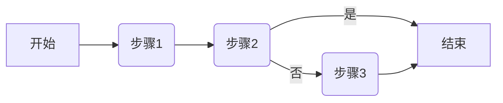
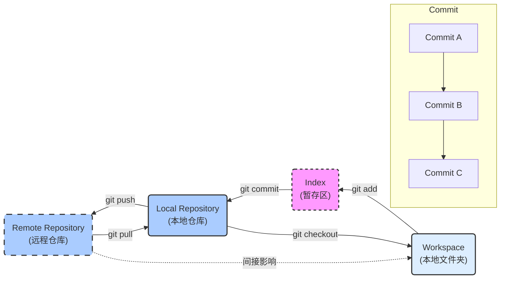
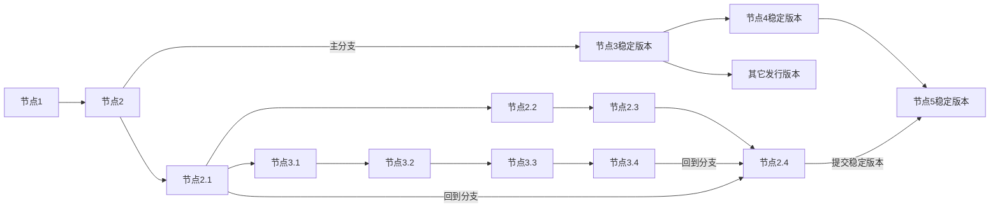
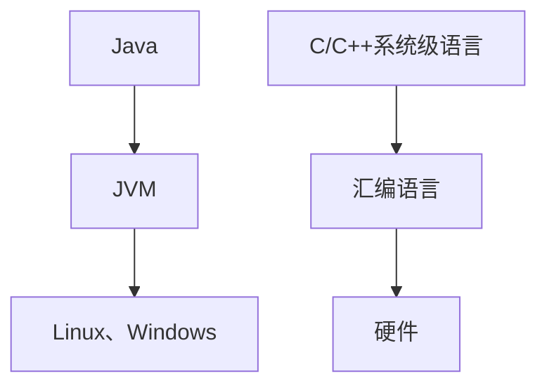
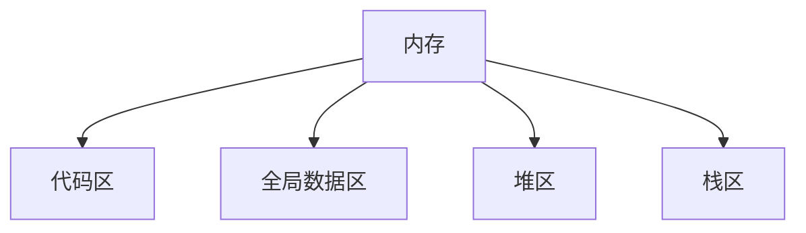
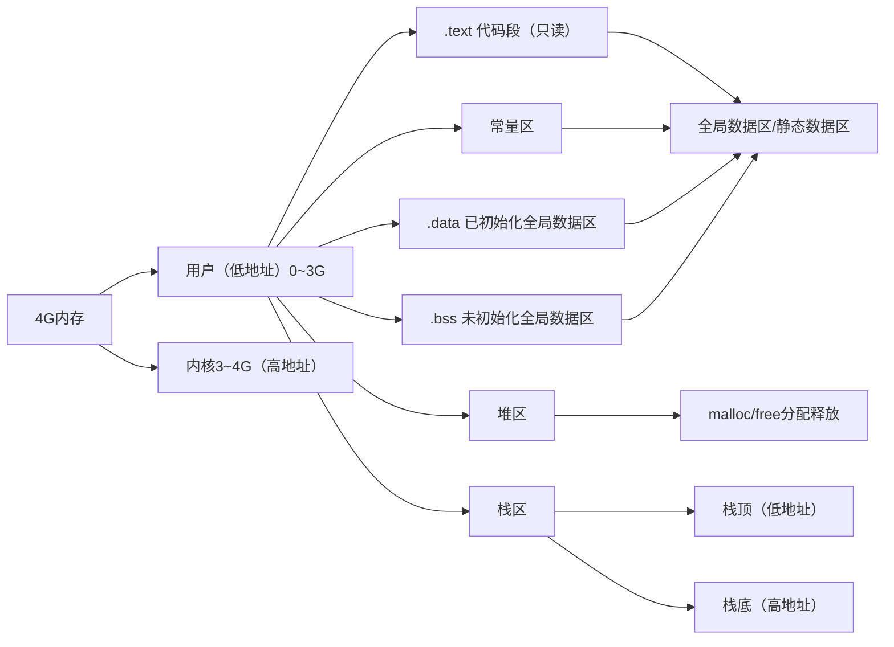

## 第一阶段

### 一、预科

``` markdown
* Ubuntu
* VSCode
* C语言基础
* Linux高级编程
* 数据结构
* 系统编程
* IO
* 并发编程
* 网络编程Socket
* 数据库编程
* C++
* QtGUI
* STM32
```

### 二、环境

#### 2.1 系统设置

##### 		2.1.1关闭防火墙

``` markdown
用于网络编程等开发环境
```

##### 		2.1.2文件扩展名

``` markdown
控制面板搜索文件资源管理器进行显示
```

#### 2.2 编辑器

##### 		2.2.1 文件编码

###### 2.2.1.1 编码类型

```  markdown
* gb2312
* gp936
* utf-8
```

###### 2.2.1.2 存储格式

``` markdown
* 单字符char 8位 256
* 多char用于存储更多字符
```

##### 2.2.2 VSCode编辑器

###### 2.2.2.1 注意事项

``` markdown
纯文本文件在Windows下不要用记事本打开（历史遗留问题）
```

###### 2.2.2.2 特性

``` markdown
* 跨平台，有丰富插件
* 安装中文插件和C/C++插件
```

##### 2.2.3 Vim编辑器

###### 2.2.3.1 命令模式

``` markdown
* hjkl 代替左下上右方向键
* yy 复制一行
* nyy 复制n行
* p 粘贴
* dd 删除一行
* nddd 删除n行
* u 撤销操作
* Ctrl+r 重做
* gg 回到开头位置
* G 回到最后位置
* 0 移动到当前行的行首
* $ 移动到当前行的行尾
* i 当前位置进入插入模式
* o 在下方插入空行，在空行进入插入模式
* a 光标后移一位进入插入模式
* I 回到当前行开头O进入插入模式
* O 在上方插入空行，在空行进入插入模式
* A 光标进入当前行末尾插入模式
```

``` bash
vim Test.c
#当文件不存在时会自动创建
#进入文件时即进入命令模式
```

###### 2.2.3.2 插入模式

``` markdown
可进行编辑操作
```

###### 2.2.3.3 底行模式

``` bash
#在命令模式下输入:进入底行模式"英文冒号"
#w 保存
#q 退出
#w！强制保存
#q！强制退出
#在底行模式连续按两次Esc进入命令模式
#3,5y复制3到5行
#p 粘贴
#3,5d删除3到5行
#set nu显示行号
#set nonu不显示行号
#n 进入第n行
#/ 查找字符串
#当查找到多个相同元素时，按n查找下一个
#3,4s/字符串1/字符串2
#替换选定范围匹配到的第一个字符串1
#3,4s/字符串1/字符串2/g
#%s/字符串1/字符串2
#替换全部范围匹配到的第一个字符串1
#%s/字符串1/字符串2/g
#替换全部范围匹配到的全部字符串1
```

###### 2.2.3.4 模式切换图


#### 2.3 配置虚拟机

##### 2.4.1 Ubuntu系统

``` markdown
Ctrl +Alt+t：打开终端
```

##### 2.4.2 设置Win和Linux共享目录

``` markdown
1.新建softeem文件夹（暂放D盘）
2./mnt/hgfs/softeem$ 位于VMware Linux的共享目录
```
##### 2.4.3 外部网络配置

``` markdown
桥接模式和NAT模式
```

#### 2.4 学习工具

##### 2.4.1  思维导图

``` markdown
CMMI 能力成熟度模型集成（实施开发标准）
过程域->目的->实践
```

##### 2.4.2 流程图



###### 2.4.2.1 图形含义

``` makedown
圆角矩形：开始与结束
矩形：行动方案
菱形：问题判断或判定（审核/审批/评审）环节
平行四边形：输入或输出
箭头：工作流方向
```

#### 2.5 Linux系统

##### 2.5.1 常用命令

###### 2.5.1.1 切换命令

``` bash
cd
#切换路径
cd /
#根目录
cd ./
#当前目录
cd ../
#上级目录
cd -
#上次目录
```

###### 2.5.1.2 查看命令

``` bash
pwd
#查看当前目录的绝对路径
ls
#查看当前目录下的文件
ls -a
#查看当前目录下的所有文件（包括隐藏文件）
ls -l
#查看当前目录下文件的详细信息
softeem@ubuntu:~$ ls -l
#文件名=文件类型+用户权限+组权限+其它权限+硬链接数+用户名+组名+文件大小+最近修改时间
drwxr-xr-x 2 softeem softeem    4096 Dec 10  2017 Documents
drwxr-xr-x 2 softeem softeem    4096 Dec 10  2017 Downloads
#开头一号位字符代表了不同的文件[bcd~lsp]
#-：普通文件
#d:目录
#b:block 块设备文件
#c:char 字符设备文件
#l:链接文件（软链接，硬链接）inode
#s:套接字文件
#p:管道文件
#--------------------------------
#开头二三四号位字符代表当前用户权限
#r:read可读
#w:write可写
#-:不可读/不可写
#开头五六七号位字符代表当前组权限
#--------------------------------
#后三位代表其它组用户权限
#--------------------------------
#权限后数字代表硬链接数
#--------------------------------
#硬链接数后是用户名和组名
#--------------------------------
#用户名后是大小和最近一次修改时间
cat 文件名
#查看文件内容
cat 文件名1 文件名2
#合并两个文件
```

###### 2.5.1.3 创建命令

``` bash
touch 文件名
#创建一个文件
mkdir 文件夹名
#创建一个目录/文件夹
mv 就文件名 新文件名
#更改文件名
```

###### 2.5.1.4 删除命令

``` shell
rm 文件名
#删除文件
rmdir 目录名
#删空目录
rm -r 目录名
#删非空目录
```

###### 2.5.1.5 复制命令

``` bash
cp 源文件名字 目标路径/新文件名
#复制文件
cp 源文件夹名字 目标路径/新文件目录名 -r
#-r代表递归，将整个目录进行拷贝
#复制文件目录
```

###### 2.5.1.6 系统命令

``` bash
clear
#终端清屏
poweroff
#关机
shutdown -h now
#关机
exit
#退出终端
```

###### 2.5.1.7 查询命令

``` bash
$ man 7 ascill
#查看ASCII编码
$ man 3 函数名
#查看对应函数信息
```

##### 2.5.2 快捷键

###### 2.5.2.1 终端命令

``` markdown
Ctrl+Alt+T 打开终端
Ctrl+Shift+N 新建终端
Ctrl+Shift+T 多标签页终端
Ctrl+Shift+'+' 终端放大
Ctrl+'-' 终端缩小
Ctrl+Alt+F7/F1 图形界面/终端界面
```

###### 2.5.2.2 补全命令

``` markdown
Tab 补全命令行代码
⬆⬇（方向键）使用历史命令
```

#### 2.6 Git版本控制

##### 2.6.1 git基本概念

###### 2.6.1.1 基本功能
``` markdown
分布式版本管理控制
```

###### 2.6.1.2 git组成

``` markdown
Index（缓存区）:master主分支，HEAD"指针",commit命令将缓存区文件提交到本地仓库
Repository（本地仓库）:
Workspace（工作区）:add指令将工作区文件提交到缓存区
Remote（远程仓库）
将路径纳入git中后出现的.git目录包含了本地仓库和缓存区
```


##### 2.6.2 git安装

``` markdown
Windows平台下安装
通过国内镜像地址快速下载
初学git时，安装使用默认选项即可
Linux环境下安装：
$ sudo apt-get install git
```

##### 2.6.2 git界面

``` bash
#水漫金山@DESKTOP-BRHPETA MINGW64 ~/Desktop/git-lerning (master)
#用户名+计算机名+windows平台特有标识+当前目录
#新装git需要配置全局用户信息
$ git config --global user.name "DamnJone"
$ git config --global user.email "2469463883@qq.com"
#邮箱地址用于区分提交用户，便于团队合作
$ git config --list
#查看配置
$ git init
$ git status
#目录中的中文名文件会显示乱码，需要配置
#左上角右键打开选项选择文本设置字符集UTF-8
$ git config --global core.quotepath false
#显示status编码
$ git config --global gui.encoding utf-8
#图形界面编码
$ git config --global i18n.commit.encoding utf-8
#提交信息编码
$ git config --global i18n.logoutputencoding utf-8
#输出log编码
$ export LESSCHARSET=utf-8
#git log 默认使用less分页， 需要bash对less命令进行utf-8编码
```

##### 2.6.3 git存储图解



``` markdown
Workspace:工作区
Index:缓存区
Repository:本地仓库
Remote:远程仓库
选定目录下的.git文件包括Repository和Index文件
```

##### 2.6.4 git基础语法

###### 2.6.4.1 提交与状态查看

``` bash
$ git status
#查看当前工作区的状态信息
$ git add README.txt
#将文件提交到缓存区
#缓存区只记录最后一次提交
$ git add .
#提交当前工作区下的所有文件
#部分文件打开时会在当前目录添加一个临时文件
#该操作会将临时文件也进行提交，注意！！！
On branch master
#在当前分支
No commits yet
Changes to be committed:
  (use "git rm --cached <file>..." to unstage)
        new file:   README.txt
Changes not staged for commit:
  (use "git add <file>..." to update what will be committed)
  (use "git restore <file>..." to discard changes in working directory)
        modified:   README.txt
```

###### 2.6.4.2 版本比较

``` bash
$ git add README.txt
#新创建和修改过的文件，都是用git add来添加到缓存区
$ git diff README.txt
#当工作区和本地仓库一致时该代码无输出
#实测比较的是缓存区版本和工作区修改过的版本
$ git diff README.txt
diff --git a/README.txt b/README.txt
#a代表修改前版本，b代表修改后版本
index 4ec7751..be9a177 100644
#由哈希方式生成修改前版本..修改后版本。
#100代表普通文件，64代表权限
--- a/README.txt
+++ b/README.txt
#---代表修改前版本
#+++代表修改后版本
@@ -1 +1,2 @@
#-改动前，+改动后，1、2代表第一行开始的连续两行
-This is a sentence.
\ No newline at end of file
+This is a sentence.
+The second line.
\ No newline at end of file
#-之前版本
#+之后版本
$ git difftool README.txt
#会通过对比展示改动前和改动后的版本
```

###### 2.6.4.3 日志管理

``` bash
$ git add README.txt
#文件跟踪只能针对纯文本文件，如果是二进制文件，只会跟踪文件的大小
$ git commit -m "This is a commit"
#提交至仓库,可加备注
$ git log
#查看提交日志
$ git log Example.txt
#Example.txt提交了三次修改和日志
commit ffedbd25ce9a80a7861e09773edcbf0278ad9aba (HEAD -> master)
#commit 后面为该次提交的ID，该标识码唯一
#master 代表主分支
#HEAD 可以理解C语言指针，指向该分区
#正式的开发一般不会位于主分支
Author: DamnJone <2469463883@qq.com>
#提交用户的信息
Date:   Wed Jul 3 10:22:52 2024 +0800
#提交时间
    This is the third modification.

commit 121846a858cf39fa7d53ffa610adfaf10ba7734c
Author: DamnJone <2469463883@qq.com>
Date:   Wed Jul 3 10:19:53 2024 +0800

    This is the second modification.

commit 818cb8dd08c8c957a05fb2465af296e27101018d
Author: DamnJone <2469463883@qq.com>
Date:   Wed Jul 3 10:18:41 2024 +0800

    This is the first modification.
#顶部信息为最后一次提交
$ git log --pretty=oneline
#一行显示一次提交
$ git log --pretty=oneline Example.txt
#显示该目录下指定文件的提交（每次单行显示）
```

###### 2.6.4.4 版本穿梭

``` bash
$ git reset --hard HEAD^
#将HEAD"指针"指向上一个节点
$ git reset --hard HEAD^^
#将HEAD"指针"指向上上一个节点,以此类推
#执行操作后，文件将回退上一个版本
$ git reset --hard ffedbd25ce9a80a7861e09773edcbf0278ad9aba
#将HEAD替换为版本ID，即回到对应版本
$ git reflog
#查看所有日志，包括版本回退后的状态
```

###### 2.6.4.5 分支管理



``` bash
#分支策略
#Master:主分支，正式版本
#Dev:开发版本
#在开发版本上新建个人分支进行团队协作
#当个人分支成熟后合并到dev分支
#团队成员都会含有master分支和dev分支
#用HEAD指向可合并和切换分支
$ git branch
#查看分支
$ git switch -c dev
$ git branch 分支名
#创建一个分支
$ git switch 分支名
#切换一个分支
$ git merge 分支名
#将分支合并到当前分支
$ git branch -d 分支名
水漫金山@DESKTOP-BRHPETA MINGW64 ~/Desktop/1 (master)
$ git merge dev
Auto-merging a.txt
CONFLICT (content): Merge conflict in a.txt
Automatic merge failed; fix conflicts and then commit the result.
#发生冲突，自动合并失败
水漫金山@DESKTOP-BRHPETA MINGW64 ~/Desktop/1 (master|MERGING)
$ cat a.txt
a
<<<<<<< HEAD
master
=======
dev
>>>>>>> dev
#手动合并过程
#分支合并策略
#当dev再次提交之后
$ git merge 分支名
#会自动把最新的dev作为master的下一个版本
#HEAD指针回退会出现问题
$ git merge --no--ff dev
#普通合并模式，会产生新的提交
```

###### 2.6.4.6 撤销工作区

``` bash
#1.新文件，没有在缓冲区中add过，也没有commit过
#处理：直接删除
$ rm 新文件
#2.修改文件
#a.缓存区存过（add）,没有commit过
#b.缓存区空了,commit过
$ git checkout HEAD--README.txt
#相当于撤销工作区未add的操作，回退到上一次add的版本。
#用缓存区覆盖工作区
$ git restore 文件名
#将缓存区文件取出覆盖工作区
#也能将本地仓库文件取出覆盖工作区
#缓存区和本地仓库哪个新用哪个
```

###### 2.6.4.7 撤销缓存区

``` bash
#首先工作区的状态是干净的
#然后，修改文件，做一次add
$ git reset HEAD readme.txt
Unstaged changes after reset:
M       readme.txt
#该命令会撤销add操作，将文件从缓存区放回工作区
#用缓存区覆盖工作区
#想完全撤销就继续使用工作区撤销的方式。
$ git restore --staged 文件名
```

###### 2.6.4.8 撤销本地仓库

``` bash
#实质：版本回退
$ git reset --hard <commit id>
```

###### 2.6.4.9 删除操作

``` bash
$ git rm 文件名
$ git rm -f 文件名
#强制删除
```

##### 2.6.5 最佳使用方案

``` bash
$ git add 文件名
#git使用的最佳方案
#多次git add 提交到缓存区
#一次 git commit 提交到本地仓库
```

##### 2.6.6 创建远程私有库

###### 2.6.6.1 gitee注册和添加公钥

``` bash
$ ssh-keygen -t rsa -C "邮箱"
#生成公钥，位于C盘用户目录下的.ssh目录
#用VSCode打开.pub文件
#将内容复制进gitee的SSH公钥
```

###### 2.6.6.2 创建仓库

``` markdown
页面右上角加号添加仓库
仓库名使用英文
```

###### 2.6.6.3 关联本地仓库与远程仓库

``` bash
#先创建一个本地仓库
$ git remote add 名称 仓库地址(SSH)
#可以做两次不同远程仓库的关联
#git默认名称origin,可修改。
$ git push -u 名称 master
#本地仓库的内容推送到远程库
#第一次推送＋-u,git不但会把本地的master分支推送到远程库的master分支，还会把本地的master分支跟远程库的master分支关联起来，关联以后可简化指令不用加u。
$ git pull 名称 分支名
#将远程库的内容推送到本地
#在远程仓库界面查看克隆和下载选项可得到ssh链接
#在push之前先从远程仓库拉取再合并
```

###### 2.6.6.4 解除本地仓库与远程仓库关联

``` bash
$ git remote -v
#查看远程库信息
GitLearning     git@gitee.com:damnjone/git-lerning.git (fetch)
GitLearning     git@gitee.com:damnjone/git-lerning.git (push)
#根据名字进行删除
$ git remote rm GitLearning
#删除选定远程库
```

###### 2.6.6.5 克隆远程仓库

``` bash
$ git clone 地址
#在本地运行克隆指令后，会新建一个仓库目录
```

#### 2.7 Gdb调试工具

##### 2.7.1 启动与退出

``` markdown
启动GDB：使用gdb [可执行文件名]命令启动GDB，并装入想要调试的可执行文件。
退出GDB：使用quit或简写为q命令退出GDB调试器。
```

##### 2.7.2 程序运行控制

``` markdown
运行程序：使用run或简写为r命令启动或重启被调试的程序。如果程序已经启动，再次输入run会重启程序。
继续执行：使用continue或简写为c命令让程序继续运行，直到遇到下一个断点或程序结束。
单步执行：
next或简写为n：单步执行，遇到函数调用时不会进入函数体内部，而是直接跳过。
step或简写为s：单步执行，遇到函数调用时会进入函数体内部。
跳转到指定位置：使用jump命令让程序执行流跳转到指定位置执行。
```

##### 2.7.3 断点管理

``` markdown
设置断点：
break或简写为b：在指定行号、函数名或程序地址处设置断点。例如，break 10在第10行设置断点，break main在main函数入口处设置断点。
设置条件断点：break 10 if i==5在第10行设置条件断点，当i等于5时触发。
查看断点：使用info break或简写为i b命令查看当前设置的断点信息。
删除断点：
delete：删除指定编号的断点，如delete 1删除编号为1的断点。
delete不加编号时，删除所有断点。
clear命令用于删除指定位置处的所有断点，如clear 10删除第10行上的所有断点。
启用/禁用断点：使用enable和disable命令启用或禁用指定编号的断点。
```

##### 2.7.4 查看与修改

``` markdown
查看源代码：使用`list`或简写为`l`命令查看当前文件的源代码。可以指定行号或函数名来查看特定部分的代码。
查看变量值：使用`print`或简写为`p`命令查看变量的值。也可以输出特定表达式的计算结果。
修改变量值：使用`set var`命令在调试过程中修改变量的值，如`set var i=10`将变量`i`的值修改为10。
```

##### 2.7.5 其他常用命令

``` markdown
查看堆栈信息：使用`backtrace`或简写为`bt`命令查看当前线程的调用堆栈。
自动查看变量：使用`display`命令在每次断点处自动显示指定变量的值。使用`undisplay`命令取消自动显示。
监视变量：使用`watch`命令监视变量的值，当变量的值发生变化时，程序会停止执行。
查看当前线程：使用`info thread`命令查看当前进程中的所有线程信息。
切换线程：使用`thread`命令切换到指定编号的线程进行调试。
```

### 三、C语言基础

#### 	3.1 语言特性

``` markdown
面向过程、面向对象、泛型编程
```

#### 	3.2 语言发展过程

##### 3.2.1 机器语言示例

``` plaintext
010110110101010
```
##### 3.2.2 汇编语言示例

``` assembly
mov eax, n
add eax, 2
mov n, eax
```
##### 3.2.3 高级语言示例

``` c
n=n+2;
```
##### 3.2.4 语言发展过程



``` markdown
机器语言->汇编语言
(会汇编语言薪资更高)
C++语言高效
用于多数大规模项目开发
```

#### 	3.3 C语言概念

``` c
//工业级C语言一般采用C89(ANSI C)标准
//开发阶段一般使用C99标准
```
#### 	3.4 C语言概要

##### 3.4.1 知识点概览

``` markdown
语句、表达式、数据类型、变量、占用字节数、输入输出
运算操作符（算术、位、逻辑、关系）
循环
分支
数组（一维数组、二维数组）
函数（返回值类型，参数传递方式，封装）
复杂函数（递归函数，静态函数，回调函数，变参函数）
指针（定义、运算、一级指针、二级指针）
内存管理
字符串指针、字符数组、内存分布
复杂数据结构（结构体、大小、结构体数组、共用体、枚举、复杂宏定义，条件编译）
代码评审
```

##### 3.4.2 程序概念

``` markdown
程序=数据结构+算法
```

#### 	3.5 编程开发工具

##### 3.5.1 不同平台的开发工具

``` markdown
Windows平台：Visual Studio IDE（Office, Wps, QQ, Wechat) 游戏
x Ubuntu：编辑器vim emacs VSCode、编译器GCC、调试器GDB（分部件）Git：代码管理工具
```

##### 3.5.2 Visual Studio IDE

###### 3.5.2.1 版本选择与下载

``` markdown
新版IDE可能存在不稳定或出现BUG等情况，推荐2017 15.9版本
```

``` markdown
不同公司的项目可能要依赖不同的库而选择不同的VS版本进行使用
```

``` markdown
//资源网站
https://msdn.itellyou.cn/
```

###### 3.5.2.2 项目创建与打开

``` markdown
最好使用英文目录
```

###### 3.5.2.3 常用热键

``` markdown
F7:编译
F9:光标处切换断点
F5:开始/继续调试，到下一个断点
Shift+F5:停止调试
F11:逐语句，会进入函数
F10:逐过程，不会进入函数
```

###### 3.5.2.4 常用配置

``` markdown
右键项目名称进入属性界面
可以设置链接库，预处理器等
```

#### 	3.6 C语言学习

##### 3.6.1 程序与文件结构

###### 3.6.1.1 简单C程序示例

``` c
//第一个简单C程序
#include<stdio.h>
//由<>定义的处于系统文件
//由""定义的处于当前目录
//包含头文件
//主函数也是被调用的函数
//返回值最好是int类型，返回0代表结果正常
int main(int argc, char* argv[])
//标准main函数
//argc 参数个数 char* argv[]字符指针数组
//cd E:\文件
//argv[0]="cd"
//argc[1]="E:\文件"
{
    printf("Hello, World\n");
    //语句以分号结尾
    return 0;
}
//分组以花括号表示
//代码结束，会进行资源管理工作

//封装函数，最好进行防御性编程
//避免他人随意调用出现错误
```

###### 3.6.1.2 多文件组织

``` c
//头文件包括宏定义，常量，类型，函数声明
//#include<xxxx.h>编译器从系统目录查找头文件
//#include"xxxx.h"编译器从当前目录查找头文件
```

##### 3.6.2 C语言编译过程

###### 3.6.2.1 单文件编译

``` bash
#Linux环境编译C代码

#gcc编译程序：依赖于.h .so .a
gcc Test.c -o Test
#编译Test.c文件，不添加-o Test的话会生成一个Test.out文件
#生成的文件为可执行文件
#四个步骤一气呵成
gcc Test.c -o Test.i -E
#预处理，展开头文件
gcc Test.i -o Test.s -S
#编译，汇编文件
gcc Test.s -0 Test.o -c
#汇编，机器语言
gcc Test.o -o Test.out
#链接，生成可执行二进制文件

#-l 链接某个库，如 libabc.so -labc libabc.a -labc libabc.a or libabc.so
libaaa.a -laaa.a
#-L 指定库目录 如-L/mnt/hgs
readelf -a Test
#查看文件信息
#-I 指定头文件目录

#.dll .so动态链接库
#.lib .a静态链接库

#程序=数据结构+算法
#可执行文件=代码+数据+依赖+依赖库中的函数地址
gc  -m32 <filename.c>
#以32位程序编译
```


###### 3.6.2.2 多文件联合编译

```bash
$ gcc 文件1.c 文件2.c -o 文件名
#确保只有一个main函数
```

###### 3.6.2.3 条件编译

``` c
#if <条件>
//当条件为1时编译代码块
//当条件为0时不编译代码块
//代码块
#endif

#if NUM
#endif
//gcc -DNUM=1 myfile.c
```

``` c
#ifndef HEAD_H
#define HEAD_H
//代码块
#endif
//避免头文件重定义
```

``` c
#define WITH_LOG
//控制开关
#ifdef WITH_LOG
#define LOG(msg) printf("%s:%s:%d %s\n",__FILE__,__func__,__LINE__,(msg))
//打印文件名函数名行数
#else
#define LOG(msg)
#endif

int main(void)
{
    LOG("abc");
    return 0;
}
```

##### 3.6.3 内存分区模型

###### 3.6.3.1 分区内容

``` markdown
代码区：存放函数体的二进制代码
全局区：存放全局变量和静态变量以及常量
-常量区：字符串常量
*全局数据区又叫静态数据区*
栈区：由编译器自动分配释放，存放函数的参数值，局部变量等
堆区：由程序员分配和释放，若程序员不释放，程序结束时由操作系统回收
```
###### 3.6.3.2 数据存放

| 数据类型 | 全局变量       | 静态全局变量   | 局部变量 | 静态局部变量 |
| -------- | -------------- | -------------- | -------- | ------------ |
| 定义位置 | 源文件函数体外 | 源文件函数体外 | 函数体内 | 函数体内     |
| 存放位置 | 全局数据区     | 全局数据区     | 栈区     | 全局数据区   |
| 生命周期 | 整个程序       | 整个程序       | 当前函数 | 整个程序     |
| 作用域   | 整个程序       | 当前源文件     | 当前函数 | 当前函数     |

``` markdown
静态局部变量,只在第一次调用函数时初始化静态局部变量，后面再调用就不会进行初始化,会直接跳过该语句。
静态函数，只能在当前源文件使用。
函数可以在整个程序用。
(static)修饰改变了作用域。
```

###### 3.6.3.2 内存分布图解





##### 3.6.4 进制

###### 3.6.4.1 常见进制及转换

``` markdown
八进制和十六进制方便阅读和使用。
N进制->十进制:Σ(位值×权值)
十进制->N进制:短除法（侧列逆写）
十进制小数->二进制:循环Num×2,进位则1，不进位则0
```

##### 3.6.5 变量

###### 3.6.5.1 变量作用

``` c
//变量和常量用于表示内存某一块区域
//变量标识的这一区域可以修改
```

###### 3.6.5.2 常见变量

``` C
//Linux64平台下的大小
char ch;//1 Byte
short sh;//2 Byte
int i;//4 Byte
long l;//8 Byte
long long ll;//8 Byte
float f;//4 Byte
double d;//8 Byte
//Linux32平台下的大小
long l;//4 Byte
double Size=sizeof(Element Type);
//sizeof()是运算符，在编译期间即计算出大小
//所有类型的数据都以二进制补码的形式存储
```

###### 3.6.5.3 声明赋值

``` c
//声明，在内存栈区开辟一块内存空间用于存放变量。
//类型+变量名称
int i;
i=10;//赋值
//初始化
int j=10;
//只声明不初始化，内存中含有脏数据
//初始化比声明赋值速度快，不用执行赋值语句
//全局变量不初始化，默认值为0
//全局变量位于全局数据区
//局部变量不初始化，默认为脏数据；
//局部变量位于栈区
//企业级开发默认初始化，便于阅读代码
int i=1.9827;
//当将浮点型赋值给整型，只保留整数部分，即i=1
```

###### 3.6.5.4 整数数据类型

``` markdown
有符号的数=最高位符号位+有效数据位
无符号的数=所有的位都是有效的数据位
```

###### 3.6.5.5 小数数据类型

``` markdown
1.十进制：1.2345
2.指数方式：2.1E7 1.3E-5(大小写皆可)
```

``` c
float f = 1.23;
double d = 2.1e5;
printf("%f\n", f);
printf("%lf\n", d);
printf("%e\n", f);
printf("%E\n", f);
printf("%le\n", d);
printf("%lE\n", d);
//%f 用十进制打印float
//%lf 用十进制打印double
//%e 以指数形式输出float类型（小写e)
//%E 以指数形式输出float类型（大写E）
//%le 以指数形式输出double类型（小写e)
//%lE 以指数形式输出double类型（大写E）
printf("%g\n", f);
printf("%g\n", d);
//%g/%G 以最短的形式输出小数，最多保留6位，不会添0
```

###### 3.6.5.6 字符数据类型

``` c
char a='a';
printf("%c\n",a);
//以字符形式打印
//中文等特殊字符存储超过一个char的大小
//考虑用int等进行特殊字符的存储
//转义字符'\n'等为一个字符
char a='\n';//换行符
char b='\t';//制表符
char d='\104';//三位，不带x表示用8进制表示一个数
char f='\x23';//16进制转义字符
char g=0x23;//16进制表示一个字符#
```

###### 3.6.5.7 字符串类型表示

``` c
char str[]="这是一个字符串";
const char* str="这是一个字符串";
pintf("%s\n",str);
puts(str);
```

###### 3.6.5.8 数据类型转换

``` c
//自动转换
int value=10.73
//由浮点型自动转换为整型，舍弃.73
//存储小的会自动的向存储大的转换
//数据类型相同的情况下
//有符号数会转换为无符号数
//强制转换
double sum=(double)10/3;
//"宽"数据向"窄"数据转换
//会截取低位数据
//注意数据一输入到计算机就以补码形式存储
//！！！截取也是在补码上进行操作的
//低类型向高类型转换，是在原码的基础上补0，再转换为补码
//直接操作补码，则负数补1，正数补0
```

###### 3.6.5.9 计算机数据存储

``` markdown
原码:本身
反码:原码取反（除了符号位都取反）
补码:正数，补码=原码;负数，补码=原码取反+1
!!!整数的反码补码都与原码一致
计算机中所有的数据都使用补码存储
!!!截断的基础是在数据的补码上
原码的加减运算都能转换为对应补码的加运算
有效精简了运算电路（只用设计加法计算器）
例：-129
	原码：1 1000 0001
	反码：1 0111 1110
	补码：1 0111 1111
	当将-129赋值给一个字节的char类型时，
	截取补码的8位，即0111 1111，结果为127
	注意数据一输入到计算机就以补码形式存储
	！！！截取也是在补码上进行操作的
例：-8在8位系统中的表示
	原码：10001000
	反码：11110111
	补码：11111000
1 B(Byte) = 8 b(bit)
1 kB = 1024 B
1 kb = 1024 b
ASCII编码
```

###### 3.6.5.10 类型重定义

``` c
typedef int size_t;
//定义size_t为int的别名
typedef int int32_t;
typedef long int64_t;

typedef int Array[20];
Array array;
//相当于int array[20];

typedef int (*ptr)[3];

typedef int* (*FuncPtr)(int,int);
//定义函数指针类型
typedef int* (*OP)(int, int);
int calculator(int num1,OP funcptr,int num2){
    return (*funcptr)(num1, num2);
}
```

###### 3.6.5.11 字节对齐

``` c
//对于特定数据类型，地址为类型的整数倍，寻址更高效。
//如int对齐为4的倍数
//结构体中的字节对齐
//前一个成员是否会补齐看后一个成员
```

###### 3.6.5.12 枚举类型

``` c
enum Week{
    MON;//0
    TUES;//1
    WED;//2
    THUR;//3
    FRI;//4
    SAT;//5
    SUN;//6
}
//当枚举类型初始化不给值会自动赋值
//当其中一个常量给值后，会自动调整后面元素的值
//枚举类型是常量，本质是整型
```

##### 3.6.6 标准IO

###### 3.6.6.1 输出语句

``` c
int Base_2 = 0b100;  // 2进制
int Base_8 = 0100;   // 8进制
int Base_10 = 100;   // 10进制
int Base_16 = 0x100; // 16进制

printf("100(2)=%d\n", Base_2);
printf("100(8)=%d\n", Base_8);
printf("100(10)=%d\n", Base_10);
printf("100(16)=%d\n", Base_16);
// 以十进制输出不同进制数

printf("100(8)=%o\n", Base_8);
// 以八进制格式输出

printf("100(16)=%x\n", Base_16);
// a~f以小写输出
printf("100(16)=%X\n", Base_16);
// A~F以大写输出
printf("100(16)=%#x\n", Base_16);
// 带0x前缀，a~f以小写输出
printf("100(16)=%#X\n", Base_16);
// 带0x前缀，A~F以大写输出

float floatNum = 1.2345;
printf("f=%.3f", floatNum);
// 精度控制3位小数

char str[] = "这是一个字符串";
printf("%s\n", str);

puts(str); // 输出字符串
putc(ch);  // 输出字符
// 会自动换行

printf("%%");
// 两个百分号才会输出一个百分号
//%d 输出10进制的有符号数int类型
//%x 输出16进制的int类型
//%X 大写输出16进制的int类型
//%u 输出10进制的无符号的int类型

//程序需要刷新缓冲区
//'/n'或用fflush(std)

//%nd 用于格式化输出，保证左右对齐，确保输出占n位
printf("%4d",1);
//输出结果___1
printf("%-4d",1);
//输出结果1___
```

``` c
//颜色输出控制
//彩色输出是通过在字符串中嵌入特定的转义序列来实现的，这些转义序列通常被称为ANSI转义序列（ANSI escape sequences）。这些序列在大多数现代终端和命令行界面中都是受支持的，包括Windows的CMD、PowerShell、Linux的终端以及各种IDE中的内置终端等。
#include <stdio.h>  
  
// 定义ANSI颜色代码  
#define ANSI_COLOR_RED   "\x1b[31m"  
#define ANSI_COLOR_GREEN "\x1b[32m"  
#define ANSI_COLOR_RESET "\x1b[0m"  
  
int main() {  
    // 在控制台中打印红色文本  
    printf(ANSI_COLOR_RED "This text is red.\n" ANSI_COLOR_RESET);  
  
    // 在控制台中打印绿色文本  
    printf(ANSI_COLOR_GREEN "This text is green.\n" ANSI_COLOR_RESET);  
  
    // 注意：使用ANSI_COLOR_RESET来重置颜色，以避免后续文本也被着色  
  
    return 0;  
}
```

###### 3.6.6.2 输入语句

``` c
int a=0;
scanf("%d",&a);
char str[100];
scanf("%s",str);
//str 作为数组首元素地址传入
//%d 输入10进制的有符号数int类型
//%x 输入16进制的int类型
//%u 输入10进制的无符号的int类型
//%s 输入字符串
//程序运行时遇到sanf函数，程序会挂起
scanf("%d+%f-%u %s",&a ,&b, &u, %s);
//控制台应该严格输入格式
//如此时10+10.0-16 字符串
//scanf读取字符串遇到空格或换行会停止读取
gets(<charArray>);
//读取字符串直到遇到换行符
//gets不安全，字符数组必须足够大
fgets(<charArray>,<size>,<istream>);
fgets(str,SIZE,stdin);
//安全版本的输入
```

##### 3.6.7 标识符

###### 3.6.7.1 定义

``` c
//变量名、函数名、宏定义所有的名称即为标识符
```

###### 3.6.7.2 命名规范

``` c
//标识符只能以字母、下划线、美元符号开头
//不能使用关键字作为标识符
```

##### 3.6.8 关键字

###### 3.6.8.1 定义

``` c
//有特殊含义的名称称关键字
```

###### 3.6.8.2 常见关键字

``` c
//数据类型
// int short long char float double void struct union signed unsigned enum

//控制语句
//for while do while do break continue
//if else switch case goto case default
//return

//存储类型
//auto static extern regigster(寄存器)

//其它
//const sizeof typedef volatile
```

##### 3.6.9  运算符

###### 3.6.9.1 算数运算符

``` c
int x=1;
int y=2;
int result=0;
result=x+y;//加法
result=x-y;//减法
result=x*y;//乘法
result=x/y;//除法
result=x%y;//取余

x=x <operation> <num>;
x <operation>=<num>;
//一种语句的简写方式

Num++;
//先参与计算后自增
++Num;
//先自增后参与计算
```

###### 3.6.9.2 关系运算符

``` c
int a = 5;
int b = 3;
printf("%d < %d=%d\n", a, b, a < b);
printf("%d <= %d=%d\n", a, b, a <= b);
printf("%d > %d=%d\n", a, b, a > b);
printf("%d >= %d=%d\n", a, b, a >= b);
printf("%d == %d=%d\n", a, b, a == b);
printf("%d != %d=%d\n", a, b, a != b);
//运算结果为0或1
```

###### 3.6.9.3 位运算符

``` c
//按位取反 ~
//按位与 &
//按位或 |
//异或 ^
//左移 << 扩大进制倍
//右移 >> 缩小进制倍

//最右侧算作0位
int a=3;
int b=5;
a=a^b;
b=a^b;
a=a^b;
//交换两个数(通过异或运算)
```

###### 3.6.9.4 逻辑运算符

``` c
int a=0,b=1;
&& //逻辑与
|| //逻辑或
！ //逻辑非
```

###### 3.6.9.5 三元运算符

``` c
int age=20;
int result=age>18? 1:0;
```

###### 3.6.9.5 运算符优先级

``` markdown
单目右>单目左>算术>关系>逻辑单>逻辑双>逻辑三>赋值>逗号
逻辑非运算符>算术运算符>关系运算符>与、或逻辑运算符>赋值运算符
```

##### 3.6.10 随机数

###### 3.6.10.1 分类

``` markdown
真随机数
伪随机数
c语言一般实现伪随机数
```

###### 3.6.10.2 时间实现

``` c
#include<time.h>
time_t seconds=time(0);
srand(seconds);//设置随机数种子
//随机数种子只需要初始化一次
//如果将取随机数封装函数使用
//初始化种子应放在main函数中
int n=rand()%8;//0~8之间的数，不包括8;
```

##### 3.6.11 分支和循环结构

###### 3.6.11.1 分支结构if...else

``` c
int num01=5;
int num02=10;
int num03=15;
if(num01==5)
    printf("num01>num02");
//单if语句
if(num01>num02)
    printf("num01>num02");
else
    printf("num01<num02");
//if...else组合
if(num01>num02)
    printf("语句1");
else if(num01>num03)
    printf("语句2");
else 
    printf("语句3");
//if...else if...else组合
if(num01>num02)
    if(num01>num03)
        printf("语句");
//嵌套if组合
//if条件表达式可以使用逻辑运算符
//条件判断，从上至下依次判断
//判断条件依次递增即可
//浮点数比较
//浮点数本身不准确，不能用==简单比较
//用差值比较精度，（可以作四舍五入的条件）
float f=0.5;
int abs=0.00001;
if((f-0.5)<=abs)
    printf("true\n");
```

###### 3.6.11.2 选择结构switch case

``` c
<Type> Option;
scanf("%<>",&Option);
//Option的值只能是整型，字符型，枚举型
switch(Option)
{
    case <value01>:
        <code01>;
        break;
    case <value02>:
        <code02>;
        break;
    default:
        <code03>;
        break;
}
```

###### 3.6.11.2 循环结构while

``` c
while(<条件表达式>)
    //当条件表达式为真时进入循环
    //需要有循环退出条件，避免死循环
    //在Linux下死循环用Ctrl+c退出死循环
    //可能一次都不会执行
```

###### 3.6.11.3 循环结构do{ }while( )

``` c
do{
    <code block>
}while(<条件>);
//至少会执行一次
```

###### 3.6.11.4循环结构for

``` c
int i=0;
int sum=0;
for(i;i<101;i++)
{
    //语句2条件为真时执行代码块
    //语句2条件为假时退出循环
    sum=sum+i;
}
//for(语句1;语句2;语句3)
//先执行语句1
//再执行条件判断语句2
//后执行语句3
//break可用于退出循环
//continue结束本次循环，进入下一次循环
```

###### 3.6.11.5 goto语句

``` c
label:
//标签，记录goto点
	if(i<10)
    {
        printf("i = %d\n",i);
        i++;
        goto label;
    }
//用goto语句模拟循环
```

##### 3.6.12 数组

###### 3.6.12.1 数组概念

``` c
<Typename> <ArrayName>[<size>];
//一片用于存储同类型元素的存储空间
//C中，创建时是静态，已经确定了大小
//元素的类型也是数组的类型
//通常情况下数组名代表首元素地址
//数组下标从0开始
int Test01[100];
//定长数组
int Test02[]={1,2,3,4,5};
//柔性数组
int n=0;
scanf("%d",n);
int array[n];
//变长数组，此操作不推荐，只能在Linux Gcc下编译
//*(<ArrayName>+i)
//数组的底层逻辑是指针
//在sizeof(ArrayName)和&ArrayName中ArrayName代表整个数组
//类型皆为<Type>[<size>]
//&ArrayName==><Type> (*)[Size];
//指向整个数组的指针
//C语言的数组都是静态的
//gcc编译越界错误时，能通过，但运行时会出问题
memset(<arrayname>,0,sizeof(<arrayname>);
//给数组清零 
```

###### 3.6.12.2 数组内存占用

``` c
printf("数组占用内存的大小：%d",sizeof(<ArrayName>));
//求取数组占用内存
```

###### 3.6.12.2 数组初始化

``` c
int Array[4]={0,1,2,3};
int Test03[100]={1,2,3};
//数组长度为100，前三个元素初始化为1、2、3
//后面元素全部初始化为0；
int Array[100]={[0 ... 30]=10,[31 ... 60]=20,[61 ... 99]=30};
//范围初始化，此操作不推荐，只能在Linux Gcc下编译
<ArrayName>[Index]=<Value>;
//数组元素的赋值
```

###### 3.6.12.3 数组遍历

``` c
int Array[100];
for(int i=0;i<100;i++)
{
    printf("%d",Array[i]);
}
//循环遍历时的范围是数值，称魔术字
//在修改数组大小时，需要同步修改遍历范围
//在正式开发中不推荐，易出错
int length=sizeof(Array)/sizeof(Array[0]);
//通过这种方法获取数组长度更易于维护
```

###### 3.6.12.4 二维数组

``` c
int array[3][4]=
{//子数组可不带括号
    //可只初始化部分元素，其余元素补0
    {1,2,3,4},
    {5,6,7,8},
    {9,10,11,12},
};
//初始化时，行和列至少需要列数
//数组初始化不能存在歧义
//二维数组在C语言的存储形式为线性存储
//逻辑上是矩阵存储
int rows=sizeof(array)/sizeof(array[0]);
int cols=sizeof(array[0]/sizeof(array[0][0]));
//获取二维数组行数列数
int temp=*((*array+i)+j);
//用指针访问二维数组
// *(array + i) 是指向 array 中第i+1个子数组的指针
//+ j指向这个子数组中的第j+1个元素（索引为j）
//*((*array+i)+j)即为该元素的值
```

###### 3.6.12.5 多维数组

``` c
int array[i][j][k];
//平常很难遇到，初始化与一二维数组类似
//数组拆解
//第一层array[i] 第二层int[j][k] 第三层int[k]
//int (*funPtr)[4](int, int);
```

###### 3.6.12.6 字符数组

``` c
//C语言字符串以'\0'结尾
//字符数组存储的不一定是字符串
char str[]={'a','b','c'};
char str1[]={"abc"};
char str2[]="abc";
//字符数组初始化
int length=strlen(str);
//获取字符串长度，不包括'\0'
int size=sizeof(str);
//获取字符数组大小，包括'\0'
//字符串本身是常量，不能直接赋值
//可以对单个字符进行赋值
//可以用strcpy()修改

//字符串常用函数（位于string.h>)
strlen(str);
//获取字符串长度
strcpy(<newstr>,<origin>);
//复制字符串
strncpy(*dest,*src);
//安全版本
strcat(*dest,*src);
//拼接字符串
strncat(*dest,*src);
//安全版本
strcmp(str0,str1);
//比较字符串,相同返回0，不同返回-1
int length=sprintf(<目标字符串>,<格式字符串>,<格式字符串参数>)
//将格式化数据写入字符串，不成功返回-1
char s[]="a=10,b=20";
int a=0;
int b=0;
sscanf(s,"a=%d,b=%d",&a,&b);
//格式化字符串中读取数值，不成功返回-1 
char src[]="abcdef12345";
char *p=strchr(src,'d');
//查找指定字符，找到第一个，返回当前位置指针，没找到返回NULL
//位于string.h
strstr(<源字符串><子串>);
//查找子串
char src[]="abc*def*ghi*jkl*mno";
char* s=strtok(src,"*");
//分割字符串,返回第一个被分割的
//分割点会被置空'\0'
while (s != NULL)
{
	printf("%s\n", s);
	s = strtok(NULL, "*");
    //传递空值会调用上次字符串
}
//字符串转换函数(位于stdlib.h)
//atoi字符串整数
//atof字符串到浮点数
//itoa整数到字符串
//会忽略空格
//遇到除e外的字符会失败
//科学技术法能转换
//转换失败返回0
char str[4][32];
//二维字符数组
char* str[4];
```

###### 3.6.12.7 结构体数组

``` c
struct Student
{
    char names[20];
    int age;
}stu[20];
//创建结构体数组
```

###### 3.6.12.8 函数指针数组

```c
int add(int num1,int num2)
{
    return num1 + num2;
}
int sub(int num1, int num2)
{
    return num1 - num2;
}
int mul(int num1, int num2)
{
    return num1 * num2;
}
int div(int num1, int num2)
{
    return num1 / num2;
}
int (*operation[4])(int,int)={add,sub,mul,div};
int result=(*operation[0])(2,4);
```

##### 3.6.13 函数

###### 3.6.13.1 函数概念

``` c
//函数的局部变量存放在栈中（节省内存）
//封装函数可提高代码的重用性和可维护性
int add(int num1,int num2)
{
    //函数体
    return num1+num2;
    //num1和num2为形参
}
//头文件+函数名+功能
//返回值（代码规范）

//函数执行过程:
//函数形参先压栈

void function()
{
    //函数体
}
//当function定义在其它文件
//可以使用extern 函数声明在其它源文件使用
```
###### 3.6.13.2 形参与实参

``` c
//当把数组作为形参传入时，会化为指针
int result=add(1,2);
//1,2对应实参
//数据从实参到形参是单向的
//参数传递过程中传值或传地址都不能改变实参的值
//只能通过地址间接修改地址指向的内容
```

###### 3.6.13.3 声明与定义

``` c
void function();
//函数声明，置于调用函数前
void function()
{
    //函数体
}
//函数定义，可置于调用函数后
```

###### 3.6.13.4 作用范围

``` c
//作用域与生命周期
static void func01(){}
//静态函数，只能在当前源文件使用
extern void func02(){}
//跨文件使用函数
```

###### 3.6.13.5 一些函数

``` c
exit(0);
//结束运行
//位于stdlib.h
```

###### 3.6.13.6 主函数解析

``` c
//argc
int main(int argc,char const *argv[])
{
    printf("argc=%d\n",argc);
    for(int i=0;i<argc;i++)
    {
        printf("argc[%d]=%s\n",i,argc[i]);
	}
}
```

``` bash
$ gcc <file.c> -o <filename>
$ ./<filename> <Parameters> <Parameters>
#运行过程向主函数传递参数
$ gcc function.c -o Test
$ ./Test Hello world
argc=3
argc[0]=./Test
argc[1]=Hello
argc[2]=world
```

###### 3.6.13.7 递归函数

``` c
//递归函数需要有递归退出条件
//递归深度太深会导致栈溢出
int func(int n)
{
    printf("%d ",n);
    if(n==1){
        //递归退出条件
        return n;
	}else{
        //继续调用递归函数
		return func(n-1);
    }
}
```

###### 3.6.13.8 回调函数

``` c
//利用函数指针
//返回调用预先定义的函数
int add(int num1,int num2){
    return num1 + num2;
}
int sub(int num1, int num2){
    return num1 - num2;
}
int calculator(int num1,OP funcptr,int num2){
    return funcptr(num1, num2);
}
```

##### 3.6.14 宏定义

###### 3.6.14.1 不带参数的宏

``` c
#define <Name> <Value>
#define MAX 100
//宏定义将MAX替换为100
#define <Name>(<Parament>) <Expression>
```

###### 3.6.14.2 带参数的宏

``` c
#define SQUARE(r) 3.14*(r)*(r)
double s=SQUARE(4);
#define MULTI(NUM1,NUM2) ((NUM1)*(NUM2))
//带参数的宏定义
//参数要加括号，避免用表达式替换出现错误
//整个表达式也要加括号，避免出现错误
#define STR(s) #s
//字符串参数
printf("%s",STR("Hello"));
#define CONCAT(s1,s2) s1##s2
//拼接参数和变量名称
double pi = 3.14;
printf("%lf", CONCAT(p, i));
#undef PI 3.14
//取消宏定义 
#define FUNCTION(name) FUNCTION##NAME
//可用于函数多态
```

##### 3.6.15 结构体

###### 3.6.15.1 定义与声明

``` c
struct Person
{
    //结构体成员
    int age;
    char sex;
    char names[32];
}
struct Person p1;
//类型 变量名
struct Person p2={16,'f',"采桑女"};
//构造初始化时，可以直接给定字符串
struct Person p3={.age=16,.sex='f',.names="采桑女"};
//只能用于构造初始化

typedef struct Student
{
    int age;
}Stu,*Stup;
typedef struct Person Person;
//重定义结构体类型名
```

###### 3.6.15.2 访问结构体成员

``` c
struct Person p;
int age=p.age;
//访问p的age成员
strcpy(p.names,str);
//为p的names变量赋值
//*(p.names)=str只能赋值第一个字符
//p.names=str;左边是常量，不可修改，不能作为左值
memset(p,0,sizeof(Person));
//清零结构体
```

###### 3.6.15.3 结构体大小

``` c
//第一个成员在于结构体偏移量为0的地址处
//其它成员对齐到对齐数整数倍的地址处
//对齐数=MIN(编译器默认的对齐数（当作long看）,该成员大小)
//编译器默认的对齐数
//Linux32 4
//Linux64 8
//结构体的总大小：
//对齐数的倍数
strcut example
{
    char c;//1	1
    double d;//8	4
    short s;//2	2
}
//size=1+3(补)+8+2=14+2(补)
//windows下对齐数为8
```

##### 3.6.16 指针

###### 3.6.16.1 指针定义

``` c
int *ptr=0;
//定义并初始化指针
//ptr存放于栈区
int num=100;
ptr=&num;
//&取地址
//把num的地址赋值给ptr
int num2=*ptr;
//将ptr指向的值赋给num2
//指针保存的全是地址
//在32位下的就是4个字节
//在64位下的就是8个字节
//指针的类型名确认对应地址数据的大小
```

``` c
//32位，64位指地址寻址范围
```

###### 3.6.16.2 指针运算

``` c
<Type>* <Name>;
//<Name>+n移动了sizeof(<Type>*n)
double num=0;
double* ptr=&num;
double* ptr2=ptr+2;
int size=ptr2-ptr;
//size=2,以元素长度为单位
int a[5]={0};
&a+1==&a[5];
//此时计量单位为int[5] *
int *p;
p=0x100000;
//十六进制单位为字节
```

###### 3.6.16.3 野指针

``` c
//指向未知位置的指针
int *ptr;
*ptr=4;
//此时ptr指向未知
//*ptr=4会篡改内存
//指针需要初始化才不会成为野指针
int *ptr=(int*)malloc(sizeof(int));
free(ptr);
//此时释放了堆的空间
//但此时指针并没有释放
//会变成野指针
ptr=NULL;
//释放指针
```

###### 3.6.16.4 指针应用

```c
PC intel 大小端
小端
低位在低地址
```

``` c
#include <stdio.h>  
int main() {  
    unsigned int num = 1;  // 在内存中，这个值通常表示为 0x00000001  
    char *ptr = (char *)&num;  
    if (*ptr == 1) {  
        printf("小端\n");  // 如果最低字节在前，则是小端  
    } else {  
        printf("大端\n");  // 如果最高字节在前，则是大端  
    }  
    return 0;  
}
```

###### 3.6.16.5 指针与常量

``` c
const char* p1;
//p初始化后不能修改，但可修改地址上的值
char const* p2;
//p初始化后可修改，但不能修改地址上的值
char* const p3;
//p初始化后可修改，但不能修改地址上的值
char const *const p;
//地址及其值都不能修改
```

###### 3.6.16.6 指针与数组

``` c
//指针数组：由指针构成的数组
//数组指针：指向数组的指针
//数组名代表的是地址常量，不能修改
int a[10];
//a++报错，a是地址常量
int array[2][3];
int (*ptr)[3]=array;
//ptr就是一个指向有3个int元素的数组的指针，与a的类型相匹配
```

###### 3.6.16.7 指针与字符串

``` c
char* str="hello";
//"hello"是常量，位于字符常量区
//该字符串不能进行修改
char* str=(char*)malloc(sizeof(char)*6);
//str="world"不会报错，但str会转而指向常量导致内存泄漏
//上述操作后free会出问题
strcpy(str,"world");
```

###### 3.6.16.8 函数指针

``` c
//函数名本身即为指针
int add(int a, int b)
{
	return a + b;
}
int (*ptr)(int, int) = add;
//(*ptr)需要用括号改变优先级
```

##### 3.6.17 共用体

``` c
typedef union Data{
    int n;
    char c;
    double d;
}Data;
//共用体大小与最大成员有关
//此共用体大小为8 Byte(double)
//公用体公用一片存储空间
Data data;
data.n=97;
//data.c结果就是'a'
//给共用体成员赋值
//不同成员会用不同的方式来解释这片内存空间
```

##### 3.6.18 内存管理

###### 3.6.18.1 内存相关概念

``` markdown
内存碎片：分配释放堆区空间过多会导致内存碎片。
内存池: 用于解决内存碎片等问题
```

###### 3.6.18.2 内存操作函数

``` c
//memset内存赋值函数
//memset(<地址>,<值>,<大小>)
int array[10]={1,2,3};
memset(array,0,sizeof(array));
//memcpy内存拷贝函数
//memcpy(<目标地址>,<源地址>,<大小>)
int array2[10]={1,2,3,4};
memcpy(array,array2,sizeof(array));
//memcmp内存比较函数
//memcmp(<地址1>,<地址2>,<大小>)
//相同返回0，不同返回对应位差值/绝对值(+/-1)
memcmp(array,array2,sizeof(array));
//malloc内存分配函数
int* ptr=(int*)malloc(sizeof(int));
if(ptr==NULL)
{
    printf("内存分配失败！");
    return -1;
}
*ptr=10;
free(ptr);
ptr=NULL;
```

###### 3.6.18.3 内存泄漏

``` c
int* initialSpace()
{
    int *ptr=(int*)malloc(sizeof(int)*10);
    if(ptr==NULL)
    {
        printf("内存分配失败！");
    	return NULL;
	}
    return ptr;
}//函数结束，ptr消亡，堆区未释放
int main(void)
{
    int *ptr=initialSpace();
    free(p);
    p=NULL;
}//释放空间

//建议谁创建谁释放

//free()释放后，指针本身不会发生变化，但指向的地址被回收，即该指针成为悬空指针，继续操作会导致未定义行为。
```

#### 3.7 数据结构

##### 3.7.1 排序

###### 3.7.1.1 冒泡排序

``` c
void BubblingSort(int array[], int size)
{
	int j = 0;
	for (j; j < size - 1; j++)
	{
		int i = 0;
		for (i; i < size - 1 - j; i++)
         //只用对未排序的部分进行操作
         //如果用size-1,会进行无效遍历
		{
			if (array[i] > array[i + 1])
			{
				Swap(&array[i], &array[i + 1]);
			}
		}
	}
}
```

###### 3.7.1.2 选择排序

``` c
void SelectSort(int array[], int size)
{
	for (int i = 0; i < size - 1; i++)
	{//n个元素n-1轮
		int MinIndex = i;
		for (int j = i+1; j < size; j++)
		{
			if (array[MinIndex] > array[j])
			{
				MinIndex = j;//直接更新下标
			}
		}
		if (MinIndex != i)
		{
			Swap(&array[MinIndex], &array[i]);
		}
	}
}
```

#### 3.8 代码评审

##### 3.8.1 开发流程


``` c
主持（项目经理）（监督）
记录
代码评审：编码规范
```
