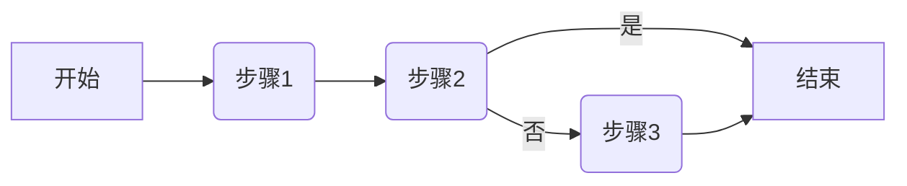
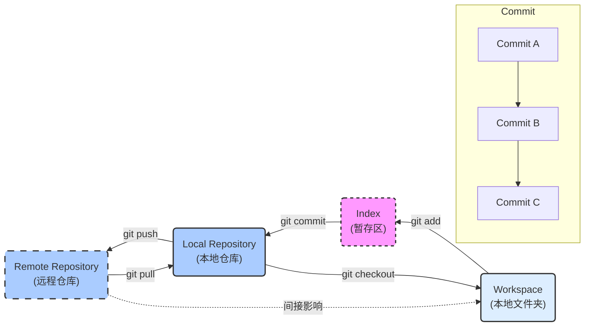
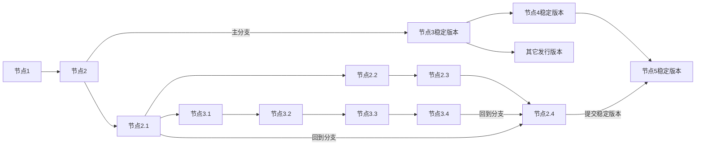
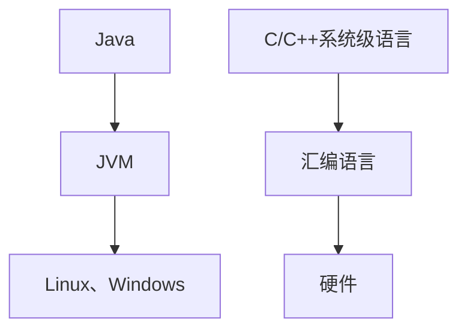
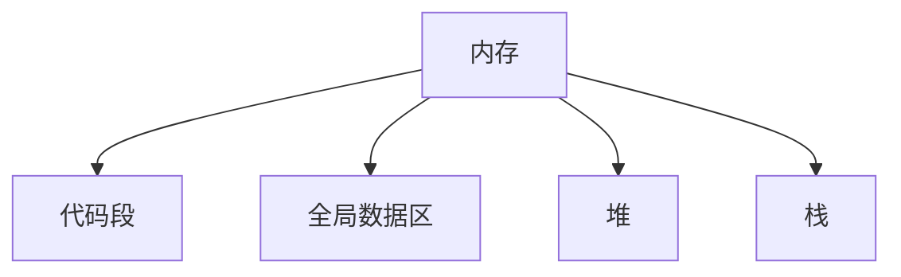

## 第一阶段

### 一、预科

``` markdown
* Ubuntu
* VSCode
* C语言基础
* Linux高级编程
* 数据结构
* 系统编程
* IO
* 并发编程
* 网络编程Socket
* 数据库编程
* C++
* QtGUI
* STM32
```

### 二、环境

#### 2.1 系统设置

##### 		2.1.1关闭防火墙

``` markdown
用于网络编程等开发环境
```

##### 		2.1.2文件扩展名

``` markdown
控制面板搜索文件资源管理器进行显示
```

#### 2.2 编辑器

##### 		2.2.1 文件编码

###### 2.2.1.1 编码类型

```  markdown
* gb2312
* gp936
* utf-8
```

###### 2.2.1.2 存储格式

``` markdown
* 单字符char 8位 256
* 多char用于存储更多字符
```

##### 2.2.2 VSCode编辑器

###### 2.2.2.1 注意事项

``` markdown
纯文本文件在Windows下不要用记事本打开（历史遗留问题）
```

###### 2.2.2.2 特性

``` markdown
* 跨平台，有丰富插件
* 安装中文插件和C/C++插件
```

##### 2.2.3 Vim编辑器

###### 2.2.3.1 命令模式

``` markdown
* hjkl 代替左下上右方向键
* yy 复制一行
* nyy 复制n行
* p 粘贴
* dd 删除一行
* nddd 删除n行
* u 撤销操作
* Ctrl+r 重做
* gg 回到开头位置
* G 回到最后位置
* 0 移动到当前行的行首
* $ 移动到当前行的行尾
* i 当前位置进入插入模式
* o 在下方插入空行，在空行进入插入模式
* a 光标后移一位进入插入模式
* I 回到当前行开头O进入插入模式
* O 在上方插入空行，在空行进入插入模式
* A 光标进入当前行末尾插入模式
```

``` bash
vim Test.c
#文件不存在时会自动创建
#进入文件时即进入命令模式
```

###### 2.2.3.2 插入模式

``` markdown
可进行编辑操作
```

###### 2.2.3.3 底行模式

``` bash
#在命令模式下输入:进入底行模式
#w 保存
#q 退出
#w！强制保存
#q！强制退出
#在底行模式连续按两次Esc进入命令模式
#3,5y复制3到5行
#p 粘贴
#3,5d删除3到5行
#set nu显示行号
#set nonu不显示行号
#n 进入第n行
#/ 查找字符串
#当查找到多个相同元素时，按n查找下一个
#3,4s/字符串1/字符串2
#替换选定范围匹配到的第一个字符串1
#3,4s/字符串1/字符串2/g
#%s/字符串1/字符串2
#替换全部范围匹配到的第一个字符串1
#%s/字符串1/字符串2/g
#替换全部范围匹配到的全部字符串1
```

##### 2.2.3.4 模式切换图


#### 2.3 配置虚拟机

##### 2.4.1 Ubuntu系统

``` markdown
Ctrl +Alt+t：打开终端
```

##### 2.4.2 设置Win和Linux共享目录

``` markdown
1.新建softeem文件夹（暂放D盘）
2./mnt/hgfs/softeem$ 位于VMware Linux的共享目录
```
##### 2.4.3 外部网络配置

``` markdown
桥接模式和NAT模式
```

#### 2.4 学习工具

##### 2.4.1  思维导图

``` markdown
CMMI 能力成熟度模型集成（实施开发标准）
过程域->目的->实践
```

##### 2.4.2 流程图



###### 2.4.2.1 图形含义

``` makedown
圆角矩形：开始与结束
矩形：行动方案
菱形：问题判断或判定（审核/审批/评审）环节
平行四边形：输入或输出
箭头：工作流方向
```


#### 2.5 Linux系统

##### 2.5.1 常用命令

###### 2.5.1.1 切换命令

``` bash
cd
#切换路径
cd /
#根目录
cd ./
#当前目录
cd ../
#上级目录
cd -
#上次目录
```

###### 2.5.1.2 查看命令

``` bash
pwd
#查看当前目录的绝对路径
ls
#查看当前目录下的文件
ls -a
#查看当前目录下的所有文件（包括隐藏文件）
ls -l
#查看当前目录下文件的详细信息
softeem@ubuntu:~$ ls -l
#文件名=文件类型+用户权限+组权限+其它权限+硬链接数+用户名+组名+文件大小+最近修改时间
drwxr-xr-x 2 softeem softeem    4096 Dec 10  2017 Documents
drwxr-xr-x 2 softeem softeem    4096 Dec 10  2017 Downloads
#开头一号位字符代表了不同的文件[bcd~lsp]
#-：普通文件
#d:目录
#b:block 块设备文件
#c:char 字符设备文件
#l:链接文件（软链接，硬链接）inode
#s:套接字文件
#p:管道文件
#--------------------------------
#开头二三四号位字符代表当前用户权限
#r:read可读
#w:write可写
#-:不可读/不可写
#开头五六七号位字符代表当前组权限
#--------------------------------
#后三位代表其它组用户权限
#--------------------------------
#权限后数字代表硬链接数
#--------------------------------
#硬链接数后是用户名和组名
#--------------------------------
#用户名后是大小和最近一次修改时间
cat 文件名
#查看文件内容
cat 文件名1 文件名2
#合并两个文件
```

###### 2.5.1.3 创建命令

``` bash
touch 文件名
#创建一个文件
mkdir 文件夹名
#创建一个目录/文件夹
```

###### 2.5.1.4 删除命令

``` shell
rm 文件名
#删除文件
rmdir 目录名
#删空目录
rm -r 目录名
#删非空目录
```

###### 2.5.1.5 复制命令

``` bash
cp 源文件名字 目标路径/新文件名
#复制文件
cp 源文件夹名字 目标路径/新文件目录名 -r
#-r代表递归，将整个目录进行拷贝
#复制文件目录
```

###### 2.5.1.6 系统命令

``` bash
clear
#终端清屏
poweroff
#关机
shutdown -h now
#关机
exit
#退出终端
```

##### 2.5.2 快捷键

###### 2.5.2.1 终端命令

``` markdown
Ctrl+Alt+T 打开终端
Ctrl+Shift+N 新建终端
Ctrl+Shift+T 多标签页终端
Ctrl+Shift+'+' 终端放大
Ctrl+'-' 终端缩小
Ctrl+Alt+F7/F1 图形界面/终端界面
```

###### 2.5.2.2 补全命令

``` markdown
Tab 补全命令行代码
⬆⬇（方向键）使用历史命令
```

#### 2.6 Git版本管理

##### 2.6.1 git基本概念

###### 2.6.1.1 基本功能
``` markdown
分布式版本管理控制
```

###### 2.6.1.2 git组成

``` markdown
Index（缓存区）:master主分支，HEAD"指针",commit命令将缓存区文件提交到本地仓库
Repository（本地仓库）:
Workspace（工作区）:add指令将工作区文件提交到缓存区
Remote（远程仓库）
将路径纳入git中后出现的.git目录包含了本地仓库和缓存区
```


##### 2.6.2 git安装

``` markdown
通过国内镜像地址快速下载
初学git时，安装使用默认选项即可
```

##### 2.6.2 git界面

``` bash
#水漫金山@DESKTOP-BRHPETA MINGW64 ~/Desktop/git-lerning (master)
#用户名+计算机名+windows平台特有标识+当前目录
#新装git需要配置全局用户信息
$ git config --global user.name "DamnJone"
$ git config --global user.email "2469463883@qq.com"
#邮箱地址用于区分提交用户，便于团队合作
$ git config --list
#查看配置
$ git init
$ git status
#目录中的中文名文件会显示乱码，需要配置
#左上角右键打开选项选择文本设置字符集UTF-8
$ git config --global core.quotepath false
#显示status编码
$ git config --global gui.encoding utf-8
#图形界面编码
$ git config --global i18n.commit.encoding utf-8
#提交信息编码
$ git config --global i18n.logoutputencoding utf-8
#输出log编码
$ export LESSCHARSET=utf-8
#git log 默认使用less分页， 需要bash对less命令进行utf-8编码
```

##### 2.6.3 git存储图解



``` markdown
Workspace:工作区
Index:缓存区
Repository:本地仓库
Remote:远程仓库
选定目录下的.git文件包括Repository和Index文件
```

##### 2.6.4 git基础语法

###### 2.6.4.1 提交与状态查看

``` bash
$ git status
#查看当前工作区的状态信息
$ git add README.txt
#将文件提交到缓存区
#缓存区只记录最后一次提交
$ git add .
#提交当前工作区下的所有文件
#部分文件打开时会在当前目录添加一个临时文件
#该操作会将临时文件也进行提交，注意！！！
On branch master
#在当前分支
No commits yet
Changes to be committed:
  (use "git rm --cached <file>..." to unstage)
        new file:   README.txt
Changes not staged for commit:
  (use "git add <file>..." to update what will be committed)
  (use "git restore <file>..." to discard changes in working directory)
        modified:   README.txt
```

###### 2.6.4.2 版本比较

``` bash
$ git add README.txt
#新创建和修改过的文件，都是用git add来添加到缓存区
$ git diff README.txt
#当工作区和本地仓库一致时该代码无输出
#实测比较的是缓存区版本和工作区修改过的版本
$ git diff README.txt
diff --git a/README.txt b/README.txt
#a代表修改前版本，b代表修改后版本
index 4ec7751..be9a177 100644
#由哈希方式生成修改前版本..修改后版本。
#100代表普通文件，64代表权限
--- a/README.txt
+++ b/README.txt
#---代表修改前版本
#+++代表修改后版本
@@ -1 +1,2 @@
#-改动前，+改动后，1、2代表第一行开始的连续两行
-This is a sentence.
\ No newline at end of file
+This is a sentence.
+The second line.
\ No newline at end of file
#-之前版本
#+之后版本
$ git difftool README.txt
#会通过对比展示改动前和改动后的版本
```

###### 2.6.4.3 日志管理

``` bash
$ git add README.txt
#文件跟踪只能针对纯文本文件，如果是二进制文件，只会跟踪文件的大小
$ git commit -m "This is a commit"
#提交至仓库,可加备注
$ git log
#查看提交日志
$ git log Example.txt
#Example.txt提交了三次修改和日志
commit ffedbd25ce9a80a7861e09773edcbf0278ad9aba (HEAD -> master)
#commit 后面为该次提交的ID，该标识码唯一
#master 代表主分支
#HEAD 可以理解C语言指针，指向该分区
#正式的开发一般不会位于主分支
Author: DamnJone <2469463883@qq.com>
#提交用户的信息
Date:   Wed Jul 3 10:22:52 2024 +0800
#提交时间
    This is the third modification.

commit 121846a858cf39fa7d53ffa610adfaf10ba7734c
Author: DamnJone <2469463883@qq.com>
Date:   Wed Jul 3 10:19:53 2024 +0800

    This is the second modification.

commit 818cb8dd08c8c957a05fb2465af296e27101018d
Author: DamnJone <2469463883@qq.com>
Date:   Wed Jul 3 10:18:41 2024 +0800

    This is the first modification.
#顶部信息为最后一次提交
$ git log --pretty=oneline
#一行显示一次提交
$ git log --pretty=oneline Example.txt
#显示该目录下指定文件的提交（每次单行显示）
```

###### 2.6.4.4 版本穿梭

``` bash
$ git reset --hard HEAD^
#将HEAD"指针"指向上一个节点
$ git reset --hard HEAD^^
#将HEAD"指针"指向上上一个节点,以此类推
#执行操作后，文件将回退上一个版本
$ git reset --hard ffedbd25ce9a80a7861e09773edcbf0278ad9aba
#将HEAD替换为版本ID，即回到对应版本
$ git reflog
#查看所有日志，包括版本回退后的状态
```

###### 2.6.4.5 分支管理



``` bash
#分支策略
#Master:主分支，正式版本
#Dev:开发版本
#在开发版本上新建个人分支进行团队协作
#当个人分支成熟后合并到dev分支
#团队成员都会含有master分支和dev分支
#用HEAD指向可合并和切换分支
$ git branch
#查看分支
$ git switch -c dev
$ git branch 分支名
#创建一个分支
$ git switch 分支名
#切换一个分支
$ git merge 分支名
#将分支合并到当前分支
$ git branch -d 分支名
水漫金山@DESKTOP-BRHPETA MINGW64 ~/Desktop/1 (master)
$ git merge dev
Auto-merging a.txt
CONFLICT (content): Merge conflict in a.txt
Automatic merge failed; fix conflicts and then commit the result.
#发生冲突，自动合并失败
水漫金山@DESKTOP-BRHPETA MINGW64 ~/Desktop/1 (master|MERGING)
$ cat a.txt
a
<<<<<<< HEAD
master
=======
dev
>>>>>>> dev
#手动合并过程
#分支合并策略
#当dev再次提交之后
$ git merge 分支名
#会自动把最新的dev作为master的下一个版本
#HEAD指针回退会出现问题
$ git merge --no--ff dev
#普通合并模式，会产生新的提交
```

###### 2.6.4.6 撤销工作区

``` bash
#1.新文件，没有在缓冲区中add过，也没有commit过
#处理：直接删除
$ rm 新文件
#2.修改文件
#a.缓存区存过（add）,没有commit过
#b.缓存区空了,commit过
$ git checkout HEAD--README.txt
#相当于撤销工作区未add的操作，回退到上一次add的版本。
#用缓存区覆盖工作区
$ git restore 文件名
#将缓存区文件取出覆盖工作区
#也能将本地仓库文件取出覆盖工作区
#缓存区和本地仓库哪个新用哪个
```

###### 2.6.4.7 撤销缓存区

``` bash
#首先工作区的状态是干净的
#然后，修改文件，做一次add
$ git reset HEAD readme.txt
Unstaged changes after reset:
M       readme.txt
#该命令会撤销add操作，将文件从缓存区放回工作区
#用缓存区覆盖工作区
#想完全撤销就继续使用工作区撤销的方式。
$ git restore --staged 文件名
```

###### 2.6.4.8 撤销本地仓库

``` bash
#实质：版本回退
$ git reset --hard <commit id>
```

###### 2.6.4.9 删除操作

``` bash
$ git rm 文件名
$ git rm -f 文件名
#强制删除
```

##### 2.6.5 最佳使用方案

``` bash
$ git add 文件名
#git使用的最佳方案
#多次git add 提交到缓存区
#一次 git commit 提交到本地仓库
```

##### 2.6.6 创建远程私有库

###### 2.6.6.1 gitee注册和添加公钥

``` bash
$ ssh-keygen -t rsa -C"邮箱"
#生成公钥，位于C盘用户目录下的.ssh目录
#用VSCode打开.pub文件
#将内容复制进gitee的SSH公钥
```

###### 2.6.6.2 创建仓库

``` markdown
页面右上角加号添加仓库
仓库名使用英文
```

###### 2.6.6.3 关联本地仓库与远程仓库

``` bash
#先创建一个本地仓库
$ git remote add 名称 git@gitee.com:damnjone/my-own-git.git
#可以做两次不同远程仓库的关联
#git默认名称origin,可修改。
$ git push -u 名称 master
#本地仓库的内容推送到远程库
#第一次推送＋-u,git不但会把本地的master分支推送到远程库的master分支，还会把本地的master分支跟远程库的master分支关联起来，关联以后可简化指令不用加u。
$ git pull GitLearning master
#将远程库的内容推送到本地
#在远程仓库界面查看克隆和下载选项可得到ssh链接
#在push之前先从远程仓库拉取再合并
```

###### 2.6.6.4 解除本地仓库与远程仓库关联

``` bash
$ git remote -v
#查看远程库信息
GitLearning     git@gitee.com:damnjone/git-lerning.git (fetch)
GitLearning     git@gitee.com:damnjone/git-lerning.git (push)
#根据名字进行删除
$ git remote rm GitLearning
#删除选定远程库
```

###### 2.6.6.5 克隆远程仓库

``` bash
$ git clone 地址
#在本地运行克隆指令后，会新建一个仓库目录
```

### 三、C语言基础

#### 	3.1 语言特性

``` markdown
面向过程、面向对象、泛型编程
```

#### 	3.2 语言发展过程

``` markdown
机器语言->汇编语言
(会汇编语言薪资更高)
```

``` plaintext
010110110101010
```

``` assembly
mov eax, n
add eax, 2
mov n, eax
```

``` c
n=n+2;
```



``` markdown
C++语言高效
用于多数大规模项目开发
```

#### 	3.3 C语言概念

``` c
//ANSI C标准
//C89(C90 ANSI C)
//C99
```
#### 	3.4 C语言概要

``` markdown
语句、表达式、数据类型、变量、占用字节数、输入输出
运算操作符（算术、位、逻辑、关系）
循环
分支
数组（一维数组、二维数组）
函数（返回值类型，参数传递方式，封装）
复杂函数（递归函数，静态函数，回调函数，变参函数）
指针（定义、运算、一级指针、二级指针）
内存管理
字符串指针、字符数组、内存分布
复杂数据结构（结构体、大小、结构体数组、共用体、枚举、复杂宏定义，条件编译）
代码评审
```

#### 	3.5 编程开发工具

##### 3.5.1 Windows平台

``` markdown
Windows平台：Visual Studio IDE（Office, Wps, QQ, Wechat) 游戏
```

##### 3.5.2 Linux平台

``` markdown
Ubuntu：编辑器vim emacs VSCode、编译器GCC、调试器GDB（分部件）
Git：代码管理工具
```

#### 	3.6 C语言学习

##### 3.6.1 简单C程序示例

``` c
//第一个简单C程序
#include<stdio.h>
//由<>定义的处于系统文件
//由""定义的处于当前目录
//包含头文件
//主函数也是被调用的函数
//返回值最好是int类型，返回0代表结果正常
int main(int argc, char* argv[])
//标准main函数
//argc 参数个数 char* argv[]字符指针数组
//cd E:\文件
//argv[0]="cd"
//argc[1]="E:\文件"
{
    printf("Hello, World\n");
    //语句以分号结尾
    return 0;
}
//分组以花括号表示
//代码结束，会进行资源管理工作
```

##### 3.6.2 C语言编译过程

``` bash
#Linux环境编译C代码

#gcc编译程序：依赖于.h .so .a
gcc Test.c -o Test
#编译Test.c文件，不添加-o Test的话会生成一个Test.out文件
#生成的文件为可执行文件
#四个步骤一气呵成
gcc Test.c -o Test.i -E
#预处理，展开头文件
gcc Test.i -o Test.s -S
#编译，汇编文件
gcc Test.s -0 Test.o -c
#汇编，机器语言
gcc Test.o -o Test.out
#指定生成文件

#-l 链接某个库，如 libabc.so -labc libabc.a -labc libabc.a or libabc.so
libaaa.a -laaa.a
#-L 指定库目录 -L/mnt/hgs
readelf -a Test
#查看文件信息
#-I include 指定头文件的位置

#.dll .so动态链接库
#.lib .a静态链接库
```


##### 3.6.3 内存概要

``` markdown
程序=数据结构+算法
可执行文件=代码+数据+依赖+依赖库中的函数地址
```


